# Class Diagram

## Overview

This document describes the class structure for the SuperSuat paper reading assistance application following Clean Architecture and SOLID principles.

## Backend (C# .NET 10)

### Domain Layer

### Application Layer - Interfaces

```mermaid
classDiagram
    class IPaperRepository {
        <<interface>>
        +GetByIdAsync(id: string) Paper
        +GetAllAsync(filter: PaperFilter) List~Paper~
        +CreateAsync(paper: Paper) Paper
        +UpdateAsync(paper: Paper) Paper
        +DeleteAsync(id: string) void
    }

    class ITextContentRepository {
        <<interface>>
        +GetByPaperIdAsync(paperId: string) TextContent
        +CreateAsync(content: TextContent) TextContent
        +UpdateAsync(content: TextContent) TextContent
    }

    class IFigureRepository {
        <<interface>>
        +GetByPaperIdAsync(paperId: string) List~Figure~
        +CreateAsync(figure: Figure) Figure
    }

    class ITableRepository {
        <<interface>>
        +GetByPaperIdAsync(paperId: string) List~Table~
        +CreateAsync(table: Table) Table
    }

    class IEquationRepository {
        <<interface>>
        +GetByPaperIdAsync(paperId: string) List~Equation~
        +CreateAsync(equation: Equation) Equation
    }

    class ITranslationRepository {
        <<interface>>
        +GetByPaperIdAndLanguageAsync(paperId: string, language: string) Translation
        +GetAvailableLanguagesAsync(paperId: string) List~string~
        +CreateAsync(translation: Translation) Translation
    }

    class ISummaryRepository {
        <<interface>>
        +GetByPaperIdAndLanguageAsync(paperId: string, language: string) Summary
        +CreateAsync(summary: Summary) Summary
    }

    class IHighlightRepository {
        <<interface>>
        +GetByPaperIdAsync(paperId: string, userId: string) List~Highlight~
        +CreateAsync(highlight: Highlight) Highlight
        +UpdateAsync(highlight: Highlight) Highlight
        +DeleteAsync(id: string) void
    }

    class IHighlightColorPresetRepository {
        <<interface>>
        +GetByUserIdAsync(userId: string) List~HighlightColorPreset~
        +CreateAsync(preset: HighlightColorPreset) HighlightColorPreset
        +UpdateAsync(preset: HighlightColorPreset) HighlightColorPreset
        +DeleteAsync(id: string) void
    }

    class IPdfProcessingService {
        <<interface>>
        +ProcessPdfAsync(pdfData: byte[], options: ProcessingOptions) ProcessedPaper
    }

    class ILlmService {
        <<interface>>
        +ExtractTextAsync(pdfContent: string) TextContent
        +TranslateAsync(content: TextContent, targetLanguage: string) Translation
        +SummarizeAsync(content: TextContent, options: SummaryOptions) Summary
        +ChatAsync(context: string, message: string) string
    }

    class IStorageService {
        <<interface>>
        +UploadAsync(data: byte[], key: string) string
        +GetUrlAsync(key: string) string
        +DeleteAsync(key: string) void
    }

    class IAuthService {
        <<interface>>
        +ValidateTokenAsync(token: string) UserClaims
        +GetUserIdAsync(token: string) string
    }
```

### Application Layer - Use Cases

```mermaid
classDiagram
    class UploadPaperUseCase {
        -IPdfProcessingService _pdfService
        -IPaperRepository _paperRepo
        -ITextContentRepository _textRepo
        -IFigureRepository _figureRepo
        -ITableRepository _tableRepo
        -IEquationRepository _equationRepo
        +ExecuteAsync(command: UploadPaperCommand) Paper
    }

    class GetPaperListUseCase {
        -IPaperRepository _paperRepo
        +ExecuteAsync(query: PaperListQuery) List~PaperSummaryDto~
    }

    class GetPaperDetailUseCase {
        -IPaperRepository _paperRepo
        -ITextContentRepository _textRepo
        -IFigureRepository _figureRepo
        -ITableRepository _tableRepo
        -IEquationRepository _equationRepo
        +ExecuteAsync(paperId: string) PaperDetailDto
    }

    class UpdatePaperMetaUseCase {
        -IPaperRepository _paperRepo
        +ExecuteAsync(command: UpdatePaperMetaCommand) Paper
    }

    class GetTranslationUseCase {
        -ITranslationRepository _translationRepo
        +ExecuteAsync(paperId: string, language: string) Translation
    }

    class CreateTranslationUseCase {
        -ITextContentRepository _textRepo
        -ITranslationRepository _translationRepo
        -ILlmService _llmService
        +ExecuteAsync(command: CreateTranslationCommand) Translation
    }

    class GetSummaryUseCase {
        -ISummaryRepository _summaryRepo
        +ExecuteAsync(paperId: string, language: string) Summary
    }

    class CreateSummaryUseCase {
        -ITextContentRepository _textRepo
        -ISummaryRepository _summaryRepo
        -ILlmService _llmService
        +ExecuteAsync(command: CreateSummaryCommand) Summary
    }

    class ManageHighlightsUseCase {
        -IHighlightRepository _highlightRepo
        +GetAsync(paperId: string, userId: string) List~Highlight~
        +CreateAsync(command: CreateHighlightCommand) Highlight
        +UpdateAsync(command: UpdateHighlightCommand) Highlight
        +DeleteAsync(id: string) void
    }

    class ChatUseCase {
        -ITextContentRepository _textRepo
        -ILlmService _llmService
        +ExecuteAsync(paperId: string, message: string) string
    }

    class ManageHighlightPresetsUseCase {
        -IHighlightColorPresetRepository _presetRepo
        +GetAsync(userId: string) List~HighlightColorPreset~
        +CreateAsync(command: CreatePresetCommand) HighlightColorPreset
        +UpdateAsync(command: UpdatePresetCommand) HighlightColorPreset
        +DeleteAsync(id: string) void
        +SetDefaultAsync(userId: string, presetId: string) void
    }
```

### Infrastructure Layer

```mermaid
classDiagram
    class DynamoDbPaperRepository {
        -IAmazonDynamoDB _dynamoDb
        -string _tableName
    }

    class DynamoDbTextContentRepository {
        -IAmazonDynamoDB _dynamoDb
        -string _tableName
    }

    class DynamoDbFigureRepository {
        -IAmazonDynamoDB _dynamoDb
        -string _tableName
    }

    class DynamoDbTableRepository {
        -IAmazonDynamoDB _dynamoDb
        -string _tableName
    }

    class DynamoDbEquationRepository {
        -IAmazonDynamoDB _dynamoDb
        -string _tableName
    }

    class DynamoDbTranslationRepository {
        -IAmazonDynamoDB _dynamoDb
        -string _tableName
    }

    class DynamoDbSummaryRepository {
        -IAmazonDynamoDB _dynamoDb
        -string _tableName
    }

    class DynamoDbHighlightRepository {
        -IAmazonDynamoDB _dynamoDb
        -string _tableName
    }

    class DynamoDbHighlightColorPresetRepository {
        -IAmazonDynamoDB _dynamoDb
        -string _tableName
    }

    class BedrockLlmService {
        -IAmazonBedrockRuntime _bedrockRuntime
        -string _modelId
    }

    class S3StorageService {
        -IAmazonS3 _s3Client
        -string _bucketName
    }

    class CognitoAuthService {
        -IAmazonCognitoIdentityProvider _cognitoClient
        -string _userPoolId
    }

    IPaperRepository <|.. DynamoDbPaperRepository
    ITextContentRepository <|.. DynamoDbTextContentRepository
    IFigureRepository <|.. DynamoDbFigureRepository
    ITableRepository <|.. DynamoDbTableRepository
    IEquationRepository <|.. DynamoDbEquationRepository
    ITranslationRepository <|.. DynamoDbTranslationRepository
    ISummaryRepository <|.. DynamoDbSummaryRepository
    IHighlightRepository <|.. DynamoDbHighlightRepository
    IHighlightColorPresetRepository <|.. DynamoDbHighlightColorPresetRepository
    ILlmService <|.. BedrockLlmService
    IStorageService <|.. S3StorageService
    IAuthService <|.. CognitoAuthService
```

## Frontend (React + TypeScript)

### Component Structure

### Service Layer

### State Management (Context)

