# Sequence Diagrams

## Overview

This document describes the sequence diagrams for key operations in the SuperSuat paper reading assistance application.

## 1. Paper Upload Flow

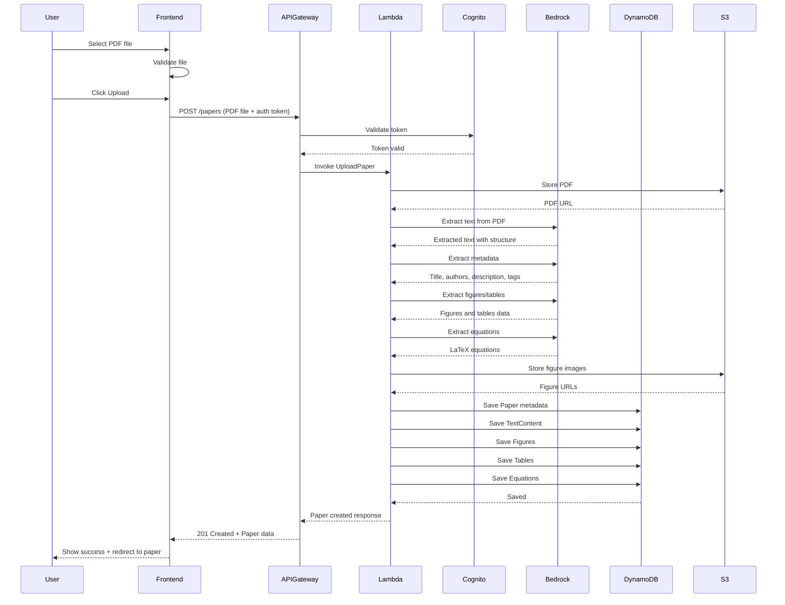
```mermaid
sequenceDiagram
    participant User
    participant Frontend
    participant APIGateway
    participant Lambda
    participant Cognito
    participant Bedrock
    participant DynamoDB
    participant S3

    User->>Frontend: Select PDF file
    Frontend->>Frontend: Validate file
    User->>Frontend: Click Upload
    Frontend->>APIGateway: POST /papers (PDF file + auth token)
    APIGateway->>Cognito: Validate token
    Cognito-->>APIGateway: Token valid
    APIGateway->>Lambda: Invoke UploadPaper
    
    Lambda->>S3: Store PDF
    S3-->>Lambda: PDF URL
    
    Lambda->>Bedrock: Extract text from PDF
    Bedrock-->>Lambda: Extracted text with structure
    
    Lambda->>Bedrock: Extract metadata
    Bedrock-->>Lambda: Title, authors, description, tags
    
    Lambda->>Bedrock: Extract figures/tables
    Bedrock-->>Lambda: Figures and tables data
    
    Lambda->>Bedrock: Extract equations
    Bedrock-->>Lambda: LaTeX equations
    
    Lambda->>S3: Store figure images
    S3-->>Lambda: Figure URLs
    
    Lambda->>DynamoDB: Save Paper metadata
    Lambda->>DynamoDB: Save TextContent
    Lambda->>DynamoDB: Save Figures
    Lambda->>DynamoDB: Save Tables
    Lambda->>DynamoDB: Save Equations
    
    DynamoDB-->>Lambda: Saved
    Lambda-->>APIGateway: Paper created response
    APIGateway-->>Frontend: 201 Created + Paper data
    Frontend-->>User: Show success + redirect to paper
```

## 2. Get Paper List Flow

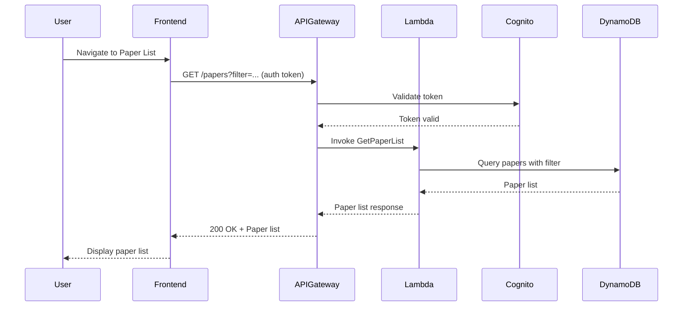
```mermaid
sequenceDiagram
    participant User
    participant Frontend
    participant APIGateway
    participant Lambda
    participant Cognito
    participant DynamoDB

    User->>Frontend: Navigate to Paper List
    Frontend->>APIGateway: GET /papers?filter=... (auth token)
    APIGateway->>Cognito: Validate token
    Cognito-->>APIGateway: Token valid
    APIGateway->>Lambda: Invoke GetPaperList
    
    Lambda->>DynamoDB: Query papers with filter
    DynamoDB-->>Lambda: Paper list
    
    Lambda-->>APIGateway: Paper list response
    APIGateway-->>Frontend: 200 OK + Paper list
    Frontend-->>User: Display paper list
```

## 3. Read Paper Flow

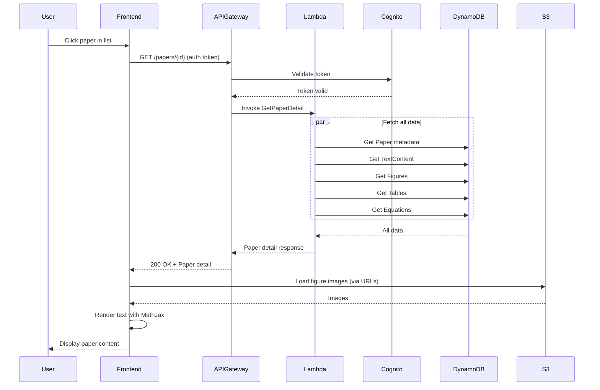
```mermaid
sequenceDiagram
    participant User
    participant Frontend
    participant APIGateway
    participant Lambda
    participant Cognito
    participant DynamoDB
    participant S3

    User->>Frontend: Click paper in list
    Frontend->>APIGateway: GET /papers/{id} (auth token)
    APIGateway->>Cognito: Validate token
    Cognito-->>APIGateway: Token valid
    APIGateway->>Lambda: Invoke GetPaperDetail
    
    par Fetch all data
        Lambda->>DynamoDB: Get Paper metadata
        Lambda->>DynamoDB: Get TextContent
        Lambda->>DynamoDB: Get Figures
        Lambda->>DynamoDB: Get Tables
        Lambda->>DynamoDB: Get Equations
    end
    
    DynamoDB-->>Lambda: All data
    Lambda-->>APIGateway: Paper detail response
    APIGateway-->>Frontend: 200 OK + Paper detail
    
    Frontend->>S3: Load figure images (via URLs)
    S3-->>Frontend: Images
    
    Frontend->>Frontend: Render text with MathJax
    Frontend-->>User: Display paper content
```

## 4. Highlighting Flow

### 4.1 Create Highlight

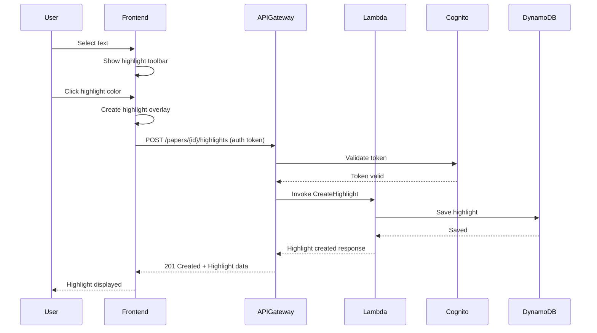
```mermaid
sequenceDiagram
    participant User
    participant Frontend
    participant APIGateway
    participant Lambda
    participant Cognito
    participant DynamoDB

    User->>Frontend: Select text
    Frontend->>Frontend: Show highlight toolbar
    User->>Frontend: Click highlight color
    
    Frontend->>Frontend: Create highlight overlay
    Frontend->>APIGateway: POST /papers/{id}/highlights (auth token)
    APIGateway->>Cognito: Validate token
    Cognito-->>APIGateway: Token valid
    APIGateway->>Lambda: Invoke CreateHighlight
    
    Lambda->>DynamoDB: Save highlight
    DynamoDB-->>Lambda: Saved
    
    Lambda-->>APIGateway: Highlight created response
    APIGateway-->>Frontend: 201 Created + Highlight data
    Frontend-->>User: Highlight displayed
```

### 4.2 Get Highlights

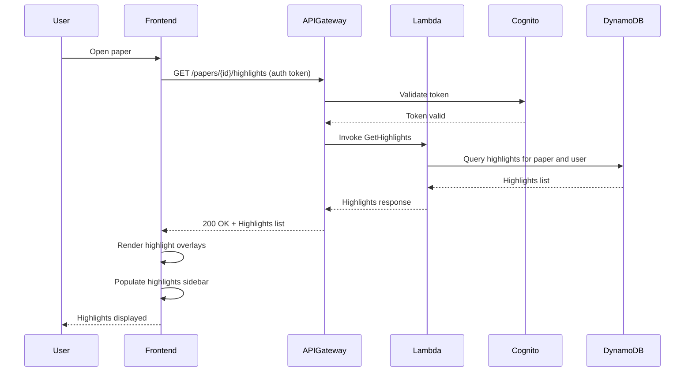
```mermaid
sequenceDiagram
    participant User
    participant Frontend
    participant APIGateway
    participant Lambda
    participant Cognito
    participant DynamoDB

    User->>Frontend: Open paper
    Frontend->>APIGateway: GET /papers/{id}/highlights (auth token)
    APIGateway->>Cognito: Validate token
    Cognito-->>APIGateway: Token valid
    APIGateway->>Lambda: Invoke GetHighlights
    
    Lambda->>DynamoDB: Query highlights for paper and user
    DynamoDB-->>Lambda: Highlights list
    
    Lambda-->>APIGateway: Highlights response
    APIGateway-->>Frontend: 200 OK + Highlights list
    Frontend->>Frontend: Render highlight overlays
    Frontend->>Frontend: Populate highlights sidebar
    Frontend-->>User: Highlights displayed
```

### 4.3 Update Highlight (Add Note)

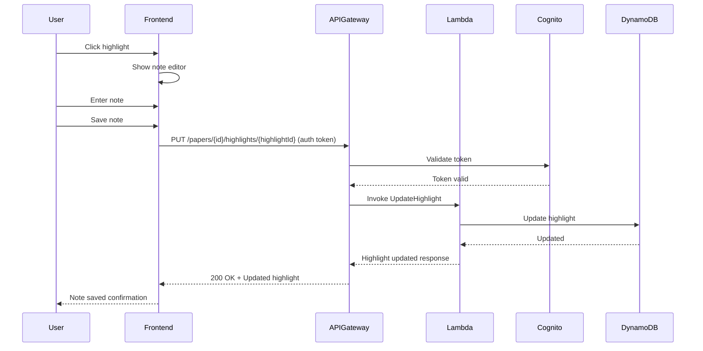
```mermaid
sequenceDiagram
    participant User
    participant Frontend
    participant APIGateway
    participant Lambda
    participant Cognito
    participant DynamoDB

    User->>Frontend: Click highlight
    Frontend->>Frontend: Show note editor
    User->>Frontend: Enter note
    User->>Frontend: Save note
    
    Frontend->>APIGateway: PUT /papers/{id}/highlights/{highlightId} (auth token)
    APIGateway->>Cognito: Validate token
    Cognito-->>APIGateway: Token valid
    APIGateway->>Lambda: Invoke UpdateHighlight
    
    Lambda->>DynamoDB: Update highlight
    DynamoDB-->>Lambda: Updated
    
    Lambda-->>APIGateway: Highlight updated response
    APIGateway-->>Frontend: 200 OK + Updated highlight
    Frontend-->>User: Note saved confirmation
```

## 5. Translation Flow

### 5.1 Get Available Languages

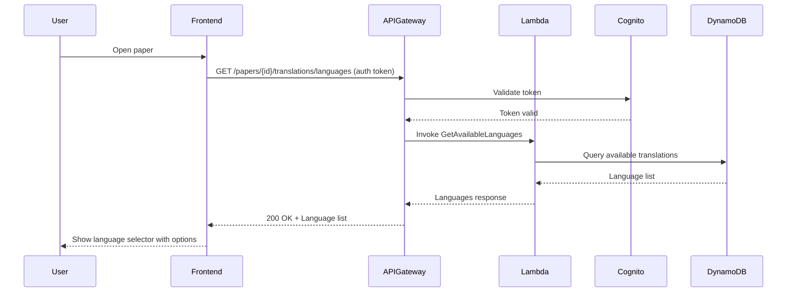
```mermaid
sequenceDiagram
    participant User
    participant Frontend
    participant APIGateway
    participant Lambda
    participant Cognito
    participant DynamoDB

    User->>Frontend: Open paper
    Frontend->>APIGateway: GET /papers/{id}/translations/languages (auth token)
    APIGateway->>Cognito: Validate token
    Cognito-->>APIGateway: Token valid
    APIGateway->>Lambda: Invoke GetAvailableLanguages
    
    Lambda->>DynamoDB: Query available translations
    DynamoDB-->>Lambda: Language list
    
    Lambda-->>APIGateway: Languages response
    APIGateway-->>Frontend: 200 OK + Language list
    Frontend-->>User: Show language selector with options
```

### 5.2 Get Translation

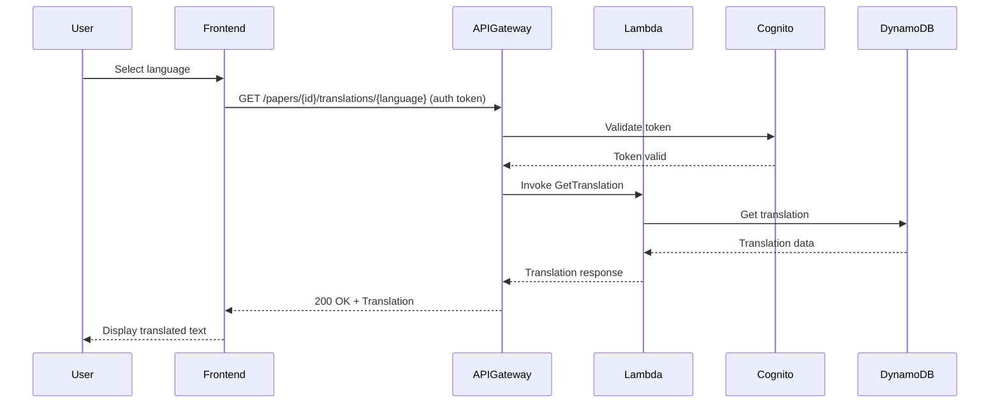
```mermaid
sequenceDiagram
    participant User
    participant Frontend
    participant APIGateway
    participant Lambda
    participant Cognito
    participant DynamoDB

    User->>Frontend: Select language
    Frontend->>APIGateway: GET /papers/{id}/translations/{language} (auth token)
    APIGateway->>Cognito: Validate token
    Cognito-->>APIGateway: Token valid
    APIGateway->>Lambda: Invoke GetTranslation
    
    Lambda->>DynamoDB: Get translation
    DynamoDB-->>Lambda: Translation data
    
    Lambda-->>APIGateway: Translation response
    APIGateway-->>Frontend: 200 OK + Translation
    Frontend-->>User: Display translated text
```

### 5.3 Create Translation

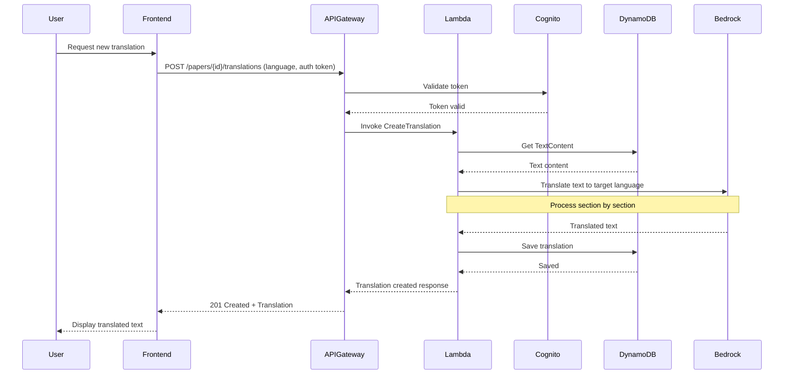
```mermaid
sequenceDiagram
    participant User
    participant Frontend
    participant APIGateway
    participant Lambda
    participant Cognito
    participant DynamoDB
    participant Bedrock

    User->>Frontend: Request new translation
    Frontend->>APIGateway: POST /papers/{id}/translations (language, auth token)
    APIGateway->>Cognito: Validate token
    Cognito-->>APIGateway: Token valid
    APIGateway->>Lambda: Invoke CreateTranslation
    
    Lambda->>DynamoDB: Get TextContent
    DynamoDB-->>Lambda: Text content
    
    Lambda->>Bedrock: Translate text to target language
    Note over Lambda,Bedrock: Process section by section
    Bedrock-->>Lambda: Translated text
    
    Lambda->>DynamoDB: Save translation
    DynamoDB-->>Lambda: Saved
    
    Lambda-->>APIGateway: Translation created response
    APIGateway-->>Frontend: 201 Created + Translation
    Frontend-->>User: Display translated text
```

## 6. Summary Flow

### 6.1 Get Summary

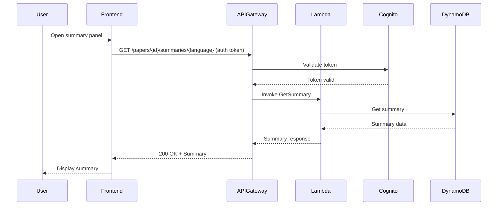
```mermaid
sequenceDiagram
    participant User
    participant Frontend
    participant APIGateway
    participant Lambda
    participant Cognito
    participant DynamoDB

    User->>Frontend: Open summary panel
    Frontend->>APIGateway: GET /papers/{id}/summaries/{language} (auth token)
    APIGateway->>Cognito: Validate token
    Cognito-->>APIGateway: Token valid
    APIGateway->>Lambda: Invoke GetSummary
    
    Lambda->>DynamoDB: Get summary
    DynamoDB-->>Lambda: Summary data
    
    Lambda-->>APIGateway: Summary response
    APIGateway-->>Frontend: 200 OK + Summary
    Frontend-->>User: Display summary
```

### 6.2 Create Summary

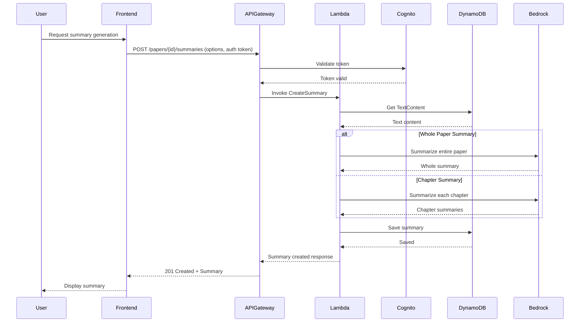
```mermaid
sequenceDiagram
    participant User
    participant Frontend
    participant APIGateway
    participant Lambda
    participant Cognito
    participant DynamoDB
    participant Bedrock

    User->>Frontend: Request summary generation
    Frontend->>APIGateway: POST /papers/{id}/summaries (options, auth token)
    APIGateway->>Cognito: Validate token
    Cognito-->>APIGateway: Token valid
    APIGateway->>Lambda: Invoke CreateSummary
    
    Lambda->>DynamoDB: Get TextContent
    DynamoDB-->>Lambda: Text content
    
    alt Whole Paper Summary
        Lambda->>Bedrock: Summarize entire paper
        Bedrock-->>Lambda: Whole summary
    else Chapter Summary
        Lambda->>Bedrock: Summarize each chapter
        Bedrock-->>Lambda: Chapter summaries
    end
    
    Lambda->>DynamoDB: Save summary
    DynamoDB-->>Lambda: Saved
    
    Lambda-->>APIGateway: Summary created response
    APIGateway-->>Frontend: 201 Created + Summary
    Frontend-->>User: Display summary
```

## 7. Chat Flow

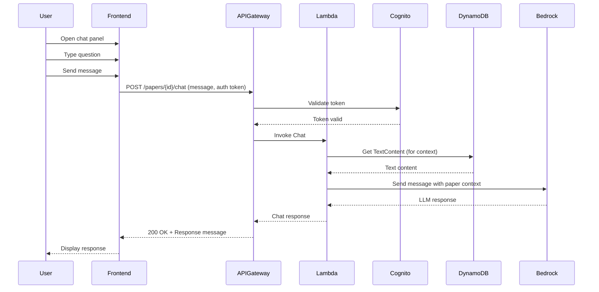
```mermaid
sequenceDiagram
    participant User
    participant Frontend
    participant APIGateway
    participant Lambda
    participant Cognito
    participant DynamoDB
    participant Bedrock

    User->>Frontend: Open chat panel
    User->>Frontend: Type question
    User->>Frontend: Send message
    
    Frontend->>APIGateway: POST /papers/{id}/chat (message, auth token)
    APIGateway->>Cognito: Validate token
    Cognito-->>APIGateway: Token valid
    APIGateway->>Lambda: Invoke Chat
    
    Lambda->>DynamoDB: Get TextContent (for context)
    DynamoDB-->>Lambda: Text content
    
    Lambda->>Bedrock: Send message with paper context
    Bedrock-->>Lambda: LLM response
    
    Lambda-->>APIGateway: Chat response
    APIGateway-->>Frontend: 200 OK + Response message
    Frontend-->>User: Display response
```

## 8. Authentication Flow (Google OAuth via Cognito)

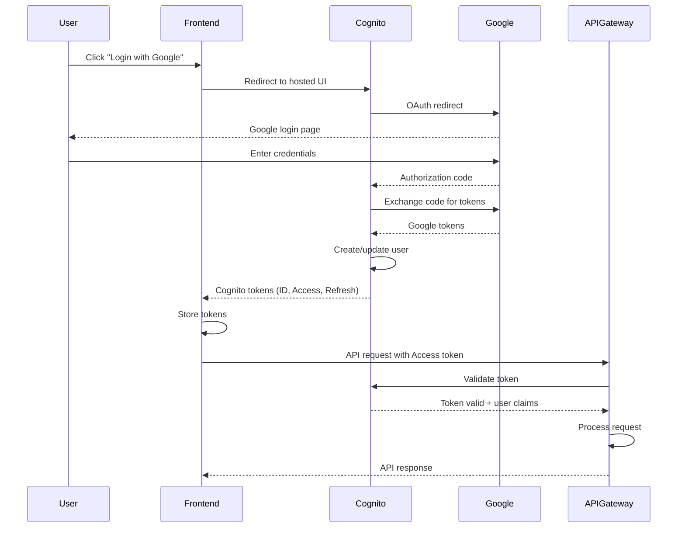
```mermaid
sequenceDiagram
    participant User
    participant Frontend
    participant Cognito
    participant Google
    participant APIGateway

    User->>Frontend: Click "Login with Google"
    Frontend->>Cognito: Redirect to hosted UI
    Cognito->>Google: OAuth redirect
    Google-->>User: Google login page
    User->>Google: Enter credentials
    Google-->>Cognito: Authorization code
    Cognito->>Google: Exchange code for tokens
    Google-->>Cognito: Google tokens
    Cognito->>Cognito: Create/update user
    Cognito-->>Frontend: Cognito tokens (ID, Access, Refresh)
    
    Frontend->>Frontend: Store tokens
    Frontend->>APIGateway: API request with Access token
    APIGateway->>Cognito: Validate token
    Cognito-->>APIGateway: Token valid + user claims
    APIGateway->>APIGateway: Process request
    APIGateway-->>Frontend: API response
```

## 9. Update Paper Metadata Flow

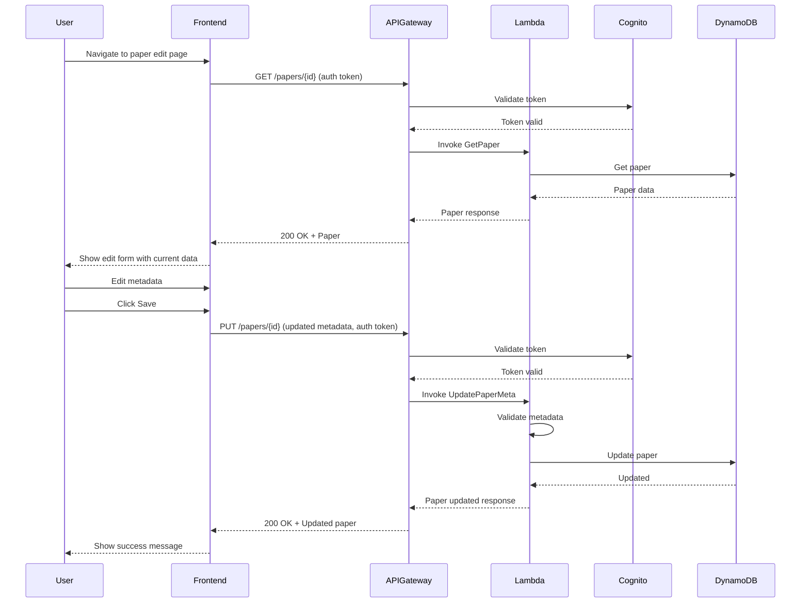
```mermaid
sequenceDiagram
    participant User
    participant Frontend
    participant APIGateway
    participant Lambda
    participant Cognito
    participant DynamoDB

    User->>Frontend: Navigate to paper edit page
    Frontend->>APIGateway: GET /papers/{id} (auth token)
    APIGateway->>Cognito: Validate token
    Cognito-->>APIGateway: Token valid
    APIGateway->>Lambda: Invoke GetPaper
    Lambda->>DynamoDB: Get paper
    DynamoDB-->>Lambda: Paper data
    Lambda-->>APIGateway: Paper response
    APIGateway-->>Frontend: 200 OK + Paper
    Frontend-->>User: Show edit form with current data
    
    User->>Frontend: Edit metadata
    User->>Frontend: Click Save
    
    Frontend->>APIGateway: PUT /papers/{id} (updated metadata, auth token)
    APIGateway->>Cognito: Validate token
    Cognito-->>APIGateway: Token valid
    APIGateway->>Lambda: Invoke UpdatePaperMeta
    
    Lambda->>Lambda: Validate metadata
    Lambda->>DynamoDB: Update paper
    DynamoDB-->>Lambda: Updated
    
    Lambda-->>APIGateway: Paper updated response
    APIGateway-->>Frontend: 200 OK + Updated paper
    Frontend-->>User: Show success message
```

## 10. Highlight Color Preset Management Flow

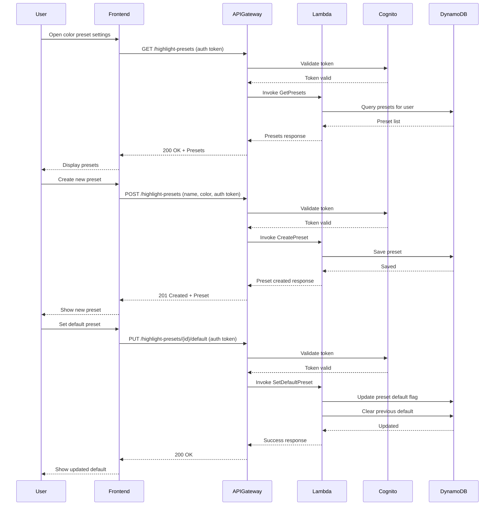
```mermaid
sequenceDiagram
    participant User
    participant Frontend
    participant APIGateway
    participant Lambda
    participant Cognito
    participant DynamoDB

    User->>Frontend: Open color preset settings
    Frontend->>APIGateway: GET /highlight-presets (auth token)
    APIGateway->>Cognito: Validate token
    Cognito-->>APIGateway: Token valid
    APIGateway->>Lambda: Invoke GetPresets
    Lambda->>DynamoDB: Query presets for user
    DynamoDB-->>Lambda: Preset list
    Lambda-->>APIGateway: Presets response
    APIGateway-->>Frontend: 200 OK + Presets
    Frontend-->>User: Display presets
    
    User->>Frontend: Create new preset
    Frontend->>APIGateway: POST /highlight-presets (name, color, auth token)
    APIGateway->>Cognito: Validate token
    Cognito-->>APIGateway: Token valid
    APIGateway->>Lambda: Invoke CreatePreset
    Lambda->>DynamoDB: Save preset
    DynamoDB-->>Lambda: Saved
    Lambda-->>APIGateway: Preset created response
    APIGateway-->>Frontend: 201 Created + Preset
    Frontend-->>User: Show new preset
    
    User->>Frontend: Set default preset
    Frontend->>APIGateway: PUT /highlight-presets/{id}/default (auth token)
    APIGateway->>Cognito: Validate token
    Cognito-->>APIGateway: Token valid
    APIGateway->>Lambda: Invoke SetDefaultPreset
    Lambda->>DynamoDB: Update preset default flag
    Lambda->>DynamoDB: Clear previous default
    DynamoDB-->>Lambda: Updated
    Lambda-->>APIGateway: Success response
    APIGateway-->>Frontend: 200 OK
    Frontend-->>User: Show updated default
```

## 11. Paragraph-level Translation Popup Flow

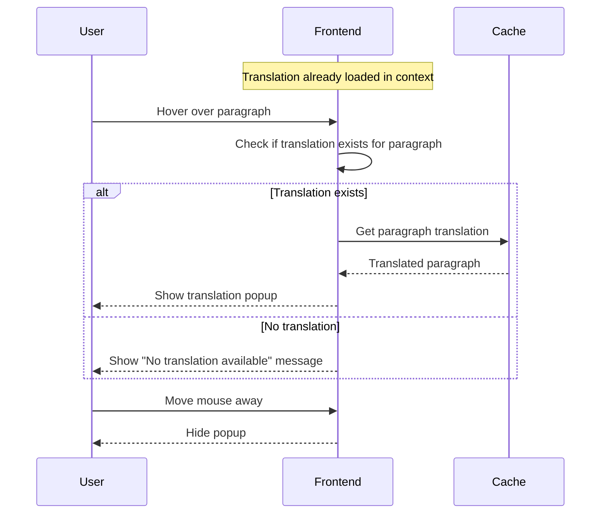
```mermaid
sequenceDiagram
    participant User
    participant Frontend
    participant Cache

    Note over Frontend: Translation already loaded in context
    
    User->>Frontend: Hover over paragraph
    Frontend->>Frontend: Check if translation exists for paragraph
    
    alt Translation exists
        Frontend->>Cache: Get paragraph translation
        Cache-->>Frontend: Translated paragraph
        Frontend-->>User: Show translation popup
    else No translation
        Frontend-->>User: Show "No translation available" message
    end
    
    User->>Frontend: Move mouse away
    Frontend-->>User: Hide popup
```

## 12. Section Navigation Flow

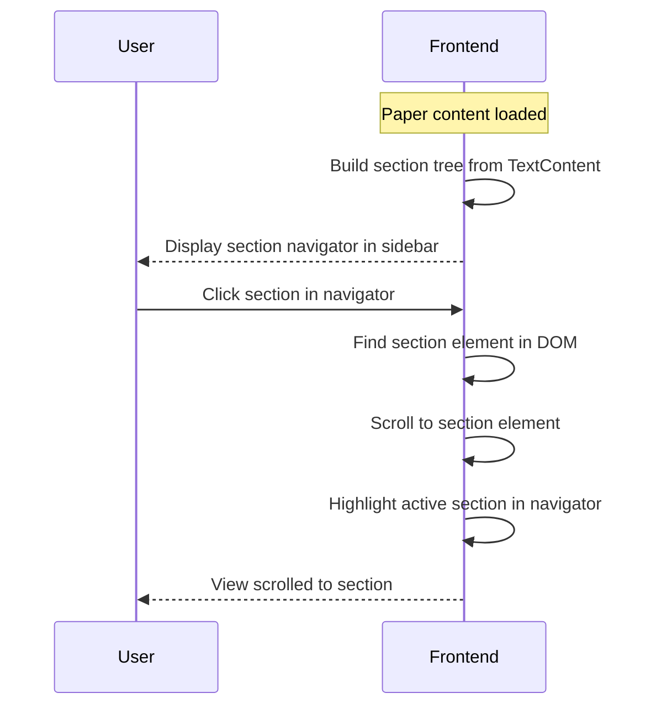
```mermaid
sequenceDiagram
    participant User
    participant Frontend

    Note over Frontend: Paper content loaded
    
    Frontend->>Frontend: Build section tree from TextContent
    Frontend-->>User: Display section navigator in sidebar
    
    User->>Frontend: Click section in navigator
    Frontend->>Frontend: Find section element in DOM
    Frontend->>Frontend: Scroll to section element
    Frontend->>Frontend: Highlight active section in navigator
    Frontend-->>User: View scrolled to section
```

## 13. Fly to Highlight Flow

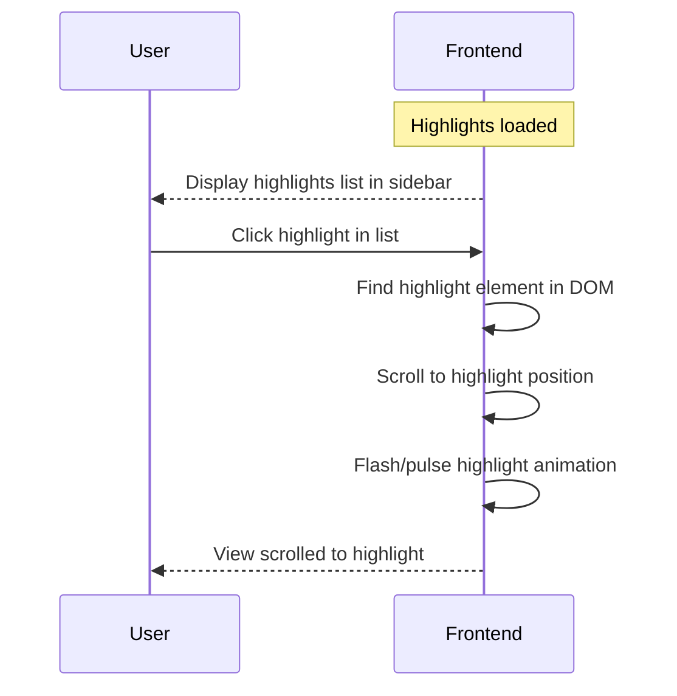
```mermaid
sequenceDiagram
    participant User
    participant Frontend

    Note over Frontend: Highlights loaded
    
    Frontend-->>User: Display highlights list in sidebar
    
    User->>Frontend: Click highlight in list
    Frontend->>Frontend: Find highlight element in DOM
    Frontend->>Frontend: Scroll to highlight position
    Frontend->>Frontend: Flash/pulse highlight animation
    Frontend-->>User: View scrolled to highlight
```
