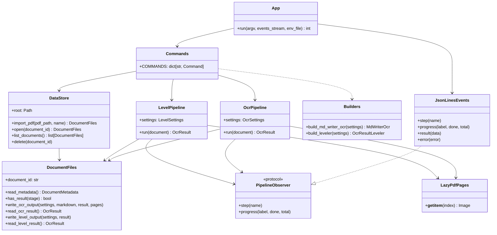
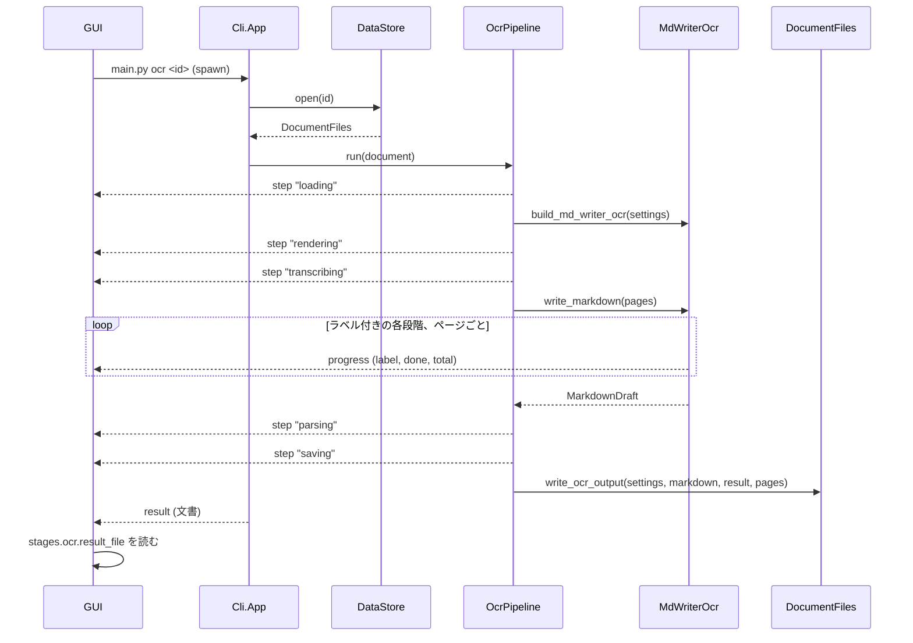

# コマンドライン

`main.py` は、GUI（または人）が Uploader を実行するための入口。PDF を `Uploader/Data`
に取り込み、MdWriter OCR で読み、Leveler で結果を入れ子にする。どのコマンドも stdout に
[JSON Lines](https://jsonlines.org/) を書くので、呼び出し側は進捗を逐次受け取り、最後に
結果を受け取れる。

English: [Cli.md](Cli.md)

## コマンド

`Uploader` ディレクトリで実行する:

```bash
uv run python main.py list
uv run python main.py import path/to/book.pdf [--name "Book"]
uv run python main.py show <document_id>
uv run python main.py delete <document_id>
uv run python main.py ocr <document_id> [--max-pages 5] [--model ...] ...
uv run python main.py level <document_id> [--model ...]
```

| コマンド | 内容 | result の `data` |
| --- | --- | --- |
| `list` | 保存済みの全文書を、取り込みの古い順に列挙する | 文書のリスト |
| `import PDF` | PDF をストアへ新しい文書としてコピーする | 文書 |
| `show ID` | 1つの文書を説明する | 文書 |
| `delete ID` | 文書とその全ファイルを削除する | `{"document_id": ...}` |
| `ocr ID` | MdWriter で文書を読む。以前の OCR 結果と Leveler 結果は破棄される | 文書 |
| `level ID` | OCR 結果を見出しレベルで入れ子にする。先に `ocr` が必要 | 文書 |

コマンドの前に置く共通オプション: `--data-dir`（既定は `Uploader/Data`）と
`--log-level`。`uv run python main.py <command> --help` で各コマンドの全オプションを表示する。

### `ocr` のオプション

| オプション | 既定値 | 意味 |
| --- | --- | --- |
| `--provider` | `OCR_PROVIDER`、なければ `openai` | `openai` または `bedrock` |
| `--model` | `OCR_MODEL_ID`、なければプロバイダごとの既定 | ページを書き、ページ境界の連結を判定するモデル |
| `--reasoning-effort` | `OPENAI_REASONING_EFFORT` | 例: `low`。未指定ならモデルの既定 |
| `--max-tokens` | 16000 | 1回の回答の最大トークン数 |
| `--detector` | `doclayout` | `doclayout`、`yomitoku`、`ppstructure` のいずれか |
| `--reference` | `none` | `yomitoku` ならローカル OCR の文字とモデルに照合させる |
| `--figure-corrector-model` | `FIGURE_CORRECTOR_MODEL_ID`、なければ Qwen3-VL | 誤った図の枠を描き直す Bedrock モデル。`none` で無効 |
| `--max-figure-corrections` | 2 | 1ページあたり |
| `--dpi` | 200 | 結果のページ番号と図の枠はこの解像度を基準にする |
| `--max-parallel` | 8 | 同時にモデルへ送る最大ページ数 |
| `--max-pages` | 全ページ | 先頭の数ページだけ読む（安く試すため） |

### `level` のオプション

| オプション | 既定値 |
| --- | --- |
| `--provider` | `LEVELER_PROVIDER`、なければ `openai` |
| `--model` | `LEVELER_MODEL_ID`、なければ `gpt-6-sol` |
| `--reasoning-effort` | `LEVELER_REASONING_EFFORT` |
| `--max-tokens` | 16000 |

ページは OCR 実行時と同じ DPI・同じページ数で描画される。

## イベント

stdout の各行が1つの JSON オブジェクトで、種類は `event` に入る:

```json
{"event": "step", "name": "transcribing"}
{"event": "progress", "label": "writing", "done": 3, "total": 20}
{"event": "result", "data": {"document_id": "...", "...": "..."}}
{"event": "error", "type": "DocumentNotFoundError", "message": "No document ..."}
```

- `step`: パイプラインのステップが始まった。`ocr` は `loading`、`rendering`、
  `transcribing`、`parsing`、`saving`、`level` は `loading`、`leveling`、`saving` の順。
- `progress`: ラベル付きの段階が `total` 件中 `done` 件を終えた。開始時に `done: 0` で
  1回通知される。OCR の段階は `detecting figures`、`reading reference`（`--reference`
  指定時）、`writing`。
- `result`: コマンドが成功した。必ず最後の行で、終了コードは 0。
- `error`: コマンドが失敗した。必ず最後の行で、終了コードは 1（中断時は 130）。`type` は
  例外のクラス名（`DocumentNotFoundError`、`MissingOcrResultError`、
  `MissingApiKeyError` など）。

引数の誤りは argparse が stderr に出力し、イベントなしで終了コード 2 になる。

各行は ASCII のみ（ASCII 以外の文字は `\u` でエスケープ）なので、コンソールのコードページで
文字化けしない。stdout にはイベント以外は書かれない: `main.py` は何かを import する前に
プロセスの stdout のファイルディスクリプタを stderr に付け替えるため、ライブラリが Python から
でもネイティブコードからでもバナーを出力して行を壊すことはない。stderr にはトレースバックと
ライブラリの出力が流れ、パイプラインのログは文書の `logs/<stage>.log` に書かれる。

### 文書

`import`、`show`、`ocr`、`level` の result（および `list` の各要素）:

```json
{
  "document_id": "7948df4b0692489da2a5adb45b2bffca",
  "name": "shido_math",
  "source_file_name": "shido_math.pdf",
  "page_count": 20,
  "created_at": "2026-09-27T09:10:20.553353+00:00",
  "directory": "C:\\...\\Data\\Documents\\7948df...",
  "source_pdf": "C:\\...\\source.pdf",
  "stages": {
    "ocr": {
      "done": true,
      "settings": {"provider": "openai", "model": "gpt-5.6-luna", "dpi": 200, "...": "..."},
      "result_file": "C:\\...\\ocr\\result.json",
      "markdown_file": "C:\\...\\ocr\\draft.md",
      "pages_dir": "C:\\...\\ocr\\pages",
      "log_file": "C:\\...\\logs\\ocr.log"
    },
    "level": {
      "done": false,
      "settings": null,
      "result_file": "C:\\...\\level\\result.json",
      "log_file": "C:\\...\\logs\\level.log"
    }
  }
}
```

パスはすべて絶対パス。result ファイルには `OcrResult` が JSON で入っている
（[README.ja.md](../README.ja.md) の文書ツリーを参照）。`settings` はその段階が完了するまで `null`。

## データの配置

`DataStore` は文書ごとに、ID を名前にしたフォルダを作る:

```
Data/Documents/<document_id>/
    document.json          DocumentMetadata
    source.pdf             取り込んだ PDF
    ocr/settings.json      OCR の実行設定
    ocr/draft.md           モデルが書いた Markdown
    ocr/result.json        OcrResult
    ocr/pages/page_<N>.png モデルが見た各ページ（図の枠つき）
    level/settings.json    Leveler の実行設定
    level/result.json      見出しレベルで入れ子にした OcrResult
    logs/ocr.log, logs/level.log
```

各段階の `result.json` は最後にアトミックに書かれるので、実行が途中で強制終了されても、
このファイルが存在するときだけ「完了」とみなせる。フォルダは `document.json` が書かれた時点で
文書として扱われる。`Data/` はコミットしない。

## 構成



| モジュール | 責務 |
| --- | --- |
| [main.py](../main.py) | stdout をイベント専用に確保し、`Cli.App` に処理を渡す |
| [Cli/App.py](../Cli/App.py) | `.env` を読み、引数を解析してコマンドを実行し、result か error のイベントで終える |
| [Cli/Parser.py](../Cli/Parser.py) | 引数、環境変数からの既定値、引数が表す設定 |
| [Cli/Commands.py](../Cli/Commands.py) | 各コマンドの処理。ログの出力先を文書のログファイルにする |
| [Cli/Events.py](../Cli/Events.py) | JSON Lines を書く |
| [Cli/DocumentView.py](../Cli/DocumentView.py) | 文書を素の JSON 値で表す |
| [Pipeline/OcrPipeline.py](../Pipeline/OcrPipeline.py) | PDF → ページ画像 → MdWriter → `OcrResult`、そして保存 |
| [Pipeline/LevelPipeline.py](../Pipeline/LevelPipeline.py) | 保存済み `OcrResult` → Leveler → 入れ子の `OcrResult`、そして保存 |
| [Pipeline/Settings.py](../Pipeline/Settings.py) | `OcrSettings` と `LevelSettings`。生成物と並べて保存される |
| [Pipeline/Builders.py](../Pipeline/Builders.py) | 設定から `MdWriterOcr` と `OcrResultLeveler` を組み立てる |
| [Pipeline/ChatModels.py](../Pipeline/ChatModels.py) | OpenAI または Bedrock のチャットモデルを作る |
| [Pipeline/PdfPages.py](../Pipeline/PdfPages.py) | PDF の各ページを、読まれたときに描画する |
| [DataStore/DataStore.py](../DataStore/DataStore.py) | `Data/Documents` 以下の全文書 |
| [DataStore/DocumentFiles.py](../DataStore/DocumentFiles.py) | 1つの文書のファイル群 |

パイプラインは OCR や Leveler を自分で組み立てず、ファクトリを受け取るので、単体テストでは
フェイクで実行できる。進捗は [PageParallel.py](../OcrModule/Blocked/PageParallel.py) の
`listening_progress()` を通じてイベントに届く。ラベル付きの `run_parallel()` の段階は
すべてここに通知される。

### `ocr` コマンド



## GUI からの呼び出し方

- `uv` を、引数 `run python main.py ...` を配列で渡し、`cwd` を `Uploader` にして、
  シェルを介さずに起動する。
- stdout は行単位に分割する。チャンクは行の途中で切れることがあるので、残りは次のチャンクに回す。
- stderr は、コマンドが error で終わったときに表示するため保持しておく。
- キャンセル時はプロセスツリーごと終了させる（`uv` は `python` を子プロセスとして起動する）。
- result はファイルを絶対パスで示す。ツリーは `result_file` を読んで取得する。
