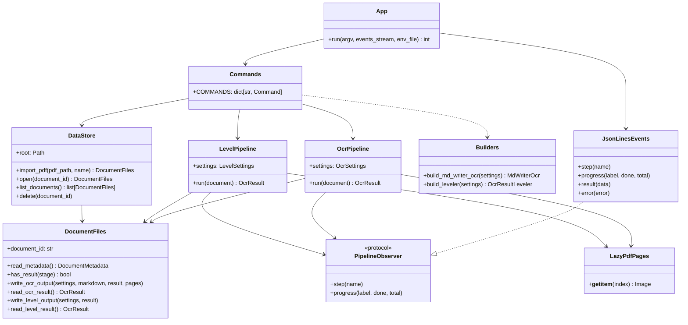
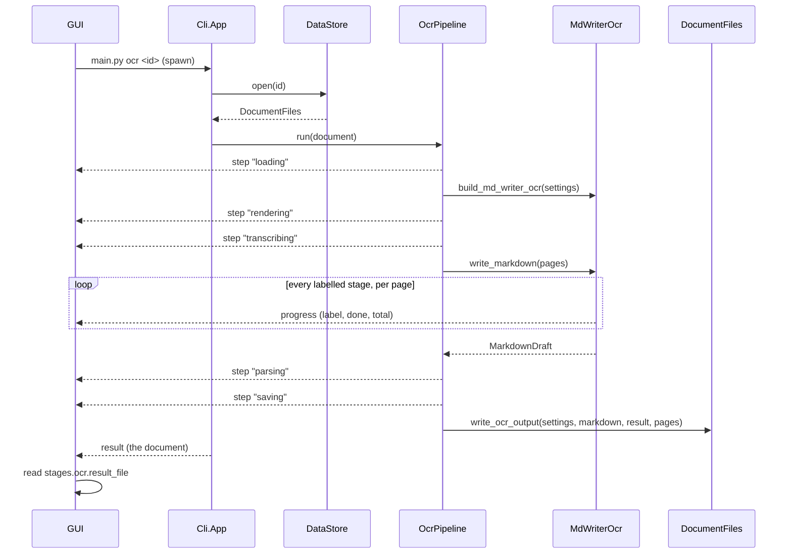

# Command line

`main.py` is how the GUI (or a person) runs the Uploader: it imports PDFs into
`Uploader/Data`, reads them with the MdWriter OCR, and nests the result with the
Leveler. Every command writes [JSON Lines](https://jsonlines.org/) to stdout, so a
caller reads the progress as it goes and the result at the end.

日本語版: [Cli.ja.md](Cli.ja.md)

## Commands

Run from the `Uploader` directory:

```bash
uv run python main.py list
uv run python main.py import path/to/book.pdf [--name "Book"]
uv run python main.py show <document_id>
uv run python main.py delete <document_id>
uv run python main.py ocr <document_id> [--max-pages 5] [--model ...] ...
uv run python main.py level <document_id> [--model ...]
```

| Command | Does | Result `data` |
| --- | --- | --- |
| `list` | Lists every stored document, the earliest imported first | a list of documents |
| `import PDF` | Copies the PDF into the store as a new document | the document |
| `show ID` | Describes one document | the document |
| `delete ID` | Removes a document and all its files | `{"document_id": ...}` |
| `ocr ID` | Reads the document with MdWriter; drops any earlier OCR and leveled tree | the document |
| `level ID` | Nests the OCR result by heading level; needs `ocr` first | the document |

Global options, before the command: `--data-dir` (default `Uploader/Data`) and
`--log-level`. `uv run python main.py <command> --help` lists every option of a
command.

### Options of `ocr`

| Option | Default | Meaning |
| --- | --- | --- |
| `--provider` | `OCR_PROVIDER`, else `openai` | `openai` or `bedrock` |
| `--model` | `OCR_MODEL_ID`, else the provider's default | writes the pages and settles the page turns |
| `--reasoning-effort` | `OPENAI_REASONING_EFFORT` | e.g. `low`; unset leaves the model's default |
| `--max-tokens` | 16000 | most tokens of one answer |
| `--detector` | `doclayout` | `doclayout`, `yomitoku` or `ppstructure` |
| `--reference` | `none` | `yomitoku` has the model check its characters against a local OCR |
| `--figure-corrector-model` | `FIGURE_CORRECTOR_MODEL_ID`, else Qwen3-VL | Bedrock model redrawing wrong figure boxes; `none` leaves it out |
| `--max-figure-corrections` | 2 | per page |
| `--dpi` | 200 | the page indexes and figure boxes of the result refer to it |
| `--max-parallel` | 8 | most pages sent to the model at once |
| `--max-pages` | all | reads only the first pages, for a cheap try |

### Options of `level`

| Option | Default |
| --- | --- |
| `--provider` | `LEVELER_PROVIDER`, else `openai` |
| `--model` | `LEVELER_MODEL_ID`, else `gpt-6-sol` |
| `--reasoning-effort` | `LEVELER_REASONING_EFFORT` |
| `--max-tokens` | 16000 |

The pages are rendered at the DPI, and up to the page count, the OCR ran with.

## Events

Each line of stdout is one JSON object, its kind in `event`:

```json
{"event": "step", "name": "transcribing"}
{"event": "progress", "label": "writing", "done": 3, "total": 20}
{"event": "result", "data": {"document_id": "...", "...": "..."}}
{"event": "error", "type": "DocumentNotFoundError", "message": "No document ..."}
```

- `step`: a step of a pipeline has started. `ocr` goes `loading`, `rendering`,
  `transcribing`, `parsing`, `saving`; `level` goes `loading`, `leveling`, `saving`.
- `progress`: a labelled stage has done `done` of its `total` items; told once with
  `done: 0` as it starts. The OCR's stages are `detecting figures`,
  `reading reference` (with `--reference`) and `writing`.
- `result`: the command succeeded; always the last line, exit code 0.
- `error`: the command failed; always the last line, exit code 1 (130 when
  interrupted). `type` is the exception's class name, such as
  `DocumentNotFoundError`, `MissingOcrResultError` or `MissingApiKeyError`.

Wrong arguments are told by argparse on stderr, with exit code 2 and no event.

Every line is ASCII: non-ASCII text is `\u` escaped, so no console code page can
garble it. Nothing else is written to stdout: `main.py` points the process's stdout
file descriptor at stderr before anything is imported, so a library printing a
banner, from Python or native code, cannot break a line. stderr carries tracebacks
and whatever the libraries print; a pipeline's logging goes to the document's
`logs/<stage>.log`.

### A document

`result` of `import`, `show`, `ocr` and `level` (and each item of `list`):

```json
{
  "document_id": "7948df4b0692489da2a5adb45b2bffca",
  "name": "shido_math",
  "source_file_name": "shido_math.pdf",
  "page_count": 20,
  "created_at": "2026-09-27T09:10:20.553353+00:00",
  "directory": "C:\\...\\Data\\Documents\\7948df...",
  "source_pdf": "C:\\...\\source.pdf",
  "stages": {
    "ocr": {
      "done": true,
      "settings": {"provider": "openai", "model": "gpt-5.6-luna", "dpi": 200, "...": "..."},
      "result_file": "C:\\...\\ocr\\result.json",
      "markdown_file": "C:\\...\\ocr\\draft.md",
      "pages_dir": "C:\\...\\ocr\\pages",
      "log_file": "C:\\...\\logs\\ocr.log"
    },
    "level": {
      "done": false,
      "settings": null,
      "result_file": "C:\\...\\level\\result.json",
      "log_file": "C:\\...\\logs\\level.log"
    }
  }
}
```

Every path is absolute. A result file holds an `OcrResult` as JSON (see
[README.md](../README.md#document-tree)); `settings` is `null` until the stage is done.

## Data layout

`DataStore` keeps each document in a folder of its own, named by its id:

```
Data/Documents/<document_id>/
    document.json          DocumentMetadata
    source.pdf             the PDF as imported
    ocr/settings.json      what the OCR ran with
    ocr/draft.md           the Markdown the model wrote
    ocr/result.json        the OcrResult
    ocr/pages/page_<N>.png every page as the model saw it, figures boxed
    level/settings.json    what the Leveler ran with
    level/result.json      the OcrResult nested by heading level
    logs/ocr.log, logs/level.log
```

A stage's `result.json` is written last and atomically, so a stage counts as done
exactly when it exists, even if a run was killed mid-way. A folder counts as a
document once `document.json` is written. `Data/` is not committed.

## Architecture



| Module | Responsibility |
| --- | --- |
| [main.py](../main.py) | Claims stdout for the events, then hands over to `Cli.App` |
| [Cli/App.py](../Cli/App.py) | Loads `.env`, parses the arguments, runs the command, ends on a result or error event |
| [Cli/Parser.py](../Cli/Parser.py) | The arguments, their defaults from the environment, and the settings they describe |
| [Cli/Commands.py](../Cli/Commands.py) | What each command does; points the logging at the document's log file |
| [Cli/Events.py](../Cli/Events.py) | Writes the JSON Lines |
| [Cli/DocumentView.py](../Cli/DocumentView.py) | A document as plain JSON values |
| [Pipeline/OcrPipeline.py](../Pipeline/OcrPipeline.py) | PDF → pages → MdWriter → `OcrResult`, stored |
| [Pipeline/LevelPipeline.py](../Pipeline/LevelPipeline.py) | stored `OcrResult` → Leveler → nested `OcrResult`, stored |
| [Pipeline/Settings.py](../Pipeline/Settings.py) | `OcrSettings` and `LevelSettings`, stored beside what they produced |
| [Pipeline/Builders.py](../Pipeline/Builders.py) | Builds `MdWriterOcr` and `OcrResultLeveler` out of their settings |
| [Pipeline/ChatModels.py](../Pipeline/ChatModels.py) | Builds an OpenAI or Bedrock chat model |
| [Pipeline/PdfPages.py](../Pipeline/PdfPages.py) | The pages of a PDF, each rendered as it is read |
| [DataStore/DataStore.py](../DataStore/DataStore.py) | Every document under `Data/Documents` |
| [DataStore/DocumentFiles.py](../DataStore/DocumentFiles.py) | The files of one document |

The pipelines take a factory for the OCR or the Leveler rather than building it, so
the unit tests run them with fakes. Progress reaches the events through
`listening_progress()` of [PageParallel.py](../OcrModule/Blocked/PageParallel.py),
which every labelled `run_parallel()` stage reports to.

### The `ocr` command



## Calling it from the GUI

- Spawn `uv` with the arguments `run python main.py ...` as an array, `cwd` set to
  `Uploader`, and no shell.
- Split stdout into lines; a chunk may end mid-line, so keep the rest for the next one.
- Keep stderr to show when the command ends on an error.
- To cancel, kill the whole process tree: `uv` starts `python` as a child of its own.
- The result names files by absolute path; read `result_file` for the tree.
