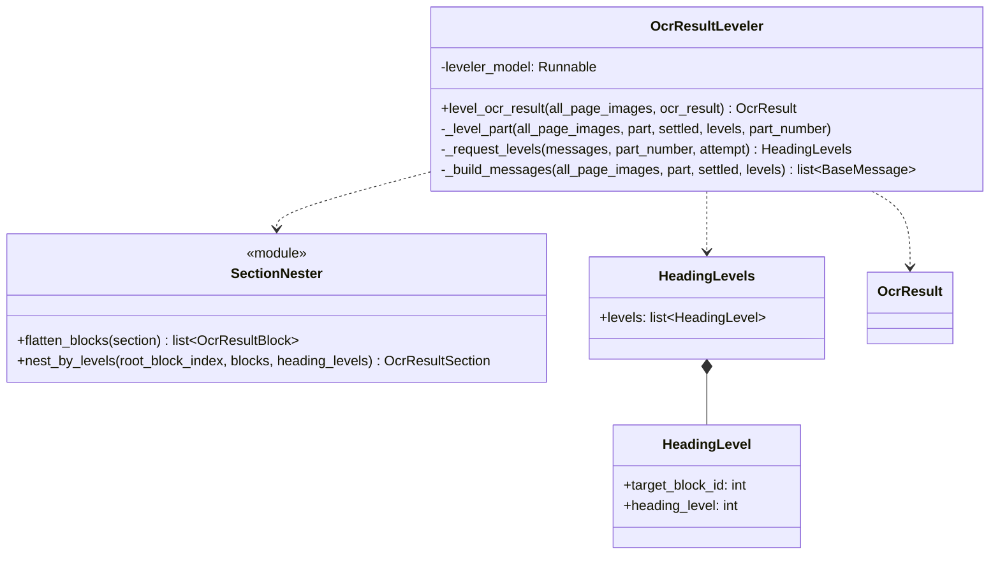
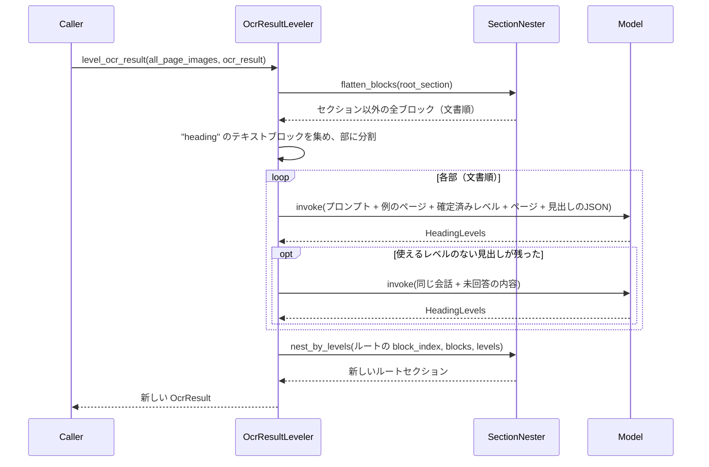

# Leveler

English version: [Leveler.md](Leveler.md)

`Leveler` は、既に `OcrResult`（[OcrSchema.py](../../OcrModule/OcrSchema.py)）として
読み終えた文書の全見出しにレベルを付け、各見出しがそのレベルに応じて入れ子になった
セクションを開くよう木を組み直す。入力はどのパイプラインの出力でもよい。例えば
MdWriter の出力では見出しがすべて1段になっている。

どのパイプラインからも呼ばれない。呼び出し側が完成した木に対して実行する。

| ファイル | 責務 |
| --- | --- |
| [OcrResultLeveler.py](../OcrResultLeveler.py) | 部ごとに全見出しのレベルをモデルに尋ね、入れ子にした木を返す |
| [SectionNester.py](../SectionNester.py) | 木をブロックの列に平坦化し、見出しレベルで入れ子に戻す |
| [LevelerSchema.py](../LevelerSchema.py) | モデルの構造化出力 `HeadingLevels` |
| [prompt.py](../prompt.py) | モデルのシステムプロンプト |

## クラス

## 処理の流れ

## 見出しの順位付け

- 最初に木を平坦化するので、元の入れ子に関係なく全見出しを一から順位付けし直す。
- 見出しとは `block_type` が `"heading"` の `OcrResultBlockText`。JSON 上の `block_id` は
  その `block_index`、ページは `existing_pages` の最初のページ。
- この時点で本文は読み終えているので、JSON には見出しの**テキスト**も含める。`2.1` の
  ような番号付けがレベルの最も強い根拠で、番号がない場合はページ画像で判断する。
  ページを持たない見出しは画像なしで列挙する。
- 見出しは見出しを含むページ `MAX_PAGES_PER_REQUEST` 枚ずつ送る。2番目以降の部には、
  確定済みの各レベルにつき1枚の例のページと確定済みレベルを添え、部をまたいで階層を
  揃える。
- 文書のタイトルがレベル `TOP_HEADING_LEVEL`（1）。それより上のレベル、尋ねていない
  ブロックへの回答、回答漏れの見出しは、既に付けたレベルを保ったまま再度尋ねる。
  `MAX_ATTEMPT_COUNT` 回試してもレベルの付かない見出しが残れば `RuntimeError` で止める。

## 木の組み直し

`OcrResultBlockText` にはレベルのフィールドがないため、レベルは `block_index` をキー
とする辞書に保持する。その後 `nest_by_levels` が開いているセクションのスタックを
持ってブロックを順にたどる:

- 見出しは、自分と同じかより深いレベルの開いたセクションをすべて閉じてから、自分の
  セクションを開く。レベル0のルートセクションは閉じない。
- 見出し自身も含め、各ブロックは最も内側の開いたセクションに入る。
- 渡された木は変更しない。新しい木は同じブロックオブジェクトを保持する。新しい各
  セクションは既存のどの index よりも大きい `block_index` を取る。ルートは元の
  `block_index` を保ち、全セクションの `existing_pages` を計算し直す。
