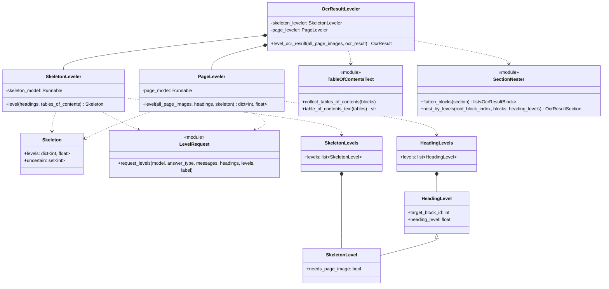
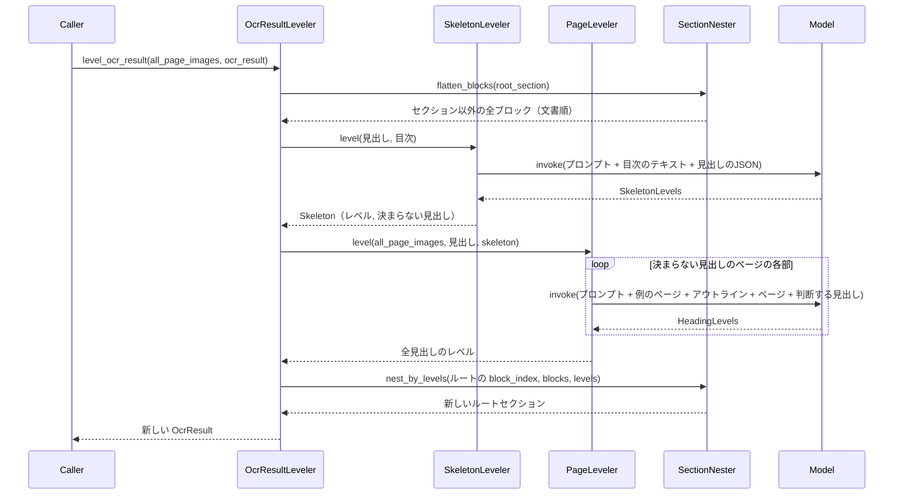

# Leveler

English version: [Leveler.md](Leveler.md)

`Leveler` は、既に `OcrResult`（[OcrSchema.py](../../OcrModule/OcrSchema.py)）として
読み終えた文書の全見出しにレベルを付け、各見出しがそのレベルに応じて入れ子になった
セクションを開くよう木を組み直す。入力はどのパイプラインの出力でもよい。例えば
MdWriter の出力では見出しがすべて1段になっている。

どのパイプラインからも呼ばれない。呼び出し側が完成した木に対して実行する。サンプル PDF で
試して評価する手順は [TestLeveler_setup.md](../../Test/Manual/Leveler/TestLeveler_setup.md) を参照。

処理は2段で行う:

1. **骨組み**: 画像なしの1リクエストで、見出しのテキストと文書中の目次から階層全体を決める。
   テキストでは決まらない見出しには印を付ける。
2. **ページ**: 印の付いた見出しだけを、印刷されたページから判断する。確定済みのレベルに
   当てはめ、2つのレベルの間に入るものには小数のレベルを付ける。

| ファイル | 責務 |
| --- | --- |
| [OcrResultLeveler.py](../OcrResultLeveler.py) | 2つの段を実行し、入れ子にした木を返す |
| [SkeletonLeveler.py](../SkeletonLeveler.py) | 段1: テキストと目次から全見出しのレベルを付け、決まらないものに印を付ける |
| [PageLeveler.py](../PageLeveler.py) | 段2: 印の付いた見出しをページから判断する。1回に `MAX_PAGES_PER_REQUEST`（16）ページ |
| [LevelRequest.py](../LevelRequest.py) | 尋ねた全見出しに使えるレベルが付くまでモデルに尋ねる |
| [Headings.py](../Headings.py) | モデルに見せる見出しとその JSON、回答の記録 |
| [TableOfContentsText.py](../TableOfContentsText.py) | 目次ブロックを字下げしたテキストにする |
| [SectionNester.py](../SectionNester.py) | 木をブロックの列に平坦化し、見出しレベルで入れ子に戻す |
| [LevelerSchema.py](../LevelerSchema.py) | モデルの構造化出力 `SkeletonLevels` と `HeadingLevels` |
| [prompt.py](../prompt.py) | 2つの段のシステムプロンプト |

## クラス

```mermaid
classDiagram
    class OcrResultLeveler {
        -skeleton_leveler: SkeletonLeveler
        -page_leveler: PageLeveler
        +level_ocr_result(all_page_images, ocr_result) OcrResult
    }
    class SkeletonLeveler {
        -skeleton_model: Runnable
        +level(headings, tables_of_contents) Skeleton
    }
    class PageLeveler {
        -page_model: Runnable
        +level(all_page_images, headings, skeleton) dict~int, float~
    }
    class Skeleton {
        +levels: dict~int, float~
        +uncertain: set~int~
    }
    class LevelRequest {
        <<module>>
        +request_levels(model, answer_type, messages, headings, levels, label)
    }
    class TableOfContentsText {
        <<module>>
        +collect_tables_of_contents(blocks)
        +table_of_contents_text(tables) str
    }
    class SectionNester {
        <<module>>
        +flatten_blocks(section) list~OcrResultBlock~
        +nest_by_levels(root_block_index, blocks, heading_levels) OcrResultSection
    }
    class SkeletonLevels {
        +levels: list~SkeletonLevel~
    }
    class HeadingLevels {
        +levels: list~HeadingLevel~
    }
    class HeadingLevel {
        +target_block_id: int
        +heading_level: float
    }
    class SkeletonLevel {
        +needs_page_image: bool
    }
    OcrResultLeveler *-- SkeletonLeveler
    OcrResultLeveler *-- PageLeveler
    OcrResultLeveler ..> SectionNester
    OcrResultLeveler ..> TableOfContentsText
    SkeletonLeveler ..> Skeleton
    SkeletonLeveler ..> LevelRequest
    SkeletonLeveler ..> SkeletonLevels
    PageLeveler ..> Skeleton
    PageLeveler ..> LevelRequest
    PageLeveler ..> HeadingLevels
    SkeletonLevels *-- SkeletonLevel
    HeadingLevels *-- HeadingLevel
    HeadingLevel <|-- SkeletonLevel
```

## 処理の流れ

```mermaid
sequenceDiagram
    participant Caller
    participant OcrResultLeveler
    participant SkeletonLeveler
    participant PageLeveler
    participant SectionNester
    participant Model
    Caller->>OcrResultLeveler: level_ocr_result(all_page_images, ocr_result)
    OcrResultLeveler->>SectionNester: flatten_blocks(root_section)
    SectionNester-->>OcrResultLeveler: セクション以外の全ブロック（文書順）
    OcrResultLeveler->>SkeletonLeveler: level(見出し, 目次)
    SkeletonLeveler->>Model: invoke(プロンプト + 目次のテキスト + 見出しのJSON)
    Model-->>SkeletonLeveler: SkeletonLevels
    SkeletonLeveler-->>OcrResultLeveler: Skeleton（レベル, 決まらない見出し）
    OcrResultLeveler->>PageLeveler: level(all_page_images, 見出し, skeleton)
    loop 決まらない見出しのページの各部
        PageLeveler->>Model: invoke(プロンプト + 例のページ + アウトライン + ページ + 判断する見出し)
        Model-->>PageLeveler: HeadingLevels
    end
    PageLeveler-->>OcrResultLeveler: 全見出しのレベル
    OcrResultLeveler->>SectionNester: nest_by_levels(ルートの block_index, blocks, levels)
    SectionNester-->>OcrResultLeveler: 新しいルートセクション
    OcrResultLeveler-->>Caller: 新しい OcrResult
```

どちらのリクエストも、回答で使えるレベルのない見出しが残れば、同じ会話で尋ね直す
（[見出しの順位付け](#見出しの順位付け) を参照）。

## 見出しの順位付け

- 最初に木を平坦化するので、元の入れ子に関係なく全見出しを一から順位付けし直す。
- 見出しとは `block_type` が `"heading"` の `OcrResultBlockText`。JSON 上の `block_id` は
  その `block_index`、ページは `existing_pages` の最初のページ。
- レベル1は文書自身のタイトルだけ。タイトルが印刷されていない文書にはレベル1の見出しが
  なく、最も外側の見出しがレベル2になる。
- レベル1より上の回答、尋ねていないブロックへの回答、回答漏れの見出しは、既に付けた
  レベルを保ったまま再度尋ねる。`MAX_ATTEMPT_COUNT`（3）回試してもレベルの付かない見出しが
  残れば `RuntimeError` で止める。

### 骨組み（テキストから）

- 全見出しをテキスト付きの JSON で一度に送り、階層全体を一目で判断させる。`2.1` や
  `第2章` のような番号付けはレベルの強い根拠になる。
- `OcrResultBlockTableOfContents` はすべて、`番号 | タイトル | ページ` の字下げした行に書き出す。
  各目次の前には、そのブロックとページを示す1行を置く。文書全体の目次も、章ごとの目次も
  含める。項目の入れ子は著者自身の階層で、モデルは各項目がどの見出しに当たるかを照合する。
- テキストでは決まらない見出しには、モデルが `needs_page_image` を付ける。例えば番号がなく
  どの目次にも載っていない見出しや、タイトルなのかその上の帯なのか分からない行。それ以外の
  レベルはここで確定する。
- 見出しが `MAX_HEADINGS_PER_SKELETON`（600）を超えると警告をログに出す。リクエストの分割は
  まだしない。

### 決まらない見出し（ページから）

- 印の付いた見出しのページだけを、`MAX_PAGES_PER_REQUEST`（16）ページずつ送る。すべての
  見出しが確定していれば、ページは1枚も送らない。
- 各リクエストには次も添える:
  - 確定済みの各レベルにつき1枚の例のページ（そのレベルの最初の見出し）。その部で送る
    ページは例として重ねて送らない。
  - 文書全体のアウトラインの JSON。確定済みの見出しには `heading_level` を付ける。印の
    付いた見出しは `"decide": true` とし、テキストから見た `draft_level` を添える。
- 確定済みのレベルは変えない。確定済みの2つのレベルの間に入る見出しは、2.5 のような
  その間の小数を取るので、確定済みの見出しを押し下げる必要がない。前の部で決めた見出しは、
  後の部では確定済みとして扱う。

## 木の組み直し

`OcrResultBlockText` にはレベルのフィールドがないため、レベルは `block_index` をキー
とする辞書に保持する。その後 `nest_by_levels` が開いているセクションのスタックを
持ってブロックを順にたどる:

- 見出しは、自分と同じかより深いレベルの開いたセクションをすべて閉じてから、自分の
  セクションを開く。レベル0のルートセクションは閉じない。レベルは比較するだけなので、
  小数のレベルは前後の整数レベルの間に入れ子になる。飛ばしたレベル（2 → 4）は単に1段深く
  入れ子になる。
- 見出し自身や目次ブロックも含め、各ブロックは最も内側の開いたセクションに入る。
- 渡された木は変更しない。新しい木は同じブロックオブジェクトを保持する。新しい各
  セクションは既存のどの index よりも大きい `block_index` を取る。ルートは元の
  `block_index` を保ち、全セクションの `existing_pages` を計算し直す。
