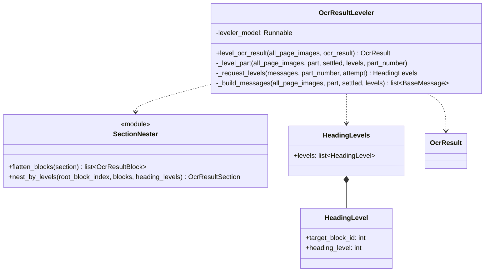
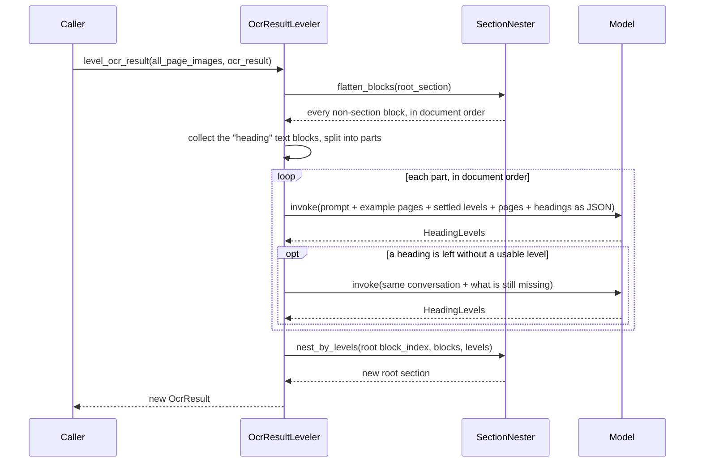

# Leveler

日本語版: [Leveler.ja.md](Leveler.ja.md)

`Leveler` ranks every heading of a document that has already been read into an
`OcrResult` ([OcrSchema.py](../../OcrModule/OcrSchema.py)), and rebuilds its tree so
that each heading opens a section nested by its level. The input can come from any
pipeline. MdWriter's output is one example: all of its headings sit one level deep.

No pipeline calls it. A caller runs it on a finished tree.

| File | Responsibility |
| --- | --- |
| [OcrResultLeveler.py](../OcrResultLeveler.py) | Asks the model for the level of every heading, part by part, and returns the nested tree |
| [SectionNester.py](../SectionNester.py) | Flattens a tree into its blocks, and nests them again by heading level |
| [LevelerSchema.py](../LevelerSchema.py) | `HeadingLevels`, the structured answer of the model |
| [prompt.py](../prompt.py) | The model's system prompt |

## Classes

## Flow

## How headings are ranked

- The tree is flattened first, so every heading is ranked again from scratch, however
  it was nested before.
- A heading is an `OcrResultBlockText` whose `block_type` is `"heading"`. Its
  `block_index` is its `block_id` in the JSON, and its page is the first of its
  `existing_pages`.
- The JSON also holds the heading's **text**, since the text has been read by now.
  Numbering such as `2.1` is the strongest evidence of a level. Where there is none,
  the page image decides. A heading with no page is listed without an image.
- Headings are sent `MAX_PAGES_PER_REQUEST` heading pages at a time. Every part after
  the first also carries one example page per level already settled, with the levels
  settled so far, so the hierarchy stays consistent across parts.
- The document's title is level `TOP_HEADING_LEVEL` (1). The model is asked again about
  an answer below that, an answer for a block it was not asked about, or a heading it
  left out, with the levels it already gave kept. If a heading still has no level after
  `MAX_ATTEMPT_COUNT` attempts, the run stops with a `RuntimeError`.

## How the tree is rebuilt

`OcrResultBlockText` has no level field, so levels are kept in a map keyed by
`block_index`. `nest_by_levels` then walks the blocks in order, keeping a stack of open
sections:

- A heading closes every open section of its own level or deeper, then opens a new
  section of its own. The root section, at level 0, is never closed.
- Every block, the heading included, goes into the innermost open section.
- The given tree is left as it is. The new tree holds the same block objects. Each new
  section takes a `block_index` above every index already in use. The root keeps its
  own `block_index`, and `existing_pages` is recomputed for every section.
