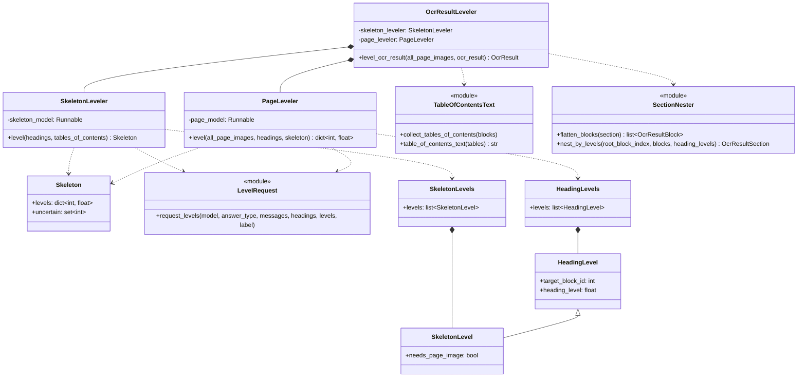
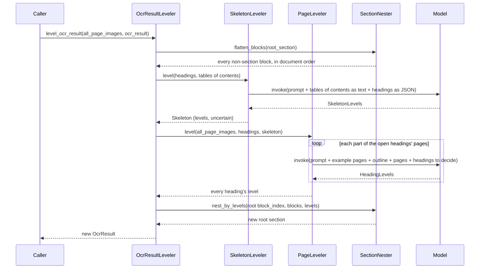

# Leveler

日本語版: [Leveler.ja.md](Leveler.ja.md)

`Leveler` ranks every heading of a document that has already been read into an
`OcrResult` ([OcrSchema.py](../../OcrModule/OcrSchema.py)), and rebuilds its tree so
that each heading opens a section nested by its level. The input can come from any
pipeline. MdWriter's output is one example: all of its headings sit one level deep.

No pipeline calls it. A caller runs it on a finished tree. To try it on the sample
PDFs and score it, see [TestLeveler_setup.en.md](../../Test/Manual/Leveler/TestLeveler_setup.en.md).

It works in two stages:

1. **Skeleton**: one text-only request lays out the whole hierarchy from the headings'
   text and the document's tables of contents. It also marks the headings the text
   leaves open.
2. **Pages**: only the open headings are decided from their printed pages. They are
   fitted into the settled levels, with a decimal level where they rank between two.

| File | Responsibility |
| --- | --- |
| [OcrResultLeveler.py](../OcrResultLeveler.py) | Runs the two stages and returns the nested tree |
| [SkeletonLeveler.py](../SkeletonLeveler.py) | Stage 1: levels every heading from text and tables of contents, and marks the open ones |
| [PageLeveler.py](../PageLeveler.py) | Stage 2: decides the open headings from their pages, `MAX_PAGES_PER_REQUEST` (16) pages at a time |
| [LevelRequest.py](../LevelRequest.py) | Asks the model until every heading asked about has a usable level |
| [Headings.py](../Headings.py) | The headings as the model sees them, as JSON, and how answers are recorded |
| [TableOfContentsText.py](../TableOfContentsText.py) | Writes the table of contents blocks out as indented text |
| [SectionNester.py](../SectionNester.py) | Flattens a tree into its blocks, and nests them again by heading level |
| [LevelerSchema.py](../LevelerSchema.py) | The structured answers of the model: `SkeletonLevels` and `HeadingLevels` |
| [prompt.py](../prompt.py) | The system prompts of the two stages |

## Classes

```mermaid
classDiagram
    class OcrResultLeveler {
        -skeleton_leveler: SkeletonLeveler
        -page_leveler: PageLeveler
        +level_ocr_result(all_page_images, ocr_result) OcrResult
    }
    class SkeletonLeveler {
        -skeleton_model: Runnable
        +level(headings, tables_of_contents) Skeleton
    }
    class PageLeveler {
        -page_model: Runnable
        +level(all_page_images, headings, skeleton) dict~int, float~
    }
    class Skeleton {
        +levels: dict~int, float~
        +uncertain: set~int~
    }
    class LevelRequest {
        <<module>>
        +request_levels(model, answer_type, messages, headings, levels, label)
    }
    class TableOfContentsText {
        <<module>>
        +collect_tables_of_contents(blocks)
        +table_of_contents_text(tables) str
    }
    class SectionNester {
        <<module>>
        +flatten_blocks(section) list~OcrResultBlock~
        +nest_by_levels(root_block_index, blocks, heading_levels) OcrResultSection
    }
    class SkeletonLevels {
        +levels: list~SkeletonLevel~
    }
    class HeadingLevels {
        +levels: list~HeadingLevel~
    }
    class HeadingLevel {
        +target_block_id: int
        +heading_level: float
    }
    class SkeletonLevel {
        +needs_page_image: bool
    }
    OcrResultLeveler *-- SkeletonLeveler
    OcrResultLeveler *-- PageLeveler
    OcrResultLeveler ..> SectionNester
    OcrResultLeveler ..> TableOfContentsText
    SkeletonLeveler ..> Skeleton
    SkeletonLeveler ..> LevelRequest
    SkeletonLeveler ..> SkeletonLevels
    PageLeveler ..> Skeleton
    PageLeveler ..> LevelRequest
    PageLeveler ..> HeadingLevels
    SkeletonLevels *-- SkeletonLevel
    HeadingLevels *-- HeadingLevel
    HeadingLevel <|-- SkeletonLevel
```

## Flow

```mermaid
sequenceDiagram
    participant Caller
    participant OcrResultLeveler
    participant SkeletonLeveler
    participant PageLeveler
    participant SectionNester
    participant Model
    Caller->>OcrResultLeveler: level_ocr_result(all_page_images, ocr_result)
    OcrResultLeveler->>SectionNester: flatten_blocks(root_section)
    SectionNester-->>OcrResultLeveler: every non-section block, in document order
    OcrResultLeveler->>SkeletonLeveler: level(headings, tables of contents)
    SkeletonLeveler->>Model: invoke(prompt + tables of contents as text + headings as JSON)
    Model-->>SkeletonLeveler: SkeletonLevels
    SkeletonLeveler-->>OcrResultLeveler: Skeleton (levels, uncertain)
    OcrResultLeveler->>PageLeveler: level(all_page_images, headings, skeleton)
    loop each part of the open headings' pages
        PageLeveler->>Model: invoke(prompt + example pages + outline + pages + headings to decide)
        Model-->>PageLeveler: HeadingLevels
    end
    PageLeveler-->>OcrResultLeveler: every heading's level
    OcrResultLeveler->>SectionNester: nest_by_levels(root block_index, blocks, levels)
    SectionNester-->>OcrResultLeveler: new root section
    OcrResultLeveler-->>Caller: new OcrResult
```

Either request is sent again, in the same conversation, when its answer leaves a heading
without a usable level (see [How headings are ranked](#how-headings-are-ranked)).

## How headings are ranked

- The tree is flattened first, so every heading is ranked again from scratch, however
  it was nested before.
- A heading is an `OcrResultBlockText` whose `block_type` is `"heading"`. Its
  `block_index` is its `block_id` in the JSON, and its page is the first of its
  `existing_pages`.
- Level 1 is the document's own title and nothing else. A document with no title printed
  in it has no level 1 heading; its outermost headings are level 2.
- An answer below level 1, an answer for a block the model was not asked about, or a
  heading left out is asked about again, with the levels already given kept. If a
  heading still has no level after `MAX_ATTEMPT_COUNT` (3) attempts, the run stops with
  a `RuntimeError`.

### The skeleton, from text

- Every heading is sent at once, as JSON with its text, so the whole hierarchy is judged
  in one view. Numbering such as `2.1` or `第2章` is strong evidence of a level.
- Every `OcrResultBlockTableOfContents` is written out as indented
  `number | title | page` lines, under a line naming its block and pages. This includes
  the table of contents of the whole document and those of single chapters. The nesting
  of the entries is the author's own hierarchy. The model matches each entry to the
  heading it names.
- The model sets `needs_page_image` for a heading whose level the text leaves open,
  such as an unnumbered heading no table of contents names, or a line that may be the
  title or a banner above it. Every other level is settled here.
- Past `MAX_HEADINGS_PER_SKELETON` (600) headings, a warning is logged. The request is
  not split yet.

### The open headings, from their pages

- Only the pages of the open headings are sent, `MAX_PAGES_PER_REQUEST` (16) at a time.
  If every heading was settled, no page is sent at all.
- Each request also carries:
  - One example page per settled level: the first heading of that level. A page the part
    sends anyway is not sent again.
  - The outline of the whole document as JSON. A settled heading has its
    `heading_level`. An open heading is marked `"decide": true`, with the `draft_level`
    the text suggested.
- Settled levels stand. A heading that ranks between two settled levels takes a decimal
  between them, such as 2.5, so nothing already settled is pushed down. A part decided
  earlier counts as settled for the parts after it.

## How the tree is rebuilt

`OcrResultBlockText` has no level field, so levels are kept in a map keyed by
`block_index`. `nest_by_levels` then walks the blocks in order, keeping a stack of open
sections:

- A heading closes every open section of its own level or deeper, then opens a new
  section of its own. The root section, at level 0, is never closed. Levels are only
  compared, so a decimal level nests between the whole levels around it. A skipped
  level (2 → 4) simply nests one deeper.
- Every block goes into the innermost open section. This includes the heading itself
  and a table of contents block.
- The given tree is left as it is. The new tree holds the same block objects. Each new
  section takes a `block_index` above every index already in use. The root keeps its
  own `block_index`, and `existing_pages` is recomputed for every section.
