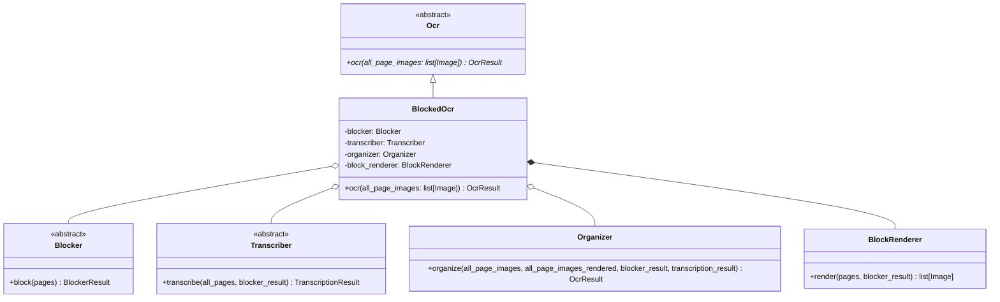
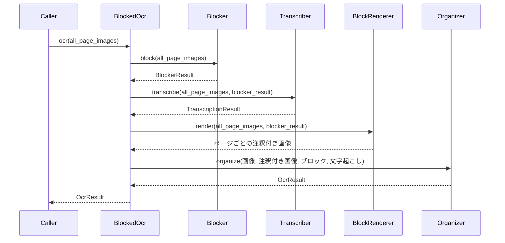

# BlockedOcr

ブロック型OCRパイプラインの入口。[Plan.md](Plan.md) の3段階を文書全体に対して実行し、
`OcrResult` のツリーを返す `Ocr` 実装。

English version: [BlockedOcr.md](BlockedOcr.md)

## 構成

各段階は構築済みのものを受け取る。どのモデルに処理させるかは呼び出し側の選択であり、
ローカルのレイアウトモデルとリモートのチャットモデルの組み合わせでも、より安価な
組み合わせでも同じパイプラインとして動く。`BlockRenderer` だけは例外でここで生成する。
モデルを持たず、選択の余地がないため。

## 実行の流れ

各段階は前段の出力を全て必要とするため、文書全体を単位として順に実行する。ページの
並列処理は `Blocker`・`Transcriber`・Organizerの `Classifier` の**内部**にあり、
このパイプラインの並列性はそこにある（[Blocker.ja.md](Blocker.ja.md) 参照）。

注釈付きページをOrganizerではなくここで描画するのは、これがOrganizerのモデルに
`block_id` とページ上のブロックの対応を示すためのものであり、文書全体分を一度描く方が
ページスキャンごとに描くより安く済むため。

## 規約

- ページ画像は一切変更しない。`BlockRenderer` はコピーに描画し、各段階は
  `all_page_images` を渡されたまま読むだけ。
- 変数に保持するページ番号は、OCRモジュール内の他の箇所と同様すべて0始まり。
