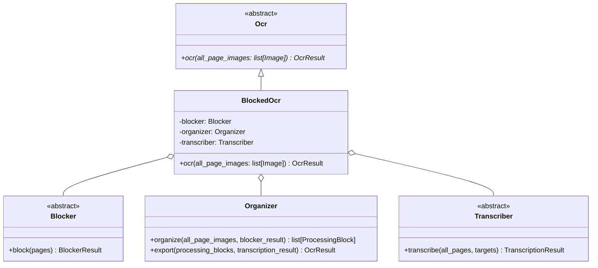
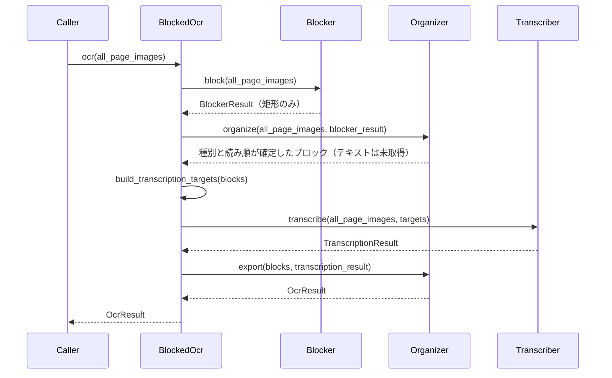

# BlockedOcr

ブロック型OCRパイプラインの入口。[Plan.md](Plan.md) の3段階を文書全体に対して実行し、
`OcrResult` のツリーを返す `Ocr` 実装。

English version: [BlockedOcr.md](BlockedOcr.md)

## 構成



各段階は構築済みのものを受け取る。どのモデルに処理させるかは呼び出し側の選択であり、
ローカルのレイアウトモデルとリモートのチャットモデルの組み合わせでも、より安価な
組み合わせでも同じパイプラインとして動く。

## 実行の流れ



読み取りを最後に回すことが、この順序の目的。Blockerには矩形だけを求め、Organizerが
ページを読んで各矩形が何かを確定し、その後で初めて、確定した種別にふさわしい読み方で
各ブロックを読む。表は表として、数式はKaTeXとして読み、図は読まない。図が語る内容は
画像の中にあるため。レイアウト検出器に分類までさせて後から訂正する道もあったが、この
順序なら訂正するものが無い。

各段階は前段の出力を全て必要とするため、文書全体を単位として順に実行する。ページや
ブロックの並列処理は `Blocker`・Organizerの `Classifier`・`Transcriber` の**内部**に
あり、このパイプラインの並列性はそこにある（[Blocker.ja.md](Blocker.ja.md) 参照）。

## テスト

このパイプラインのうち、モデルを介さずに何かを決めている部分——orderをブロックに適用する、
そこから文書ツリーを組み立てる、各段階をページ並列で回す——は `Test/Unit/Blocked/` の
ユニットテストで担保している。モデルもGPUも不要。

```
uv run pytest
```

`Test/Manual/Ocr/Blocked/` 以下の手動スクリプトはもう一方の担保で、実際のモデルをサンプルPDFに
対して走らせ、結果を書き出して目視確認するためのもの。

## 規約

- ページ画像は一切変更しない。注釈付きのコピーは必要な場所で生成し、各段階は
  `all_page_images` を渡されたまま読むだけ。
- 変数に保持するページ番号は、OCRモジュール内の他の箇所と同様すべて0始まり。
- どの段階であれ失敗した時点で実行全体を終了し、例外を呼び出し元へ送る。
