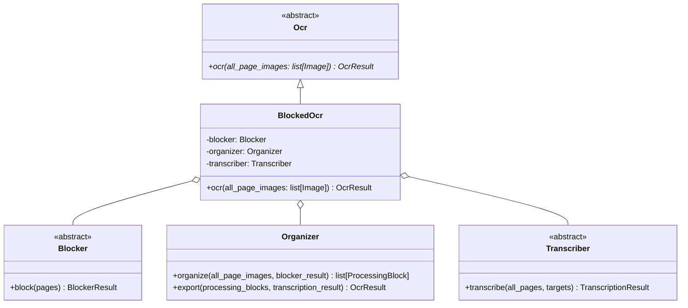
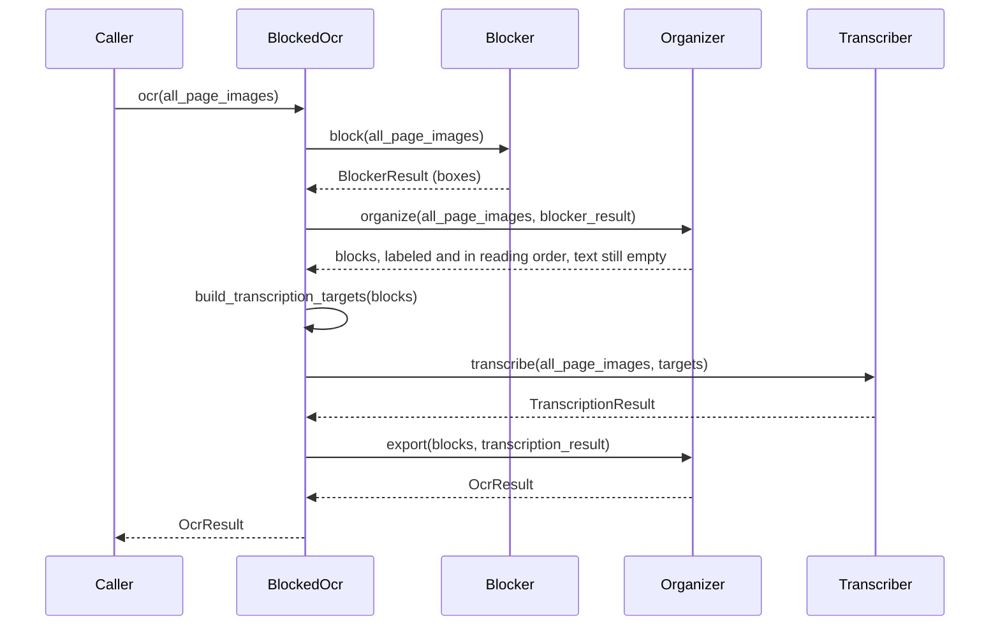

# BlockedOcr

The entry point of the blocked OCR pipeline: it is the `Ocr` implementation that
runs the three stages of [Plan.md](Plan.md) over a document and hands back the
`OcrResult` tree.

日本語版: [BlockedOcr.ja.md](BlockedOcr.ja.md)

## Structure



Each stage is handed in already built, so which model does the work is the caller's
choice: a local layout model with a remote chat model, or a cheaper mix, is the same
pipeline.

## Run



Reading last is what the order is for. The Blocker is asked for boxes and nothing
else, the Organizer reads the page to settle what each box is, and only then is each
block read — as the kind of thing it turned out to be. A table is read as a table, a
formula as KaTeX, and a figure is not read at all, since what a figure says is in the
picture. Asking a layout detector to categorize, then correcting it later, was the
alternative; this way nothing has to be corrected.

The stages run one after another, each one over the whole document: every stage needs
all of the previous one's output. Pages and blocks are worked on several at a time
*inside* `Blocker`, the organizer's `Classifier`, and `Transcriber`, which is where
the parallelism of this pipeline lives (see [Blocker.md](Blocker.md)).

## Tests

The parts of this pipeline that decide something without a model - applying an order
to the blocks, building the tree out of them, running a stage over its pages - are
covered by unit tests in `Test/Unit/Blocked/`, which need no model and no GPU:

```
uv run pytest
```

The manual scripts under `Test/Manual/Blocked/` are the other half: they run real
models over the sample PDFs and write out what came back, for eyeballing.

## Conventions

- The page images are never modified: annotated copies are drawn where they are
  needed, and every stage reads `all_page_images` as given.
- Every page held in a variable is 0-indexed, as everywhere else in the OCR module.
- A failure in any stage ends the whole run, with the error raised to the caller.
