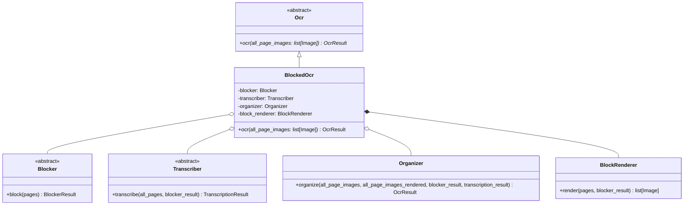
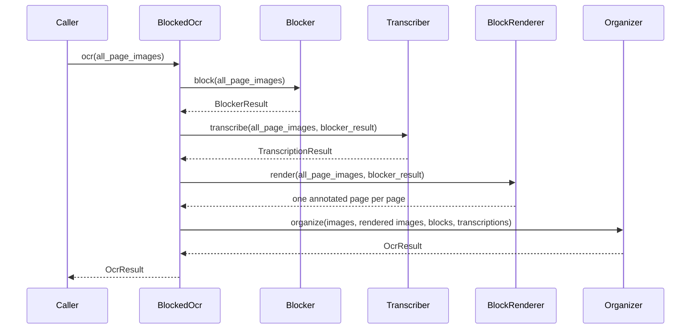

# BlockedOcr

The entry point of the blocked OCR pipeline: it is the `Ocr` implementation that
runs the three stages of [Plan.md](Plan.md) over a document and hands back the
`OcrResult` tree.

日本語版: [BlockedOcr.ja.md](BlockedOcr.ja.md)

## Structure

Each stage is handed in already built, so which model does the work is the caller's
choice: a local layout model with a remote chat model, or a cheaper mix, is the same
pipeline. `BlockRenderer` is the exception and is built here - it has no model and no
choice to make.

## Run

The stages run one after another, each one over the whole document: every stage needs
all of the previous one's output. Pages are worked on several at a time *inside*
`Blocker`, `Transcriber` and the organizer's `Classifier`, which is where the
parallelism of this pipeline lives (see [Blocker.md](Blocker.md)).

The annotated pages are rendered here rather than in the organizer: they exist so the
organizer's model can tell which block on the page a `block_id` names, and rendering
them once for the whole document is cheaper than once per page scan.

## Conventions

- The page images are never modified: `BlockRenderer` draws on copies, and every stage
  reads `all_page_images` as given.
- Every page held in a variable is 0-indexed, as everywhere else in the OCR module.
