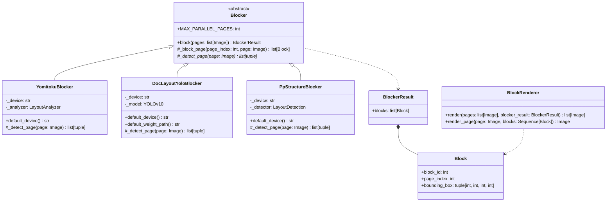
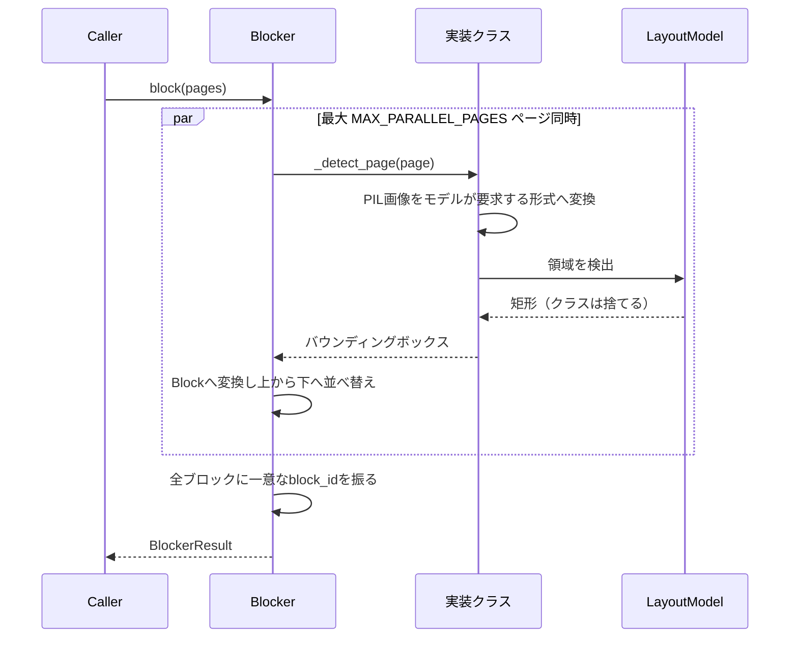

# Blocker

ブロック分割OCRパイプラインの第1段階（[Plan.md](Plan.md) 参照）。ページ画像を受け取り、
読み取る価値のある領域を返す。ここで決めるのはそれだけで、レイアウトモデルに求めるのは
矩形のみ。各ブロックが何であるかは [Classifier](StructureOrganizer.ja.md) が判断し、
テキストは種別が決まった後に [Transcriber](Transcriber.ja.md) が最後に読み取る。

English version: [Blocker.md](Blocker.md)

## 構造

パイプラインが依存するのは `Blocker` のみ。実装同士は差し替え可能で、どれに変えても
後続の段階には影響しない。各実装はそれぞれ重量級のフレームワークを抱えるため、
`Blocker/__init__.py` は名前を要求されたときに初めてその実装をimportする。パッケージ
自体のimportには何のコストもかからない。

`Blocker` 自体がテンプレートメソッドとして `block()` を実装している。各実装が行うのは
1ページ分の領域検出だけで、`_detect_page()` がバウンディングボックスを順不同で返せば
よい。それを `Block` に変換し、ページごとに上から下へ並べ替え、文書全体で一意な連番の
`block_id` を振るのは基底クラスの役割であり、実装ごとに繰り返す必要はない。

ここで使うレイアウトモデルはいずれも領域の種別も出力するが、その推定は意図的に捨てる。
カテゴリ体系はモデルごとに異なり、どれも文書ツリーの型とは一致せず、そもそもClassifierが
ページを読み直す。ここで推定を残しても、後段で対立する二つ目の意見が増えるだけ。

ページ同士は独立しているため、`MAX_PARALLEL_PAGES` ページを同時に処理する。idを振る前に
ページ順へ戻すので、`block_id` がどのページから終わったかに左右されることはない。モデルが
複数スレッドからの呼び出しに耐えない実装は、この値を下げる。

## ページの並列実行

`PageParallel.py` の `run_parallel()` は、このパイプラインの各段階が共通で使うページ
並列実行の仕組み。終了順に関わらず結果は入力順で返り、段階ごとの進捗バーを表示し、
最初の失敗で実行全体を終了する（未開始の処理をキャンセルし、例外を呼び出し元へ送る）。
途中まで読んだ文書に価値はなく、即座に止めればどのページで失敗したかが分かり、残りの
ページの費用も発生しない。

## 規約

全実装に共通し、基底クラスが強制する取り決め。

- `page_index` はOCRモジュールの全ページ変数と同様に0始まり。1始まりのページ番号は
  表示する箇所にのみ現れる。
- モデルの出力は `[x1, y1, x2, y2]`、`Block.bounding_box` は `(x, y, width, height)`。
- 同一ページのブロックは上から下、次に左から右へ並べる。これは安定した順序であり、
  読み順ではない。読み順の推定はClassifierの役割。
- `block_id` はページ内ではなく文書全体で一意（上記の並び順で0始まりの連番）。
- 中身が何であれ領域として返す。本文・キャプション・柱・ノンブル・数式・図・表の
  区別をつけるのは後段の仕事。
- モデルの重みは初回実行時にダウンロードされキャッシュされるため、各実装の初回実行には
  ネットワーク接続が必要。

## 使い分け

| | `YomitokuBlocker` | `DocLayoutYoloBlocker` | `PpStructureBlocker` |
| --- | --- | --- | --- |
| モデル | yomitoku `LayoutAnalyzer`（RT-DETRv2） | DocLayout-YOLO（YOLOv10, DocStructBench） | PP-DocLayout_plus-L（PP-StructureV3のレイアウト段） |
| フレームワーク | torch | torch | paddle |
| 主な学習対象 | 日本語文書 | 各種の実文書 | 中国語・英語を中心とした各種文書 |
| RTX 4070でのA4 200DPI | 約0.2〜0.5秒/ページ | 約0.1〜0.3秒/ページ | 約0.1〜0.4秒/ページ |

3つともローカル実行であり、課金は発生せず、データは外部に出ない。差が出るのは、
どこに矩形を見つけ、どこを見落とすかだけ。

## YomitokuBlocker

[yomitoku](https://github.com/kotaro-kinoshita/yomitoku) の `LayoutAnalyzer`
（レイアウト解析と表構造認識を組み合わせたもの）を利用する。`paragraphs`・`figures`・
`tables` のいずれも、単なる矩形として返す。

## DocLayoutYoloBlocker

[DocLayout-YOLO](https://github.com/opendatalab/DocLayout-YOLO) の公開重み
（DocStructBench、Hugging Face Hub の `juliozhao/DocLayout-YOLO-DocStructBench`）を使う。
1ページ1回の推論で全領域が得られる単一モデルであり、パイプラインではない。検出パラメータ
（`image_size`・`confidence`・`iou`）はコンストラクタ引数で、既定値は公式デモと同じ。

## PpStructureBlocker

[PP-StructureV3](https://github.com/PaddlePaddle/PaddleOCR) のレイアウト検出モデル
`PP-DocLayout_plus-L` を、PaddleOCR の `LayoutDetection` 経由で使う。PP-StructureV3 の
残りの部分（OCR・表認識・数式認識）は意図的に使わない。それらが読む文字は、結局
Transcriberがブロック単位で読み直すため。`model_name=` を渡せば `PP-DocLayout-L`・
`-M`・`-S` などの軽量版も使える。

## BlockRenderer

各ブロックの矩形と `block_id` を、単色でページのコピー上に描画する。Blockerがブロックの
種別を推定しなくなった以上、色で伝えるべき情報は無い。

これはデバッグ用のヘルパーであるだけでなく、パイプラインの一部でもある。この注釈付き
ページがClassifierへの入力であり、モデルが `block_id` とページ上の矩形を対応づけられる
のはこの画像のおかげ。`render_page()` は1ページだけを描くもので、Classifierは文書全体の
注釈付きコピーをメモリに置かずに1ページずつこれを受け取る。`render()` は全ページを描く
もので、`TestBlocker.py` と `TestBlockRenderer.py`（`Test/Manual/Ocr/Blocked/` 参照）が
PNGの書き出しに使う。

## デバイス

`YomitokuBlocker()` と `DocLayoutYoloBlocker()` はGPUが利用可能なら `cuda`、無ければ
`cpu` を選ぶ。`PpStructureBlocker()` も同様に paddle の `gpu` を選ぶ。`device=` で明示
指定もできる。

torchはCUDA 13.0、paddleはCUDA 12.9のwheelインデックスから導入される
（`pyproject.toml` の `[tool.uv.sources]`）ため、`uv sync` で両方ともGPU対応版が入る。

> Windowsではpaddleが自身のDLLディレクトリをtorchより先に登録するため、paddleの後に
> importしたtorchはロードに失敗する。そのため `PpStructure.py` はpaddleより先にtorchを
> importしている。この行を消さないこと。torch系とpaddle系のBlockerを同一プロセスで
> 併用できるのは、この順序のおかげ。
