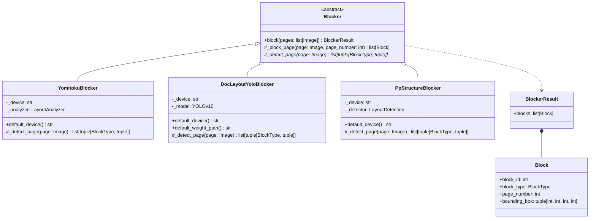
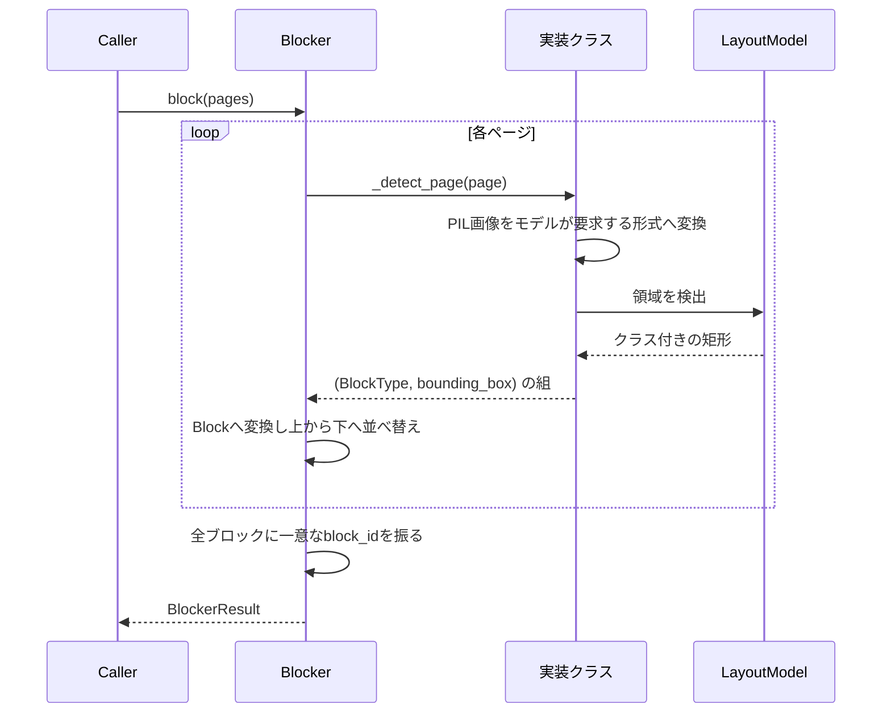

# Blocker

ブロック分割OCRパイプラインの第1段階（[Plan.md](Plan.md) 参照）。ページ画像を受け取り、
読み取る価値のある領域を返す。ここでは文字認識を行わない。各ブロックのテキストは
第2段階で、ブロック単位で独立に読み取る。

English version: [Blocker.md](Blocker.md)

## 構造

パイプラインが依存するのは `Blocker` のみ。実装同士は差し替え可能で、どれに変えても
後続の段階には影響しない。

`Blocker` 自体がテンプレートメソッドとして `block()` を実装している。各実装が行うのは
1ページ分の領域検出だけで、`_detect_page()` が `(BlockType, bounding_box)` の組を
順不同で返せばよい。それを `Block` に変換し、ページごとに上から下へ並べ替え、文書
全体で一意な連番の `block_id` を振るのは基底クラスの役割であり、実装ごとに繰り返す
必要はない。

## 規約

全実装に共通し、基底クラスが強制する取り決め。

- `page_number` はOCRモジュール全体と同様に0始まり。
- モデルの出力は `[x1, y1, x2, y2]`、`Block.bounding_box` は `(x, y, width, height)`。
- 同一ページのブロックは上から下、次に左から右へ並べる。これは安定した順序であり、
  読み順ではない。読み順の推定は第3段階の役割。
- `block_id` はページ内ではなく文書全体で一意（上記の並び順で0始まりの連番）。
- キャプション・柱・フッター・ノンブルは本文と同じ文字列なので `TEXT` として返す。
  扱いは第3段階が決める。
- モデルの重みは初回実行時にダウンロードされキャッシュされるため、各実装の初回実行には
  ネットワーク接続が必要。

## 使い分け

| | `YomitokuBlocker` | `DocLayoutYoloBlocker` | `PpStructureBlocker` |
| --- | --- | --- | --- |
| モデル | yomitoku `LayoutAnalyzer`（RT-DETRv2） | DocLayout-YOLO（YOLOv10, DocStructBench） | PP-DocLayout_plus-L（PP-StructureV3のレイアウト段） |
| フレームワーク | torch | torch | paddle |
| クラス数 | paragraphのrole4種＋figures＋tables | 10 | 20 |
| 数式クラス | 既定モデルには無い | 独立数式のみ有り | 有り |
| 主な学習対象 | 日本語文書 | 各種の実文書 | 中国語・英語を中心とした各種文書 |
| RTX 4070でのA4 200DPI | 約0.2〜0.5秒/ページ | 約0.1〜0.3秒/ページ | 約0.1〜0.4秒/ページ |

3つともローカル実行であり、課金は発生せず、データは外部に出ない。

## YomitokuBlocker

[yomitoku](https://github.com/kotaro-kinoshita/yomitoku) の `LayoutAnalyzer`
（レイアウト解析と表構造認識を組み合わせたもの）を利用する。

| yomitokuの要素 | `BlockType` |
| --- | --- |
| `inline_formula`・`display_formula` ロールの `paragraphs` | `MATH` |
| その他の `paragraphs`（`section_headings`・`page_header`・`page_footer` ロールを含む） | `TEXT` |
| `figures` | `IMAGE` |
| `tables` | `TABLE` |

既定のレイアウトモデル（`rtdetrv2v2`）には数式カテゴリが無いため、実際には数式も `TEXT` と
して返り、第3段階のLLMが判別する。`MATH` が出るのは、数式ロールを出力するモデルを
`configs=` で指定した場合のみ。

## DocLayoutYoloBlocker

[DocLayout-YOLO](https://github.com/opendatalab/DocLayout-YOLO) の公開重み
（DocStructBench、Hugging Face Hub の `juliozhao/DocLayout-YOLO-DocStructBench`）を使う。
1ページ1回の推論で全領域とそのクラスが得られる単一モデルであり、パイプラインではない。

| DocStructBenchのクラス | `BlockType` |
| --- | --- |
| `isolate_formula` | `MATH` |
| `figure` | `IMAGE` |
| `table` | `TABLE` |
| `title`・`plain text`・`abandon`・`figure_caption`・`table_caption`・`table_footnote`・`formula_caption` | `TEXT` |

`abandon` は柱・フッター・ノンブルのクラス。検出パラメータ（`image_size`・`confidence`・
`iou`）はコンストラクタ引数で、既定値は公式デモと同じ。

## PpStructureBlocker

[PP-StructureV3](https://github.com/PaddlePaddle/PaddleOCR) のレイアウト検出モデル
`PP-DocLayout_plus-L` を、PaddleOCR の `LayoutDetection` 経由で使う。PP-StructureV3 の
残りの部分（OCR・表認識・数式認識）は意図的に使わない。それらが読む文字は、結局
第2段階がブロック単位で読み直すため。`model_name=` を渡せば `PP-DocLayout-L`・`-M`・
`-S` などの軽量版も使える。

| PP-DocLayoutのラベル | `BlockType` |
| --- | --- |
| `formula` | `MATH` |
| `image`・`chart`・`seal` | `IMAGE` |
| `table` | `TABLE` |
| `text`・`paragraph_title`・`doc_title`・`abstract`・`content`・`figure_title`・`number`・`reference`・`reference_content`・`footnote`・`header`・`footer`・`algorithm`・`formula_number`・`aside_text` | `TEXT` |

## デバイス

`YomitokuBlocker()` と `DocLayoutYoloBlocker()` はGPUが利用可能なら `cuda`、無ければ
`cpu` を選ぶ。`PpStructureBlocker()` も同様に paddle の `gpu` を選ぶ。`device=` で明示
指定もできる。

torchはCUDA 13.0、paddleはCUDA 12.9のwheelインデックスから導入される
（`pyproject.toml` の `[tool.uv.sources]`）ため、`uv sync` で両方ともGPU対応版が入る。

> Windowsではpaddleが自身のDLLディレクトリをtorchより先に登録するため、paddleの後に
> importしたtorchはロードに失敗する。そのため `PpStructure.py` はpaddleより先にtorchを
> importしている。この行を消さないこと。torch系とpaddle系のBlockerを同一プロセスで
> 併用できるのは、この順序のおかげ。
