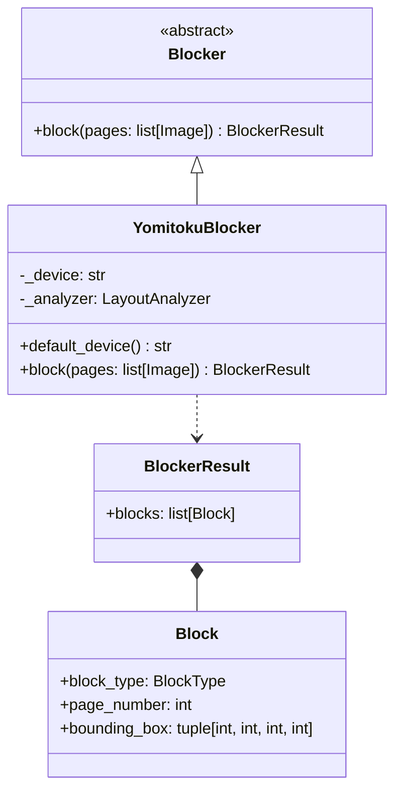
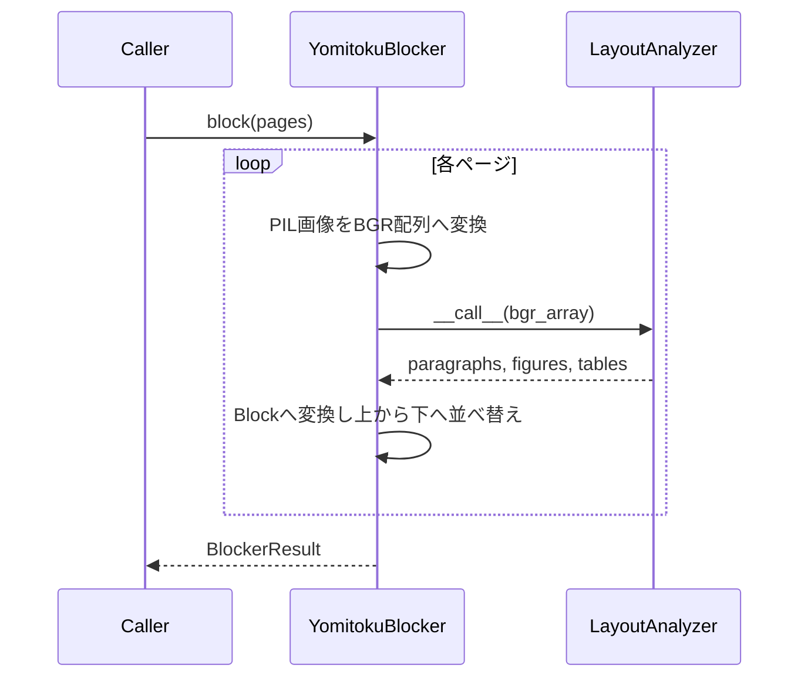

# Blocker

ブロック分割OCRパイプラインの第1段階（[Plan.md](Plan.md) 参照）。ページ画像を受け取り、
読み取る価値のある領域を返す。ここでは文字認識を行わない。各ブロックのテキストは
第2段階で、ブロック単位で独立に読み取る。

English version: [Blocker.md](Blocker.md)

## 構造

パイプラインが依存するのは `Blocker` のみ。別のレイアウトモデルによる実装に差し替えても、
後続の段階には影響しない。

## YomitokuBlocker

[yomitoku](https://github.com/kotaro-kinoshita/yomitoku) の `LayoutAnalyzer`
（レイアウト解析と表構造認識を組み合わせたもの）を利用する。

### ブロック種別の対応

| yomitokuの要素 | `BlockType` |
| --- | --- |
| `inline_formula`・`display_formula` ロールの `paragraphs` | `MATH` |
| その他の `paragraphs`（`section_headings`・`page_header`・`page_footer` ロールを含む） | `TEXT` |
| `figures` | `IMAGE` |
| `tables` | `TABLE` |

既定のレイアウトモデル（`rtdetrv2v2`）には数式カテゴリが無いため、実際には数式も `TEXT` と
して返り、第3段階のLLMが判別する。`MATH` が出るのは、数式ロールを出力するモデルを
`configs=` で指定した場合のみ。

### 規約

- `page_number` はOCRモジュール全体と同様に0始まり。
- yomitokuの矩形は `[x1, y1, x2, y2]`、`Block.bounding_box` は
  `(x, y, width, height)`。
- 同一ページのブロックは上から下、次に左から右へ並べる。これは安定した順序であり、
  読み順ではない。読み順の推定は第3段階の役割。

### デバイス

`YomitokuBlocker()` はGPUが利用可能なら `cuda`、無ければ `cpu` を選ぶ。`device=` で
明示指定も可能。torchはCUDA 12.8のwheelインデックスから導入される
（`pyproject.toml` の `[tool.uv.sources]`）ため、`uv sync` でGPU対応版が入る。

モデルの重みは初回実行時にHugging Face Hubからダウンロードされ、キャッシュされる。
