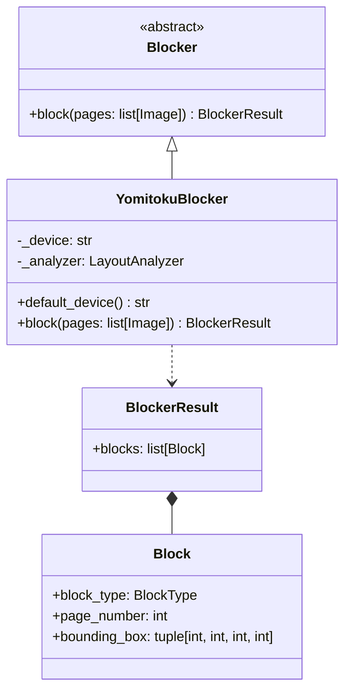
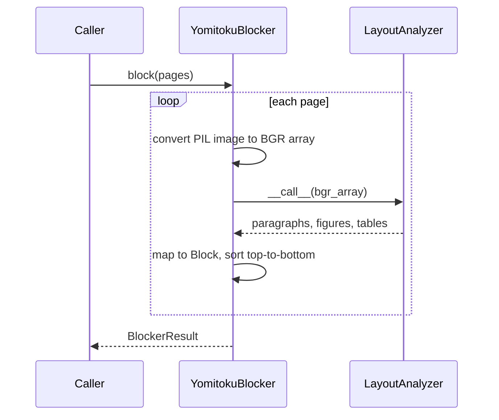

# Blocker

Step 1 of the blocked OCR pipeline (see [Plan.md](Plan.md)): a page image goes in,
the regions worth reading come out. Nothing is recognized here — the text of each
block is read in step 2, so that every block can be OCR'd in isolation.

日本語版: [Blocker.ja.md](Blocker.ja.md)

## Structure

`Blocker` is the only thing the pipeline depends on, so an implementation backed by
another layout model can replace `YomitokuBlocker` without touching the later steps.

## YomitokuBlocker

Uses [yomitoku](https://github.com/kotaro-kinoshita/yomitoku)'s `LayoutAnalyzer`,
which combines layout parsing with table structure recognition.

### Block type mapping

| yomitoku element | `BlockType` |
| --- | --- |
| `paragraphs` with the `inline_formula` or `display_formula` role | `MATH` |
| any other `paragraphs` (including the `section_headings`, `page_header`, `page_footer` roles) | `TEXT` |
| `figures` | `IMAGE` |
| `tables` | `TABLE` |

The default layout model (`rtdetrv2v2`) has no formula category, so in practice every
formula comes out as `TEXT` and step 3's LLM tells the two apart. `MATH` appears only
with a model that emits the formula roles, configured through `configs=`.

### Conventions

- `page_number` is 0-indexed, as everywhere else in the OCR module.
- yomitoku reports boxes as `[x1, y1, x2, y2]`; `Block.bounding_box` is
  `(x, y, width, height)`.
- Blocks of one page are sorted top-to-bottom, then left-to-right. This is a stable
  order, not a reading order — reading order is step 3's job.

### Device

`YomitokuBlocker()` picks `cuda` when a GPU is available and falls back to `cpu`;
pass `device=` to force one. Torch is installed from the CUDA 12.8 wheel index
(`[tool.uv.sources]` in `pyproject.toml`), so `uv sync` gives a GPU-capable build.

The model weights are downloaded from Hugging Face Hub on first use and cached.
