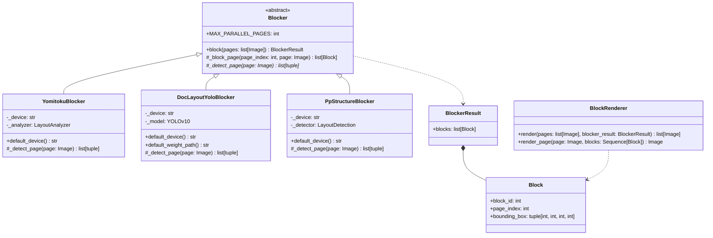
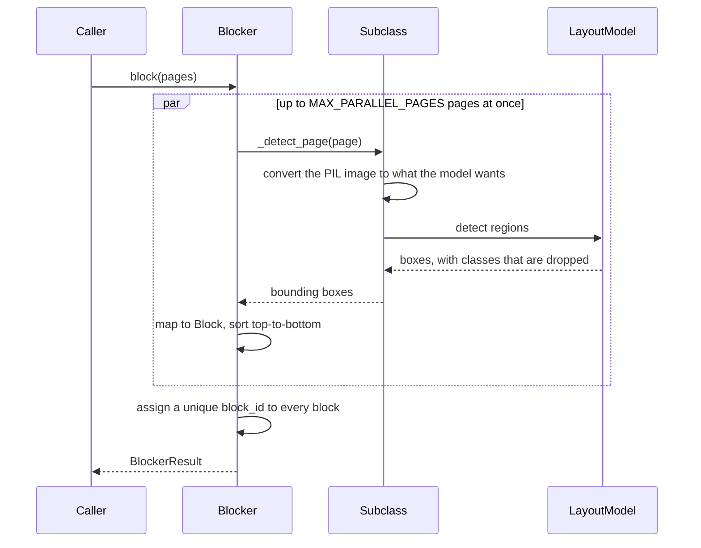

# Blocker

Step 1 of the blocked OCR pipeline (see [Plan.md](Plan.md)): a page image goes in,
the regions worth reading come out. Nothing else is decided here — a box is all a
layout model is asked for. What each block *is* is settled by the
[Classifier](StructureOrganizer.md), and its text is read last, by the
[Transcriber](Transcriber.md), once its kind is known.

日本語版: [Blocker.ja.md](Blocker.ja.md)

## Structure

`Blocker` is the only thing the pipeline depends on, so the implementations are
interchangeable: swapping one for another never touches the later steps. Each one
pulls in a heavy framework of its own, so `Blocker/__init__.py` imports an
implementation only when it is named — importing the package itself costs nothing.

`Blocker` itself implements `block()` as a template method: a subclass only detects
the regions of a single page — `_detect_page()` returns bounding boxes, in any order.
The base class turns those into `Block`s, sorts each page top-to-bottom, and assigns
every block in the document a unique, sequential `block_id`, so none of that has to
be repeated per implementation.

Every layout model here also reports what it thinks each region is, and that guess is
deliberately thrown away. The categories differ from model to model, none of them
matches the document tree's own types, and the Classifier reads the page anyway — so
a guess kept here would only be a second opinion to argue with later.

Pages are independent, so `MAX_PARALLEL_PAGES` of them are detected at once. The
results are put back in page order before the ids are handed out, so a document's
`block_id`s never depend on which page finished first. A subclass whose model does
not take being called from several threads at once lowers that number.

## Running pages at once

`run_parallel()` in `PageParallel.py` is what every stage of this pipeline uses to
work on several pages at the same time. It keeps the results in input order whatever
order the work finished in, shows a progress bar for the stage, and ends the whole
run on the first failure: what has not started is cancelled and the error is raised
to the caller. A document read half-way is not a result worth keeping, and stopping
at once says which page went wrong while the rest has not yet been paid for.

## Conventions

Shared by every implementation, and enforced by the base class:

- `page_index` counts from 0, as every page variable in the OCR module does; a page
  number counted from 1 appears only where one is shown.
- The models report boxes as `[x1, y1, x2, y2]`; `Block.bounding_box` is
  `(x, y, width, height)`.
- Blocks of one page are sorted top-to-bottom, then left-to-right. This is a stable
  order, not a reading order — reading order is the Classifier's job.
- `block_id` is unique across the whole document (0-indexed, in the sorted order
  above), not just within a page.
- A region is reported whatever it holds: prose, a caption, a running head, a page
  number, a formula, a figure, a table. Sorting that out comes later.
- Model weights are downloaded on first use and cached, so the first run of each
  implementation needs a network connection.

## Choosing one

| | `YomitokuBlocker` | `DocLayoutYoloBlocker` | `PpStructureBlocker` |
| --- | --- | --- | --- |
| Model | yomitoku `LayoutAnalyzer` (RT-DETRv2) | DocLayout-YOLO (YOLOv10, DocStructBench) | PP-DocLayout_plus-L (PP-StructureV3's layout stage) |
| Framework | torch | torch | paddle |
| Trained mainly on | Japanese documents | mixed real-world documents | mixed, Chinese and English documents |
| Speed on an RTX 4070, A4 at 200 DPI | ~0.2–0.5 s/page | ~0.1–0.3 s/page | ~0.1–0.4 s/page |

All three are local: nothing is billed and nothing leaves the machine. What separates
them now is only where they find a box and where they miss one.

## YomitokuBlocker

Uses [yomitoku](https://github.com/kotaro-kinoshita/yomitoku)'s `LayoutAnalyzer`,
which combines layout parsing with table structure recognition. Its `paragraphs`,
`figures`, and `tables` all come out as plain boxes.

## DocLayoutYoloBlocker

Uses [DocLayout-YOLO](https://github.com/opendatalab/DocLayout-YOLO) with the released
DocStructBench checkpoint, fetched from Hugging Face Hub
(`juliozhao/DocLayout-YOLO-DocStructBench`). One forward pass per page gives every
region, so it is a single model rather than a pipeline. Detection parameters
(`image_size`, `confidence`, `iou`) are constructor arguments; the defaults are the
ones the model's own demo uses.

## PpStructureBlocker

Uses the layout detection model of
[PP-StructureV3](https://github.com/PaddlePaddle/PaddleOCR), `PP-DocLayout_plus-L`,
through PaddleOCR's `LayoutDetection`. The rest of PP-StructureV3 (its OCR, table, and
formula recognizers) is deliberately left out: it would read the text the Transcriber
reads anyway, block by block. Pass `model_name=` to run a lighter variant such as
`PP-DocLayout-L`, `-M`, or `-S`.

## BlockRenderer

Draws every block's box and `block_id` onto a copy of its page, in one color — the
Blocker no longer guesses what a block is, so there is nothing for a color to say.

This is not only a debugging helper: the annotated page is what the Classifier is
shown, and is how the model can tell which box on the page a `block_id` names.
`render_page()` draws one page, which is how the Classifier gets it, one page at a
time, rather than holding an annotated copy of the whole document in memory;
`render()` draws them all, which is what `TestBlocker.py` and `TestBlockRenderer.py`
(see `Test/Manual/Blocked/`) use to write PNGs.

## Device

`YomitokuBlocker()` and `DocLayoutYoloBlocker()` pick `cuda` when a GPU is available and
fall back to `cpu`; `PpStructureBlocker()` picks paddle's `gpu` the same way. Pass
`device=` to force one.

Torch is installed from the CUDA 13.0 wheel index and paddle from the CUDA 12.9 one
(`[tool.uv.sources]` in `pyproject.toml`), so `uv sync` gives GPU-capable builds of
both.

> On Windows, paddle puts its own DLL directory ahead of torch's, and a torch imported
> after paddle fails to load. `PpStructure.py` therefore imports torch first, before
> paddle. Keep that import — it is what lets the torch-based blockers and the
> paddle-based one live in one process.
