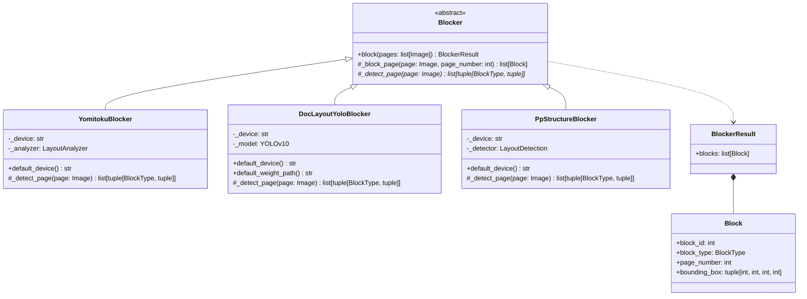
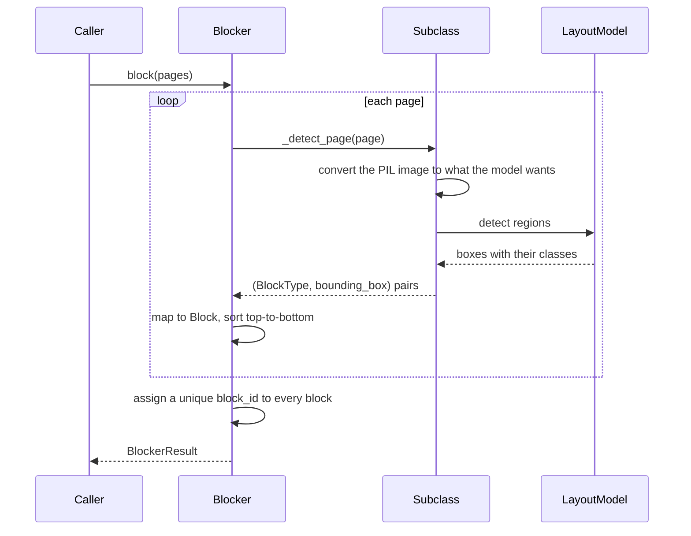

# Blocker

Step 1 of the blocked OCR pipeline (see [Plan.md](Plan.md)): a page image goes in,
the regions worth reading come out. Nothing is recognized here — the text of each
block is read in step 2, so that every block can be OCR'd in isolation.

日本語版: [Blocker.ja.md](Blocker.ja.md)

## Structure

`Blocker` is the only thing the pipeline depends on, so the implementations are
interchangeable: swapping one for another never touches the later steps.

`Blocker` itself implements `block()` as a template method: a subclass only detects
the regions of a single page — `_detect_page()` returns `(BlockType, bounding_box)`
pairs, in any order. The base class turns those into `Block`s, sorts each page
top-to-bottom, and assigns every block in the document a unique, sequential
`block_id`, so none of that has to be repeated per implementation.

## Conventions

Shared by every implementation, and enforced by the base class:

- `page_number` is 0-indexed, as everywhere else in the OCR module.
- The models report boxes as `[x1, y1, x2, y2]`; `Block.bounding_box` is
  `(x, y, width, height)`.
- Blocks of one page are sorted top-to-bottom, then left-to-right. This is a stable
  order, not a reading order — reading order is step 3's job.
- `block_id` is unique across the whole document (0-indexed, in the sorted order
  above), not just within a page.
- Captions, running heads, footers, and page numbers are prose, so they come out as
  `TEXT`; step 3 decides what to do with them.
- Model weights are downloaded on first use and cached, so the first run of each
  implementation needs a network connection.

## Choosing one

| | `YomitokuBlocker` | `DocLayoutYoloBlocker` | `PpStructureBlocker` |
| --- | --- | --- | --- |
| Model | yomitoku `LayoutAnalyzer` (RT-DETRv2) | DocLayout-YOLO (YOLOv10, DocStructBench) | PP-DocLayout_plus-L (PP-StructureV3's layout stage) |
| Framework | torch | torch | paddle |
| Classes | 4 paragraph roles + figures + tables | 10 | 20 |
| Formula class | no (with the default model) | yes, isolated formulas only | yes |
| Trained mainly on | Japanese documents | mixed real-world documents | mixed, Chinese and English documents |
| Speed on an RTX 4070, A4 at 200 DPI | ~0.2–0.5 s/page | ~0.1–0.3 s/page | ~0.1–0.4 s/page |

All three are local: nothing is billed and nothing leaves the machine.

## YomitokuBlocker

Uses [yomitoku](https://github.com/kotaro-kinoshita/yomitoku)'s `LayoutAnalyzer`,
which combines layout parsing with table structure recognition.

| yomitoku element | `BlockType` |
| --- | --- |
| `paragraphs` with the `inline_formula` or `display_formula` role | `MATH` |
| any other `paragraphs` (including the `section_headings`, `page_header`, `page_footer` roles) | `TEXT` |
| `figures` | `IMAGE` |
| `tables` | `TABLE` |

The default layout model (`rtdetrv2v2`) has no formula category, so in practice every
formula comes out as `TEXT` and step 3's LLM tells the two apart. `MATH` appears only
with a model that emits the formula roles, configured through `configs=`.

## DocLayoutYoloBlocker

Uses [DocLayout-YOLO](https://github.com/opendatalab/DocLayout-YOLO) with the released
DocStructBench checkpoint, fetched from Hugging Face Hub
(`juliozhao/DocLayout-YOLO-DocStructBench`). One forward pass per page gives every
region and its class, so it is a single model rather than a pipeline.

| DocStructBench class | `BlockType` |
| --- | --- |
| `isolate_formula` | `MATH` |
| `figure` | `IMAGE` |
| `table` | `TABLE` |
| `title`, `plain text`, `abandon`, `figure_caption`, `table_caption`, `table_footnote`, `formula_caption` | `TEXT` |

`abandon` is the class for running heads, footers, and page numbers. Detection
parameters (`image_size`, `confidence`, `iou`) are constructor arguments; the defaults
are the ones the model's own demo uses.

## PpStructureBlocker

Uses the layout detection model of
[PP-StructureV3](https://github.com/PaddlePaddle/PaddleOCR), `PP-DocLayout_plus-L`,
through PaddleOCR's `LayoutDetection`. The rest of PP-StructureV3 (its OCR, table, and
formula recognizers) is deliberately left out: it would read the text that step 2 reads
anyway, block by block. Pass `model_name=` to run a lighter variant such as
`PP-DocLayout-L`, `-M`, or `-S`.

| PP-DocLayout label | `BlockType` |
| --- | --- |
| `formula` | `MATH` |
| `image`, `chart`, `seal` | `IMAGE` |
| `table` | `TABLE` |
| `text`, `paragraph_title`, `doc_title`, `abstract`, `content`, `figure_title`, `number`, `reference`, `reference_content`, `footnote`, `header`, `footer`, `algorithm`, `formula_number`, `aside_text` | `TEXT` |

## Device

`YomitokuBlocker()` and `DocLayoutYoloBlocker()` pick `cuda` when a GPU is available and
fall back to `cpu`; `PpStructureBlocker()` picks paddle's `gpu` the same way. Pass
`device=` to force one.

Torch is installed from the CUDA 13.0 wheel index and paddle from the CUDA 12.9 one
(`[tool.uv.sources]` in `pyproject.toml`), so `uv sync` gives GPU-capable builds of
both.

> On Windows, paddle puts its own DLL directory ahead of torch's, and a torch imported
> after paddle fails to load. `PpStructure.py` therefore imports torch first, before
> paddle. Keep that import — it is what lets the torch-based blockers and the
> paddle-based one live in one process.
