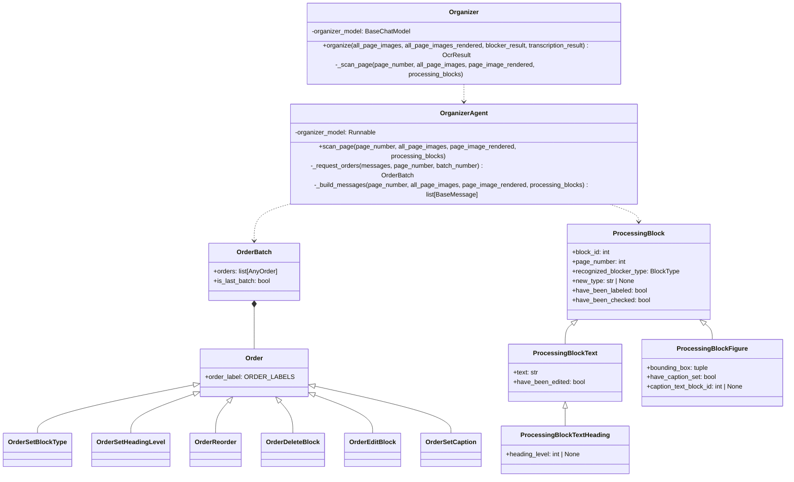

# StructureOrganizer

ブロック分割OCRパイプラインの第3段階（[Plan.md](Plan.md) 参照）。`Blocker` が検出し
`Transcriber` が読み取ったブロックを、マルチモーダルモデルがページ単位で処理し、
ドキュメント構造を確定する。確定するのは、各テキストブロックの種別、各見出しの階層
レベル、各図のキャプション、そして読み順。

English version: [StructureOrganizer.md](StructureOrganizer.md)

## 構造

モデル自身はブロックを書き換えない。モデルは `OrderBatch` を返すだけで、
`ProcessingBlock` を変更するのは `execute_orders()` のみ。受け取ったJSONがどのorderかは
`order_label` で決まり、pydanticがこれをunionの判別子として使うため、各orderは自身の
スキーマで検証済みの状態で届く。

## ページスキャン

バッチはブロックのコピーに適用する。途中で失敗したバッチはブロックを一切変更せず、
その旨をモデルに伝えて再試行させる。ページの完了はモデルが `is_last_batch` で宣言し、
`MAX_BATCH_COUNT` は宣言しないモデルに対する保険でしかない。

## モデルに与えるコンテキスト

ページスキャンのたびにコンテキスト全体を送り直すため、そのページに必要なものだけに絞る。

- そのページが属している見出しのページ画像。外側から順に、直前ページ終了時点で開いて
  いた最も内側の見出し、その上の見出し、…、レベル1のドキュメントタイトルまで。長い
  ドキュメントでも見出しレベルを一貫させるのはこの仕組み。直前ページがH3で終わって
  いれば、そのH3・H2・H1のページ画像が渡る。同一ページに複数の上位見出しがある場合は、
  そのページ画像を1枚だけ送り、その中の見出しをまとめて示す。
- 直前 `RECENT_PAGE_COUNT` ページの画像。ページ境界をまたぐブロックのため。見出しの
  ページとして既に渡したページは重複して送らない。
- 現在のページ画像そのもの。
- 各ブロックの枠線と `block_id` を描画した現在のページ画像（`BlockRenderer` による。
  [Blocker.ja.md](Blocker.ja.md) 参照）。
- 現在のページと直前ページ群の `ProcessingBlock` の状態を、現在の順序でJSON化したもの。
  それ以前は確定済みなので含めない。

## Order一覧

| Order | 効果 |
| --- | --- |
| `set_block_type` | テキストブロックに `TEXT_BLOCK_TYPES` のいずれかを付与する。 |
| `set_heading_level` | 見出しにレベルを与え、同時に見出しとして分類する。 |
| `reorder` | ブロックを別のブロックの直前へ移動する。 |
| `delete_block` | ブロックを削除し、それを指していたキャプション参照も解除する。 |
| `edit_block` | 指定されたフィールドのみ変更する（種別・本文・見出しレベル）。 |
| `set_caption` | 図とそのキャプションであるテキストブロックを紐づける。 |

orderはリスト順に適用され、各orderは直前までの結果に対して働く。見出しとして分類される
か、レベルを与えられた時点で、テキストブロックは `ProcessingBlockTextHeading` になる。

## 規約

- 変数として保持するページ番号は全て0始まり（`scan_page` の `page_index` も
  `ProcessingBlock.page_number` も同様）。`+ 1` するのは表示する箇所だけ——プロンプト、
  画像のラベル、ブロック状態JSON、ログ。読み手は1からページを数えるため。
- モデルに見せたJSONに存在するidのみ使用でき、未知のidを指すorderは無視ではなく却下する。
- プロンプトおよびモデル向けのテキストは全て英語。
