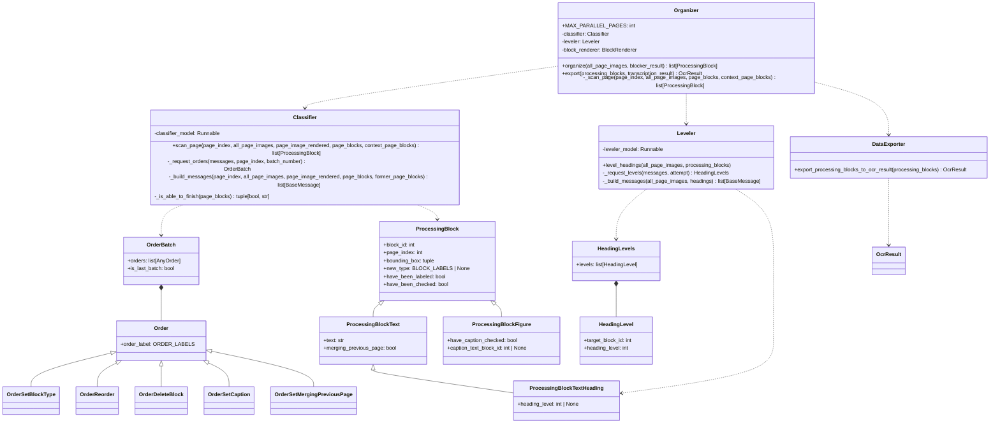
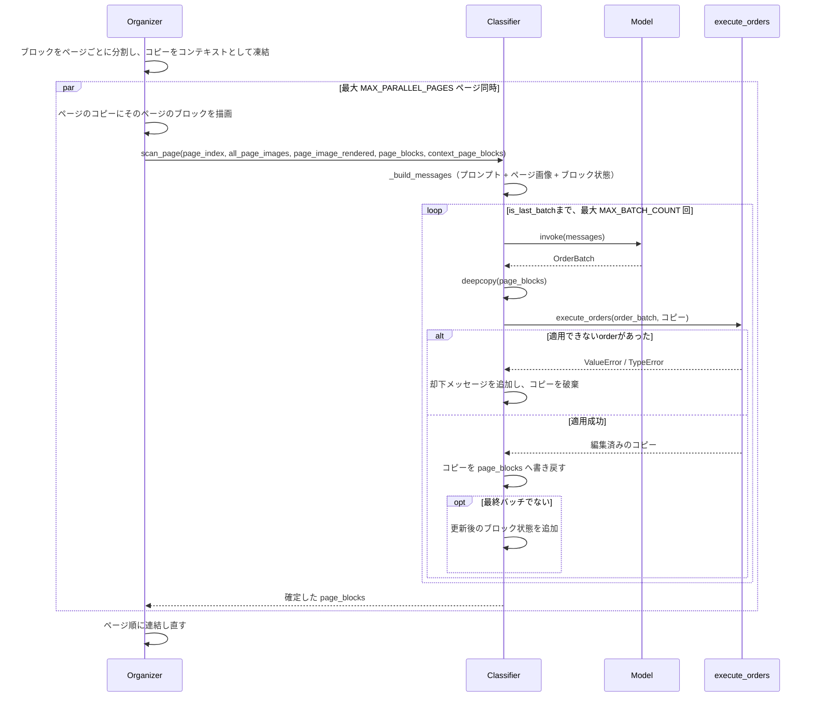
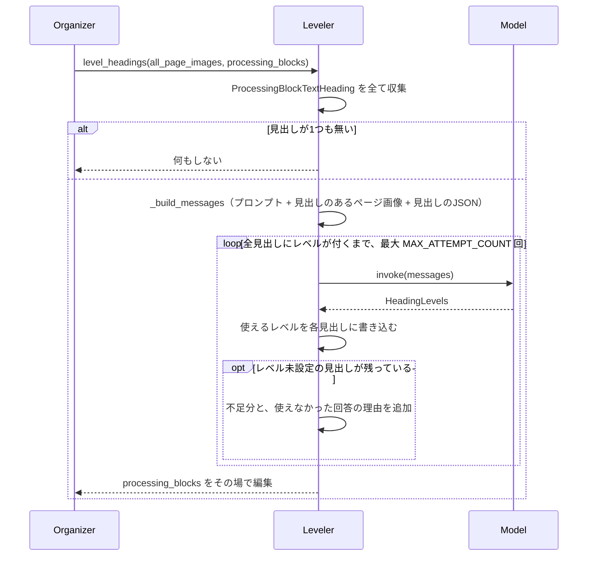

# StructureOrganizer

ブロック分割OCRパイプラインの第2段階（[Plan.md](Plan.md) 参照）。`Blocker` が見つけた
矩形を、マルチモーダルモデルがページを読んで文書構造へ落とし込む。各ブロックの種別、
各見出しの階層レベル、各図のキャプション、そして読み順を確定する。

この時点で文字起こしは行われていない。それがこの設計の要点で、ブロックが何であるかは
ページから読み取るものであり、ここでの判断が [Transcriber](Transcriber.ja.md) に
「各ブロックをどう読むか」を伝える。文書ツリーの構築も、テキストが戻ってきた後に
ここで行う。

English version: [StructureOrganizer.md](StructureOrganizer.md)

## 2つのモデル段階

判断に何を見る必要があるかで、処理を分割している。

- **`Classifier/`** はページ単位で確定する。各ブロックが何か、どの図にどのキャプションが
  付くか、どの順に読むか——いずれも目の前のページだけで判断できる事柄。そのため
  `MAX_PARALLEL_PAGES` ページずつ並列に処理する。
- **`Leveler/`** は見出しの階層を決める。見出しのレベルは文書全体との関係でしか意味を
  持たないため、全ページの分類が終わった後に一度だけ実行し、見出しを含むページを
  まとめて見る。

`Organizer` はこの順に2段階を実行し、Transcriberがブロックを読み終えた後に、確定した
ブロックを `DataExporter` へ渡す。

## 構造

モデル自身がブロックを書き換えることはない。モデルは `OrderBatch` を返し、
`ProcessingBlock` を変更するのは `execute_orders()` だけ。JSONがどのorderであるかは
`order_label` が決め、pydanticがそれを判別子（discriminator）として使うため、各orderは
自分のスキーマで検証済みの状態で届く。

ブロックは最初、idと矩形しか持たない素の `ProcessingBlock` として存在し、ラベル付けが
どの種類のブロックになるかを決める。見出しはレベルを持ち、図はキャプションを持ち自身の
テキストは持たず、それ以外は素のテキストブロックになる。ラベルを付け直すと新しいラベルに
応じた種類へ作り直されるため、見出しを段落に変えたブロックが、使われることのないレベルを
抱えたまま見出し扱いされ続けることはない。

## ページスキャン

各ページはそれぞれ専用のリスト上で確定する。`Organizer` がブロックをページごとに分割し、
その時点のコピーを「ページ同士が読み合うコンテキスト」として凍結した上で、各ページに
自分のリストを渡す。orderが届くのはそのリストだけで、ページ間で状態を共有しないため、
`run_parallel()`（[Blocker.ja.md](Blocker.ja.md) 参照）で `MAX_PARALLEL_PAGES` ページずつ
並列実行し、結果はページ順で戻る。

バッチはブロックのコピーに対して適用するため、途中で失敗したバッチはブロックを一切
変更せず、モデルにはその旨を伝えた上で再試行させる。ページが完了したかどうかはモデルが
`is_last_batch` で示す。`MAX_BATCH_COUNT` バッチを尽くしても確定しないページは実行全体を
終了させる。そのページについて書き出せるものが何も無いため。

完了したと言えば完了するわけではない。`_is_able_to_finish()` がページ上の全ブロックに
block_typeがあるか、全ての図がキャプション確認済みかを検査し、不足があれば該当ブロックの
idを添えてモデルへ差し戻す。見出しレベルはここでは検査しない。1ページだけでは答えられない
情報のため。検査を通ったページのブロックには `have_been_checked` を立てる。

注釈付きページは文書全体分を先に作るのではなく、各ページの処理の中で描画する。文書全体の
注釈付きコピーは元の文書と同じだけのメモリを食う一方、必要なのは処理中のページの分だけ
だから。

### モデルに渡すコンテキスト

ページスキャンは毎回コンテキスト全体を送り直すため、そのページに必要なものだけに絞る。

- 直前 `RECENT_PAGE_COUNT` ページの画像。ページ境界をまたぐブロックの判断に使う。
- 当該ページの画像（スキャンされたまま）。
- 同じページに各ブロックの矩形と `block_id` を描画した画像（`BlockRenderer` による。
  [Blocker.ja.md](Blocker.ja.md) 参照）。
- 現在のページと直前1ページの `ProcessingBlock` の状態を、現在の順序でJSON化したもの。
  各ブロックのid・ページ・バウンディングボックス・現時点のラベルが入る。テキストは無い。
  まだ何も読んでいないため。直前ページは同時に処理中なので、Blockerが出力したままの
  未分類の状態で渡し、その旨と、orderの対象にはできないことをモデルに伝える。

画像はいずれも長辺 `MODEL_IMAGE_MAX_EDGE` に縮小して送る。これより大きい画像は各プロバイダ
側でどのみちこの程度まで縮小され、しかもページスキャンは往復のたびに画像を送り直すため、
原寸のまま送れば無駄な費用を何度も払うことになる。

### orderの一覧

| order | 効果 |
| --- | --- |
| `set_block_type` | ブロックに `TEXT_BLOCK_TYPES` のいずれか、または `figure` を割り当てる。 |
| `reorder` | ブロックを別のブロックの直前へ移動する。 |
| `delete_block` | ブロックを削除し、それを指すキャプション参照も解除する。 |
| `set_caption` | 図とキャプションブロックを結び付ける。キャプションが無い図にはnullを指定する。どちらの場合も図は確認済みになる。 |
| `set_merging_previous_page` | 前ページが途中で切ったブロックの続きであると印を付ける。結合自体はエクスポート時に行う。 |

orderはリスト順に適用され、各orderは直前までの適用結果に対して作用する。テキストを修正する
orderは無い。この時点で修正すべきテキストが存在しないため。

## 見出しレベル

モデルには、見出しを含む全ページの画像（そのページにある見出しの `block_id` を添える）と、
見出しそのものを文書順に並べたJSONを渡す。見出しの無いページは送らない。階層は見出しと
その組版から判断するものであり、本文だけのページは判断材料にならないため。

見出しはこの時点でテキストを持たない（読むのは後の段階）ため、判断材料はページ画像だけ
になる。番号体系・級数と太さ・字下げがそれにあたる。階層を文字列のリストではなくページを
見て決めるのは、そのため。

回答はorderではなく「見出しごとのレベル」の形で受け取る。この段階が変更するのは1つの
フィールドだけであり、全見出しを一度に答えさせることがレベルの一貫性を生むため。1未満の
レベルや、この文書の見出しではない `block_id` に対する回答は書き込まず、レベル未設定の
見出しと併せてモデルへ差し戻す。`MAX_ATTEMPT_COUNT` 回試してもレベルの付かない見出しが
残る場合は実行を終了する。階層が半ば当て推量の文書を書き出すよりは止める。

## エクスポート

Transcriberがブロックを読み終えた後、`Organizer.export()` が各転記結果を対応するブロックへ
書き込み、`export_processing_blocks_to_ocr_result()` が平坦なリストを読み順に辿って
`OcrResult` のツリーへ変換する。

- 見出しはセクションを開き、それより低いレベルの最も内側の開いているセクションの下に入る。
  見出しブロック自身がそのセクションの最初のブロックになる。同レベル以下の見出しは、
  自分が属さないセクションを閉じる。よって `1.` の下の `1.1` は入れ子になり、続く `2.` は
  `1.` の兄弟になる。
- それ以外のブロックは、現在開いているセクションに追加する。最初の見出しより前のブロックは
  ルートセクション、すなわち文書そのものに入る。
- 図のキャプションブロックは図の `caption` に畳み込まれ、独立したブロックとしては出力
  されない。キャプションの文言が2度現れないようにするため。
- `merging_previous_page` が立ったブロックは、前ページの同じラベルを持つ最後のブロックへ
  畳み込まれ、そのページ番号が結合先の `existing_pages` に加わる。畳み込みは連鎖を辿るため、
  3ページにまたがる段落も1つのブロックになる。テキストの結合は、両側がASCIIのとき——
  単語を空白で区切る言語のとき——のみ空白を挟み、それ以外は直接つなぐ。ページが強いた
  改行はもともとテキストの一部ではないため。ページ跨ぎでハイフンにより分割された単語は
  ハイフンを残したまま結合する。著者自身が書いたハイフンを落とすと復元できないため。
- 各セクションの `existing_pages` は内容の和集合で、`block_index` は文書順に振られる
  （ルートが0）。
- ここで文書を弾くことはしない。ラベルの付かなかったブロックは `paragraph` として、
  レベルの無い見出しはセクションを開かないものとして書き出し、存在しないブロックを指す
  キャプションは捨てる。いずれも警告をログに残す。1ブロックのために実行全体を失う方が、
  おかしなブロックが1つある文書より悪いため。

## 規約

- 変数として保持するページ番号は全て0始まりの `page_index`。`scan_page` の引数も
  `ProcessingBlock.page_index` も同様。`+ 1` するのはページ番号を表示する箇所——
  プロンプト・画像のラベル・ブロック状態のJSON・ログ——だけ。読者はページを1から数えるため。
  モデルに見せるJSONでフィールド名を `page_number` としているのも同じ理由。
- モデルが使えるidは、見せたJSONに存在するものだけ。未知のid——他ページのブロックを
  含む——を指すorderは無視ではなく却下する。
- 使えないモデル回答は実行全体を終了させる。途中まで確定した文書に価値はなく、以降の
  ページの費用を払うより止める方が安い。
- プロンプトとモデル向けの文言はすべて英語。
