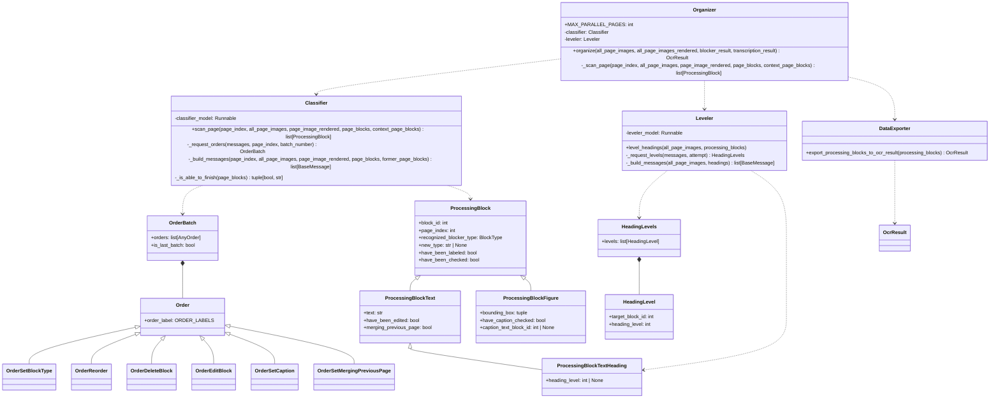
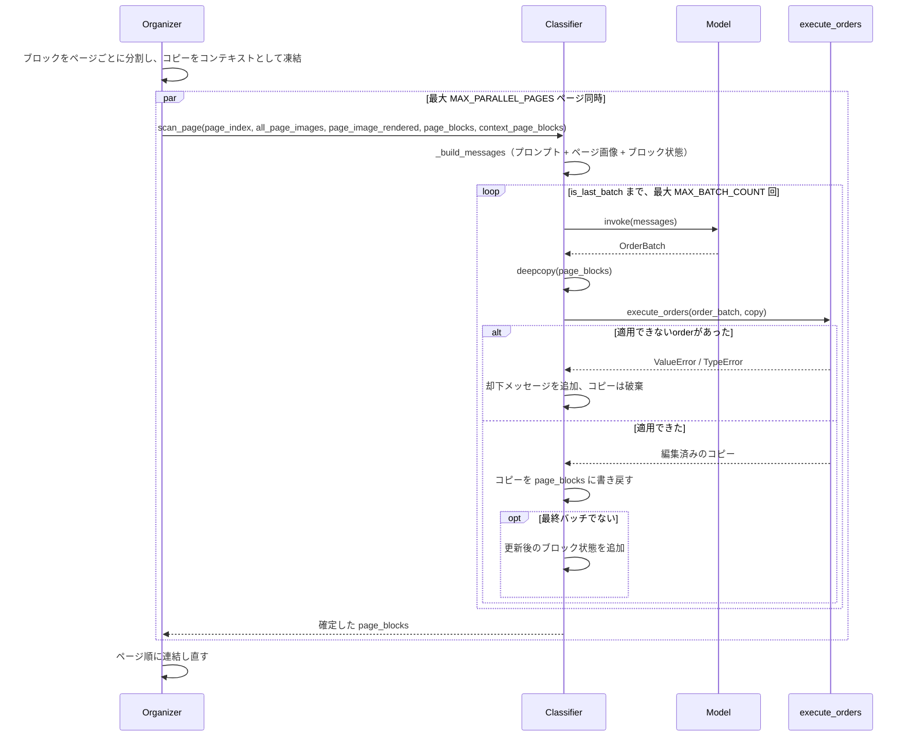
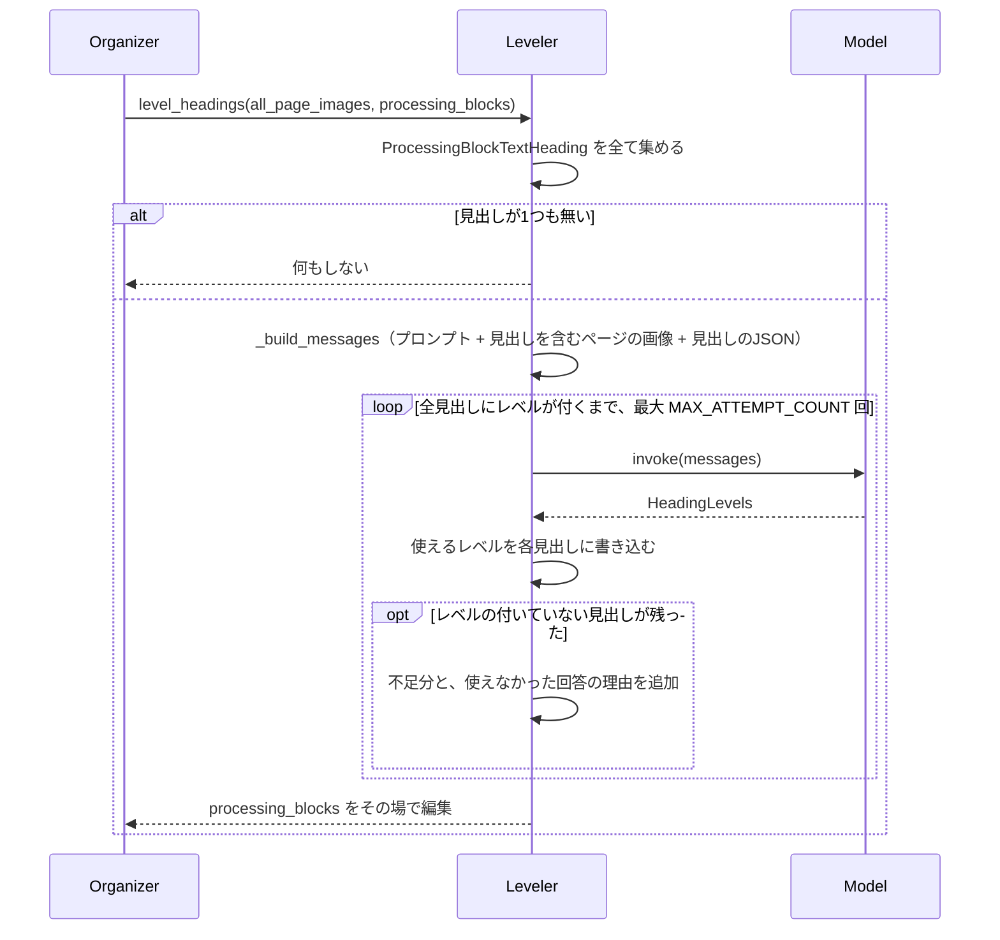

# StructureOrganizer

ブロック分割OCRパイプラインの第3段階（[Plan.md](Plan.md) 参照）。`Blocker` が検出し
`Transcriber` が読み取ったブロックを、マルチモーダルモデルがドキュメント構造へと
確定する。確定するのは、各テキストブロックの種別、各見出しの階層レベル、各図の
キャプション、そして読み順。

English version: [StructureOrganizer.md](StructureOrganizer.md)

## 2つのモデル段階

判断に何が見えている必要があるかで、処理を分割している。

- **`Classifier/`** はページ単位で確定する。各ブロックが何か、どの図にどのキャプションが
  付くか、どの順に読むか——いずれも目の前のページだけで判断できる事柄。そのため
  `MAX_PARALLEL_PAGES` ページずつ並列に処理する。
- **`Leveler/`** は見出しのレベルを決める。見出しのレベルはドキュメント全体との関係で
  しか意味を持たないため、全ページの分類が終わった後に1回だけ実行し、見出しを含む
  ページ群を一度にまとめて見る。

`Organizer` がこの順に両者を実行し、結果を `DataExporter` に渡す。

## 構造

モデル自身はブロックを書き換えない。モデルは `OrderBatch` を返すだけで、
`ProcessingBlock` を変更するのは `execute_orders()` のみ。受け取ったJSONがどのorderかは
`order_label` で決まり、pydanticがこれをunionの判別子として使うため、各orderは自身の
スキーマで検証済みの状態で届く。

## ページスキャン

各ページはそれぞれ専用のリスト上で確定する。`Organizer` がブロックをページごとに分割し、
その時点のコピーを「ページ同士が読み合うコンテキスト」として凍結した上で、各ページに
自分のリストを渡す。orderが届くのはそのリストだけで、ページ間で状態を共有しないため、
`map_pages()`（[Blocker.ja.md](Blocker.ja.md) 参照）で `MAX_PARALLEL_PAGES` ページずつ
並列実行し、結果はページ順で戻る。

バッチはブロックのコピーに適用する。途中で失敗したバッチはブロックを一切変更せず、
その旨をモデルに伝えて再試行させる。ページの完了はモデルが `is_last_batch` で宣言し、
`MAX_BATCH_COUNT` は宣言しないモデルに対する保険でしかない。

ただし宣言すれば完了というわけではない。`_is_able_to_finish()` が、ページ上の全ブロックに
block_type があるか、図のキャプションが確認済みかを検査し、足りなければ該当ブロックを
名指しでモデルに差し戻す。見出しレベルはここでは検査しない——どのページも単独では
答えられないため。通過したページのブロックには `have_been_checked` が立つ。

### モデルに与えるコンテキスト

ページスキャンのたびにコンテキスト全体を送り直すため、そのページに必要なものだけに絞る。

- 直前 `RECENT_PAGE_COUNT` ページの画像。ページ境界をまたぐブロックのため。
- 現在のページ画像そのもの。
- 各ブロックの枠線と `block_id` を描画した現在のページ画像（`BlockRenderer` による。
  [Blocker.ja.md](Blocker.ja.md) 参照）。
- 現在のページと直前1ページの `ProcessingBlock` の状態を、現在の順序でJSON化したもの。
  ページ境界をまたぐブロックには1ページ分で足りる。直前ページは同時に処理中のため、
  Blockerが出力したままの未分類の状態で渡し、その旨と、orderの対象にはできないことを
  モデルに伝える。

### Order一覧

| Order | 効果 |
| --- | --- |
| `set_block_type` | テキストブロックに `TEXT_BLOCK_TYPES` のいずれかを付与する。 |
| `reorder` | ブロックを別のブロックの直前へ移動する。 |
| `delete_block` | ブロックを削除し、それを指していたキャプション参照も解除する。 |
| `edit_block` | 指定されたフィールドのみ変更する（種別・本文）。 |
| `set_caption` | 図をキャプションのテキストブロックに紐づける。キャプションが無い図にはnullを指定する。どちらの場合も確認済みとして扱う。 |
| `set_merging_previous_page` | 前ページで途切れたブロックの続きであることを記録する。結合自体はエクスポート時に行う。 |

orderはリスト順に適用され、各orderは直前までの結果に対して働く。見出しとして分類された
時点でテキストブロックは `ProcessingBlockTextHeading` になり、レベルは `Leveler` が
埋めるまで空のまま。

## 見出しレベル

モデルに渡すのは、見出しを含む全ページの画像（そのページ上の見出しの `block_id` を
ラベルに記載）と、ドキュメント順に並べた見出しのJSON。見出しを含まないページは送らない。
階層は見出し自体とその組版から決まるため、本文だけのページは判断材料にならない。

回答はorderではなく「見出し1つにつきレベル1つ」の形式。この段階が変更するのは1つの
フィールドだけであり、全見出しを一度に答えさせることこそがレベルの一貫性を生むため。
1未満のレベルや、このドキュメントの見出しではない `block_id` に対する回答は書き込まず、
レベルの付いていない見出しと併せてモデルに差し戻す。`MAX_ATTEMPT_COUNT` 回の試行後も
レベルが付かなかった見出しは、推測せずレベル無しのままにする。エクスポート側が既に
対応しているため。

## エクスポート

全ページのスキャンと見出しのレベル付けが終わると、
`export_processing_blocks_to_ocr_result()` が平坦なブロック列を `OcrResult` の木に
変換する。読み順に走査し、

- 見出しはセクションを開く。ネスト先は、より小さいレベルで開いている最も内側の
  セクション。見出し自身はそのセクションの先頭ブロックになる。同レベル以下の見出しは
  内側にいないセクションを閉じるため、`1.` の下に `1.1` が入り、続く `2.` は `1.` の
  兄弟になる。
- それ以外は現在開いているセクションに追加する。最初の見出しより前のブロックは、
  ドキュメント自身であるルートセクションに入る。
- 図のキャプションブロックは図の `caption` に畳み込まれ、独立したブロックとしては
  出力しない。キャプションのテキストが重複しないようにするため。
- `merging_previous_page` が立ったブロックは、前ページの同じラベルを持つ最後のブロックに
  畳み込まれ、そのページ番号は結合先の `existing_pages` に加わる。連鎖も辿るため、3ページに
  またがる段落も1ブロックになる。テキストの結合は、境界の両側がASCII（＝単語を空白で
  区切る言語）の場合のみ空白を挟み、それ以外は直接つなぐ。ページが強制した改行は元々
  テキストの一部ではないため。ハイフンで分割された語はハイフンを残す。著者自身が書いた
  ハイフンを落とすと復元できないため。
- 各セクションの `existing_pages` は内容の和集合。`block_index` はドキュメント順に
  採番し、ルートが0。

ここでドキュメントを拒否することはない。ラベルの無いブロックは `paragraph` として、
レベルの無い見出しはセクションを開かずに、存在しないブロックを指すキャプションは破棄
して書き出す。いずれもログに警告を残す。ブロック1つのために実行全体を失う方が、
おかしなブロックが1つ混じるより悪いため。

## 規約

- Blockerが画像または表として検出したブロックは、最初から `figure` / `table` として
  ラベル付けされた状態で始まる。検出結果が答えなので、オーガナイザには実際に判断すべき
  ブロックだけが残る。
- 変数として保持するページは全て0始まりのindexで、名前は `page_index`（`scan_page` の
  引数も `ProcessingBlock.page_index` も同様）。`+ 1` するのは表示する箇所だけ——プロンプト、
  画像のラベル、ブロック状態JSON、ログ。読み手は1からページを数えるため。モデルに見せる
  JSONでフィールド名が `page_number` なのも同じ理由。
- モデルに見せたJSONに存在するidのみ使用でき、未知のid——他ページのブロックを含む——を
  指すorderは無視ではなく却下する。
- プロンプトおよびモデル向けのテキストは全て英語。
