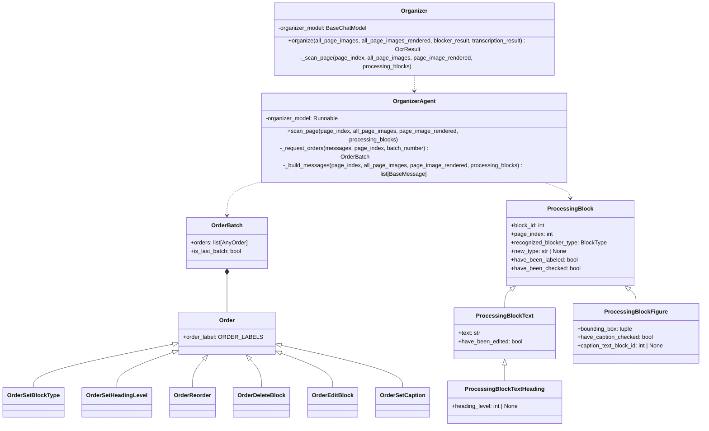
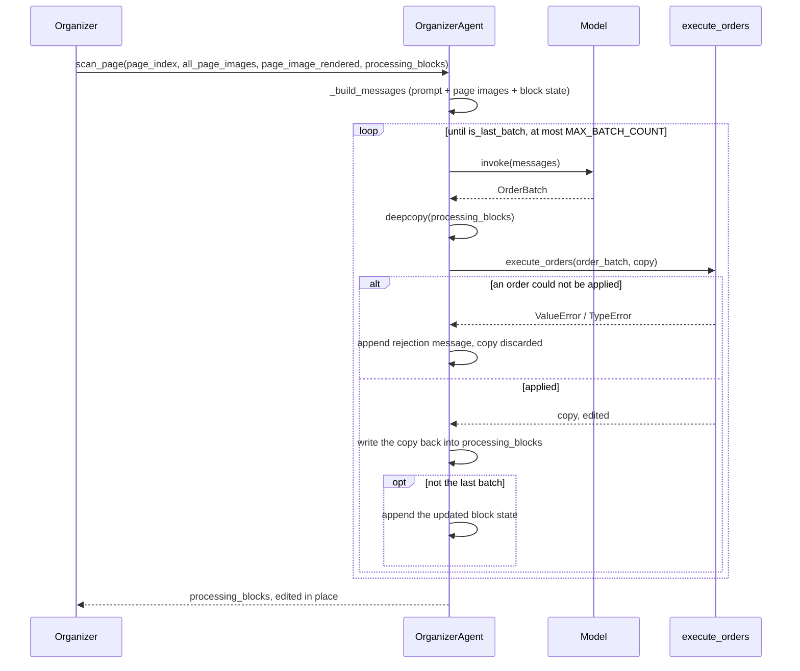

# StructureOrganizer

Step 3 of the blocked OCR pipeline (see [Plan.md](Plan.md)): the blocks a `Blocker`
found and a `Transcriber` read are settled into a document structure — each text
block's type, each heading's level in the hierarchy, each figure's caption, and the
reading order — one page at a time, by a multimodal model.

日本語版: [StructureOrganizer.ja.md](StructureOrganizer.ja.md)

## Structure

The model never edits the blocks itself: it answers with an `OrderBatch`, and
`execute_orders()` is the only code that changes a `ProcessingBlock`. Which order a
piece of JSON is, is decided by its `order_label`, which pydantic uses as the union
discriminator, so each order arrives already validated against its own schema.

## Page scan

A batch is applied to a copy of the blocks, so a batch that fails partway leaves the
blocks exactly as they were and the model is told so before it tries again. The model
sets `is_last_batch` when the page is done; `MAX_BATCH_COUNT` only guards against a
model that never does.

## Context given to the model

Every page scan resends the whole context, so it is kept to what the page needs:

- The page image of each heading the page still sits under, outermost first — the
  innermost heading open when the previous page ended, then the heading above it, up
  to the document's level 1 title. This is what keeps heading levels consistent across
  a long document: if the previous page ended under an H3, the pages of that H3, its
  H2, and the H1 are shown. Headings that share a page are named together on that one
  page image, which is sent once.
- The `RECENT_PAGE_COUNT` pages just before this one, for blocks that continue across
  a page boundary. A page already shown as a heading page is not sent twice.
- The page itself, as scanned.
- The page again, with each block outlined and labeled with its `block_id`, as
  `BlockRenderer` draws it (see [Blocker.md](Blocker.md)).
- The `ProcessingBlock` state of this page and the pages just before it, as JSON, in
  current order. Everything earlier is settled and is left out.

## Orders

| Order | Effect |
| --- | --- |
| `set_block_type` | Labels a text block with one of the `TEXT_BLOCK_TYPES`. |
| `set_heading_level` | Gives a heading its level, and labels it a heading. |
| `reorder` | Moves a block immediately in front of another. |
| `delete_block` | Removes a block, and clears any caption pointing at it. |
| `edit_block` | Changes only the fields it fills in: label, text, heading level. |
| `set_caption` | Ties a figure to the text block that is its caption. |

Orders apply in list order, each one acting on the state the previous ones left. A
text block becomes a `ProcessingBlockTextHeading` as soon as it is labeled a heading
or given a level.

## Conventions

- Every page held in a variable is an index counting from 0, named `page_index`:
  `scan_page`'s argument and `ProcessingBlock.page_index` alike. The `+ 1` happens
  only where a page number is shown - the prompt, the image labels, the block state
  JSON, and the logs - since a reader counts pages from 1. That is also why the JSON
  the model sees calls the field `page_number`.
- The model is given only ids that exist in the JSON it was shown, and an order
  naming an unknown id is rejected rather than ignored.
- All prompts and model-facing text are English.
