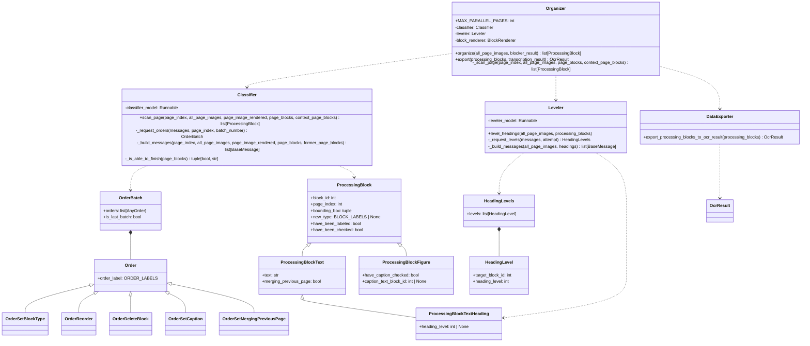
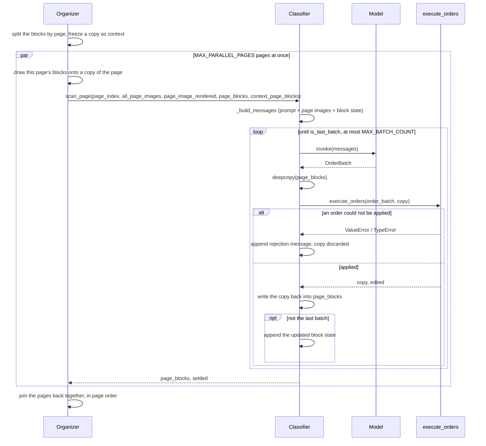
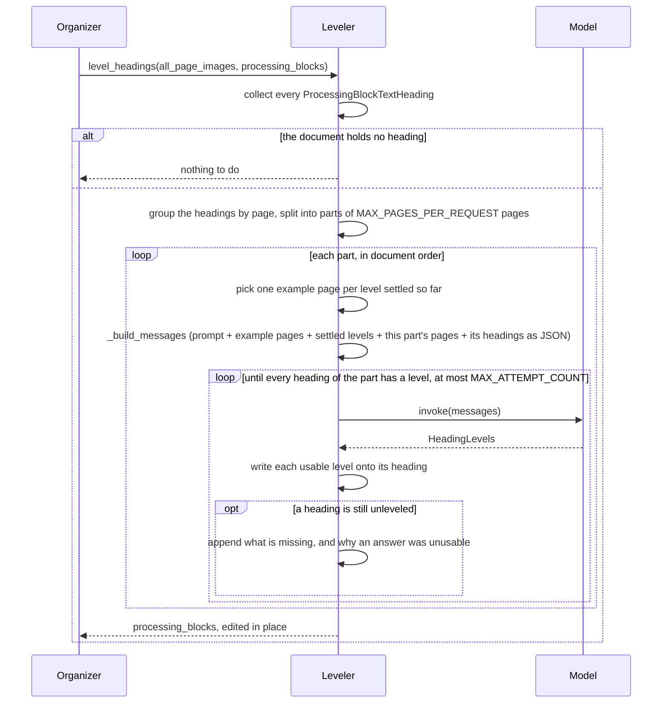

# StructureOrganizer

Step 2 of the blocked OCR pipeline (see [Plan.md](Plan.md)): the boxes a `Blocker`
found are settled into a document structure — what each block is, each heading's
level in the hierarchy, each figure's caption, and the reading order — by a
multimodal model reading the page.

Nothing has been transcribed at this point. That is the point: what a block is, is
read off the page, and what this stage decides is what tells the
[Transcriber](Transcriber.md) how to read each block afterwards. The document tree is
built here too, once the text is back.

日本語版: [StructureOrganizer.ja.md](StructureOrganizer.ja.md)

## The two model stages

The work splits by what a decision needs to see:

- **`Classifier/`** settles one page at a time: what each block is, which blocks
  belong to which figure, what order they are read in. Everything it decides can be
  decided from the page in front of it, so the pages are classified in parallel,
  `MAX_PARALLEL_PAGES` at a time.
- **`Leveler/`** ranks the headings. A heading's level means nothing except against
  the rest of the document, so this runs once, after every page has been classified,
  and sees every page that holds a heading at the same time.

`Organizer` runs the two in that order, and later — once the Transcriber has read the
blocks — hands the finished blocks to `DataExporter`.

## Structure

The model never edits the blocks itself: it answers with an `OrderBatch`, and
`execute_orders()` is the only code that changes a `ProcessingBlock`. Which order a
piece of JSON is, is decided by its `order_label`, which pydantic uses as the union
discriminator, so each order arrives already validated against its own schema.

A block starts as a bare `ProcessingBlock` — an id and a box, nothing else — and
labeling it is what decides which kind of block it becomes: a heading carries a
level, a figure carries a caption and no text of its own, anything else is a plain
text block. Labeling it again rebuilds it as the kind the new label calls for, so a
heading called a paragraph stops being a heading rather than keeping a level nothing
will use.

## Page scan

Each page is settled in a list of its own: `Organizer` splits the blocks by page,
freezes a copy of that split as the context the pages read of each other, and hands
each page its own list. A page's orders reach that list and nothing else, so the
pages share no state and run through `run_parallel()` (see [Blocker.md](Blocker.md))
`MAX_PARALLEL_PAGES` at a time, coming back in page order.

A batch is applied to a copy of the blocks, so a batch that fails partway leaves the
blocks exactly as they were and the model is told so before it tries again. The model
sets `is_last_batch` when the page is done; a page still unsettled after
`MAX_BATCH_COUNT` batches ends the run, since there is nothing to write down for it.

Saying the page is done does not make it so: `_is_able_to_finish()` checks every block
on the page for a block_type and every figure for its caption check, and a page still
missing either goes back to the model with the blocks at fault named. Heading levels
are not checked here — no page can answer for them. Once the page passes, its blocks
are marked `have_been_checked`.

The annotated page is drawn inside the page's own work rather than for the whole
document up front: a document's worth of annotated copies is the same memory again as
the document itself, and only the pages being worked on need one.

### Context given to the model

Every page scan resends the whole context, so it is kept to what the page needs:

- The `RECENT_PAGE_COUNT` pages just before this one, for blocks that continue across
  a page boundary.
- The page itself, as scanned.
- The page again, with each block outlined and labeled with its `block_id`, as
  `BlockRenderer` draws it (see [Blocker.md](Blocker.md)).
- The `ProcessingBlock` state of this page and the page before it, as JSON, in
  current order: each block's id, page, bounding box, and the label it carries so
  far. There is no text to show — nothing has been read yet. The page before is shown
  as the Blocker left it, still unlabeled, since it is being settled at the same
  time, and the model is told so, and told that it is not something an order can name.

Every image is sent at `MODEL_IMAGE_MAX_EDGE` on its longest side. Providers resize
anything larger down to about that anyway, and a page scan resends its images with
every round-trip, so the full-resolution page would be paid for again and again for
nothing.

### Orders

| Order | Effect |
| --- | --- |
| `set_block_type` | Labels a block with one of the `TEXT_BLOCK_TYPES`, or `figure`. |
| `reorder` | Moves a block immediately in front of another. |
| `delete_block` | Removes a block, and clears any caption pointing at it. |
| `set_caption` | Ties a figure to its caption block, or to null for a figure that has none. Either way the figure counts as checked. |
| `set_merging_previous_page` | Marks a block as the rest of a block the previous page broke off. The join itself happens on export. |

Orders apply in list order, each one acting on the state the previous ones left. There
is no order for correcting text: at this point there is none to correct.

## Heading levels

The model is given the image of every page that holds a heading — labeled with the
`block_id`s of the headings on it — and the headings themselves as JSON, in document
order. Pages holding no heading are not sent: the hierarchy is decided from the
headings and how they are printed, so a page of body text adds nothing.

The headings arrive here with no text — they are read later — so the page image is
all there is to judge from: numbering, type size and weight, indentation. That is
also why the hierarchy is settled by looking at pages rather than at a list of
strings.

### Parts, and the example pages that hold them together

Every heading page is an image, so a document with headings on a hundred pages cannot
be one request. The heading pages are taken `MAX_PAGES_PER_REQUEST` at a time, in
document order.

Split naively, each part would rank its own headings from scratch and the parts would
not agree — the same size of heading would come out a level 2 in one part and a level
3 in the next. So every part after the first also carries **one page per level
already settled**, labeled with which of its blocks is the example of that level,
plus the levels settled so far as JSON. The model is not asked to remember what a
level 2 looked like; it is shown one, and told those pages are examples to judge
against rather than work to answer for. One page often carries examples of two
levels, and is then sent once.

The answer is one level per heading rather than a batch of orders: this stage changes
one field, and an answer that covers a whole part at once is what makes the levels
within it consistent. A level below 1, or one for a `block_id` that was not asked
about, is not written down and comes back to the model along with the headings still
unleveled. A heading still without a level after `MAX_ATTEMPT_COUNT` attempts ends
the run rather than leaving the document's hierarchy half guessed.

## Export

Once the Transcriber has read the blocks, `Organizer.export()` writes each
transcription onto its block and `export_processing_blocks_to_ocr_result()` turns the
flat list into the `OcrResult` tree, walking it in reading order:

- A heading opens a section, nested under the innermost open section of a lower level,
  and the heading itself becomes that section's first block. A heading of the same or
  a lower level closes the sections it is not inside, so `1.1` under `1.` nests, and a
  following `2.` becomes `1.`'s sibling.
- Anything else is appended to the section currently open. Blocks before the first
  heading land in the root section, which is the document itself.
- A figure's caption block is folded into the figure's `caption` and is not emitted as
  a block of its own, so the caption text appears once.
- A block marked `merging_previous_page` is folded into the last block of the previous
  page carrying the same label, and its page joins that block's `existing_pages`. The
  fold follows a chain, so a paragraph running over three pages ends up as one block.
  The two texts are joined with a space only where both sides of the join are ASCII -
  a space-separated script - and directly otherwise, since the line break the page
  forced was never part of the text. A word the page split across a hyphen keeps its
  hyphen, because dropping one the author wrote cannot be undone.
- Each section's `existing_pages` is the union of its contents', and `block_index` is
  handed out in document order, the root taking 0.

Nothing here rejects a document. A block the organizer never labeled is written down
as a `paragraph`, a heading left without a level opens no section, and a caption
pointing at a block that is not there is dropped - each with a warning in the log,
since losing a whole run over one block is worse than a document with one odd block
in it.

## Conventions

- Every page held in a variable is an index counting from 0, named `page_index`:
  `scan_page`'s argument and `ProcessingBlock.page_index` alike. The `+ 1` happens
  only where a page number is shown - the prompts, the image labels, the block state
  JSON, and the logs - since a reader counts pages from 1. That is also why the JSON
  the model sees calls the field `page_number`.
- The model is given only ids that exist in the JSON it was shown, and an order
  naming an unknown id - including a block of another page - is rejected rather than
  ignored.
- A model answer that cannot be used ends the run: a half-settled document is not a
  result worth keeping, and it is cheaper to stop than to pay for the pages after it.
- All prompts and model-facing text are English.
