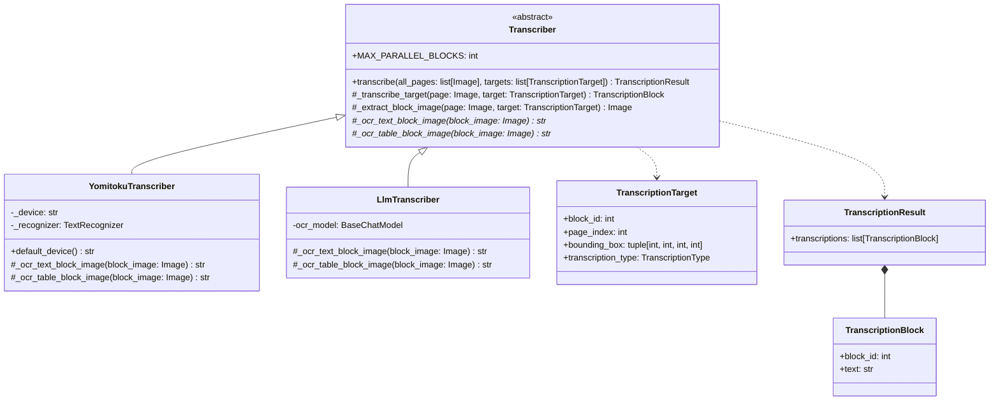
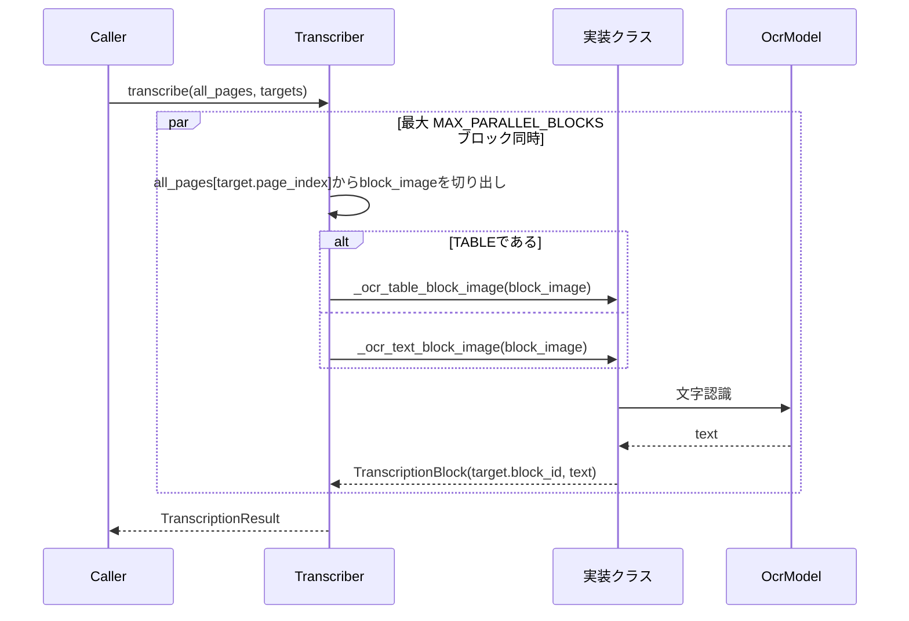

# Transcriber

ブロック分割OCRパイプラインの最終段階（[Plan.md](Plan.md) 参照）。
[Classifier](StructureOrganizer.ja.md) がテキストを含むと判断した各ブロックをページから
切り出し、ブロック単位で独立にOCRする。テキストはテキストとして、表はMarkdownの表として
読み取る。

読み取りを最後に置くのは意図的なもの。ここへ来る時点で各ブロックは段落・注・数式・表・図の
いずれかとして確定しているため、その種類にふさわしい読み方ができる。図はそもそも読まない。
図が語る内容は画像の中にある。

English version: [Transcriber.md](Transcriber.md)

## 構造

`Transcriber` はテンプレートメソッドとして `transcribe()` を実装している。各実装が行うのは
切り出し済みの1ブロック画像を読み取ることだけ（テキストは `_ocr_text_block_image()`、
表は `_ocr_table_block_image()`）。ページからの切り出し、どちらのメソッドに渡すかの
振り分け、`TranscriptionResult` の組み立ては基底クラスの役割。

何を読むかはこの段階の判断ではない。テキストを持つブロックごとに `TranscriptionTarget`
が渡され、そこにブロックの位置と2通りのどちらで読むかが書かれている。ここまで届く区別は
`TranscriptionType.TABLE` だけ。表は構造を保ったまま読む必要がある一方、見出しも注も数式も、
認識器にとっては等しくページ上の文字であるため。

ブロック同士は独立しているため、`run_parallel()`（[Blocker.ja.md](Blocker.ja.md) 参照）で
`MAX_PARALLEL_BLOCKS` ブロックを同時に読む。終了順に関わらず結果はtargetの順で返る。
モデルが複数スレッドからの呼び出しに耐えない実装は、この値を1に下げる。

## 規約

- 図は一切読まない。targetそのものが作られないため、この段階は図が何かを知る必要がない。
- 表は行単位ではなく1つのMarkdownの表として読み取るため、行と列の構造が保たれる。
- 各ブロックはページ全体ではなく、切り出した画像単体でOCRする。認識時に隣接ブロックが
  見えることはない。
- 切り出しは四辺に `BLOCK_CROP_PADDING` ピクセルの余白を付け、ページ内に収める。矩形が
  文字のわずか内側に寄っている場合、余白が無いと行の上端が切れるため。
- `TranscriptionBlock.block_id` は切り出し元の `block_id` と一致する。この値でブロックと
  転記結果を結び付けられる。

## YomitokuTranscriber

[yomitoku](https://github.com/kotaro-kinoshita/yomitoku) の `TextRecognizer` を、
文字検出器を使わずに直接呼び出す。各ブロック画像はすでに切り出し済みのため、画像全体を
認識器の唯一の多角形として渡す（`points=None`）。読み取りは1ブロックずつ
（`MAX_PARALLEL_BLOCKS = 1`）。GPU上に状態を持つモデルであり、逐次呼び出しを前提に
書かれているため。

## LlmTranscriber

マルチモーダルのチャットモデルに、`PROMPT`（表の場合は `TABLE_PROMPT`）のOCR指示に従って
ブロック画像を転記させる。回答全体がコードフェンスで囲まれていた場合は取り除く。
プロンプトでは付けないよう指示しているが、付いてきた場合にそのまま文書へ入るのを防ぐため。

## デバイス

`YomitokuTranscriber()` はGPUが利用可能なら `cuda`、無ければ `cpu` を選ぶ。`YomitokuBlocker`
と同じ方式（[Blocker.ja.md](Blocker.ja.md) 参照）。`device=` で明示指定もできる。
