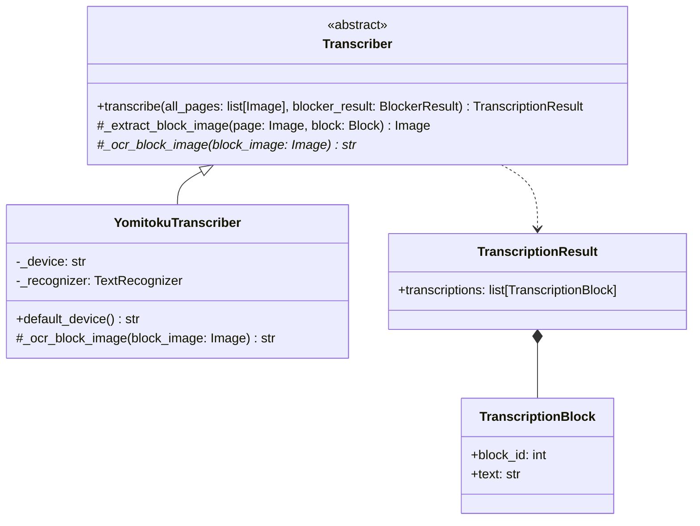
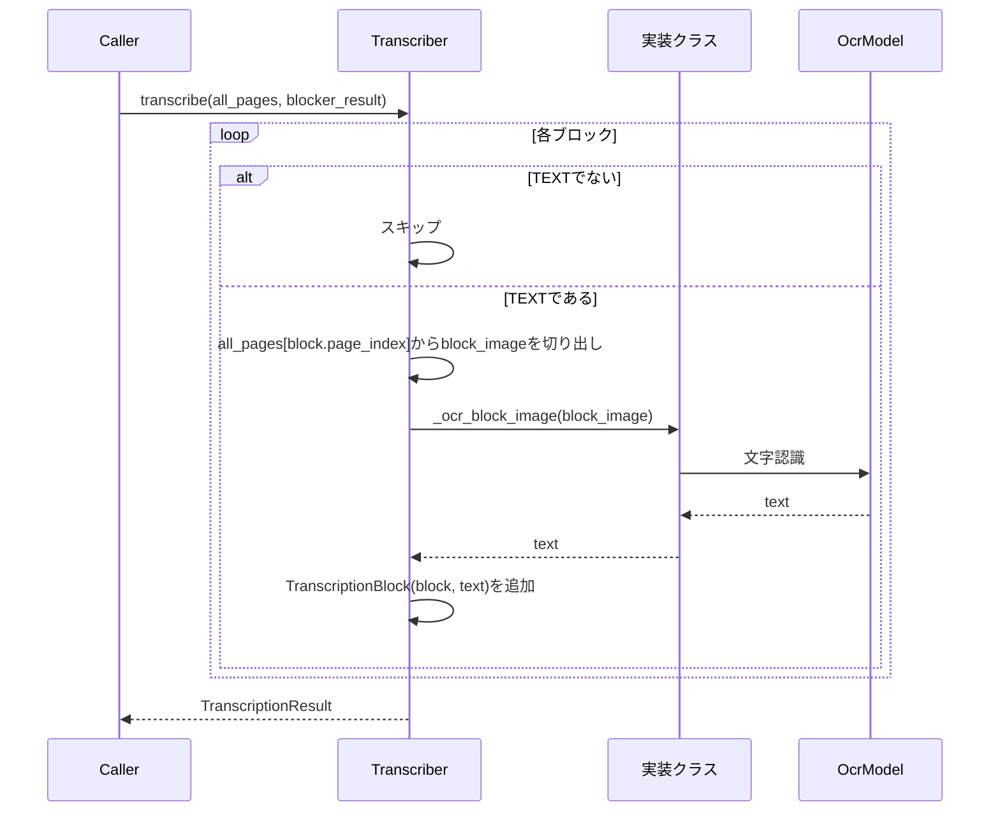

# Transcriber

ブロック分割OCRパイプラインの第2段階（[Plan.md](Plan.md) 参照）。`Blocker` が検出した
各 `TEXT` ブロックをページから切り出し、ブロック単位で独立にOCRする。

English version: [Transcriber.md](Transcriber.md)

## 構造

`Transcriber` はテンプレートメソッドとして `transcribe()` を実装している。各実装が行うのは
切り出し済みの1ブロック画像を読み取るだけ（`_ocr_block_image()`）で、`TEXT` ブロックへの
絞り込み、ページからの切り出し、`TranscriptionResult` の組み立ては基底クラスの役割。

## 規約

- ここで読み取るのは `TEXT` ブロックのみ。`MATH`・`IMAGE`・`TABLE` ブロックは後続の
  パイプライン段階に委ねる。
- 各ブロックはページ全体ではなく、切り出した画像単体でOCRする。認識時に隣接ブロックが
  見えることはない。
- `TranscriptionBlock.block_id` は切り出し元の `Block.block_id` と一致する。この値で
  ブロックと転記結果を結び付けられる。

## YomitokuTranscriber

[yomitoku](https://github.com/kotaro-kinoshita/yomitoku) の `TextRecognizer` を、
文字検出器を使わずに直接呼び出す。各ブロック画像はすでに切り出し済みのため、画像全体を
認識器の唯一の多角形として渡す（`points=None`）。

## デバイス

`YomitokuTranscriber()` はGPUが利用可能なら `cuda`、無ければ `cpu` を選ぶ。`YomitokuBlocker`
と同じ方式（[Blocker.md](Blocker.md) 参照）。`device=` で明示指定もできる。
