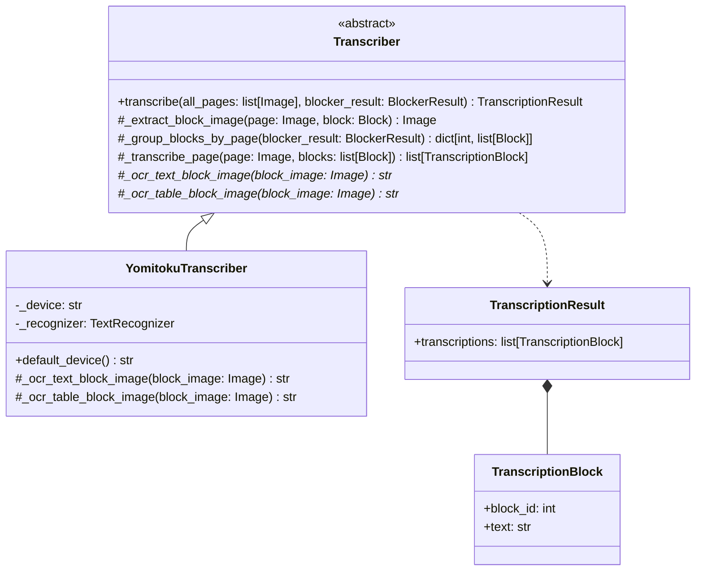
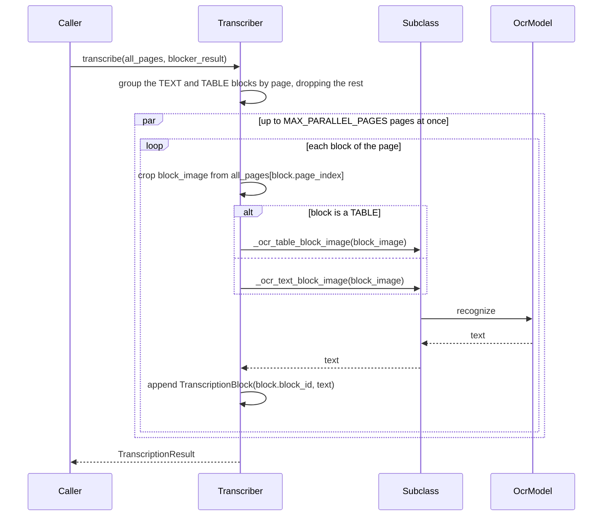

# Transcriber

Step 2 of the blocked OCR pipeline (see [Plan.md](Plan.md)): each `TEXT` and `TABLE`
block found by a `Blocker` is cropped from its page and OCR'd in isolation, one block
at a time - text as text, a table as a Markdown table.

日本語版: [Transcriber.ja.md](Transcriber.ja.md)

## Structure

`Transcriber` implements `transcribe()` as a template method: a subclass only reads
one already-cropped block image — `_ocr_text_block_image()` for text and
`_ocr_table_block_image()` for a table — while the base class handles picking the
blocks worth reading, cropping each one out of its page, sending it to the right one
of those two, and assembling the `TranscriptionResult`.

A page's blocks are read one after another, but `MAX_PARALLEL_PAGES` pages are read
at once. The transcriptions come back in block order whatever order the pages
finished in. A subclass whose model does not take being called from several threads
at once lowers that number.

## Conventions

- `TEXT` and `TABLE` blocks are transcribed here, the types in
  `TRANSCRIBED_BLOCK_TYPES`; `MATH` and `IMAGE` blocks are left for later pipeline
  steps.
- A table is read as a whole into a Markdown table, not line by line, so its rows and
  columns survive.
- Each block is OCR'd on its own crop, not the whole page, so recognition never sees
  neighboring blocks.
- `TranscriptionBlock.block_id` matches the `Block.block_id` it was cropped from, so
  transcriptions can be joined back to their blocks by that id.

## YomitokuTranscriber

Uses [yomitoku](https://github.com/kotaro-kinoshita/yomitoku)'s `TextRecognizer`
directly, without its text detector: since each block image is already an isolated
crop, the whole crop is passed as the recognizer's single polygon (`points=None`).

## Device

`YomitokuTranscriber()` picks `cuda` when a GPU is available and falls back to `cpu`,
the same way `YomitokuBlocker` does (see [Blocker.md](Blocker.md)). Pass `device=` to
force one.
