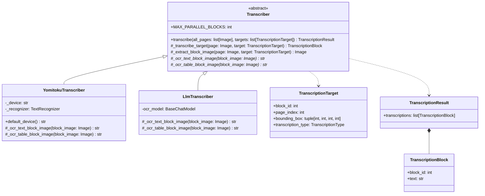
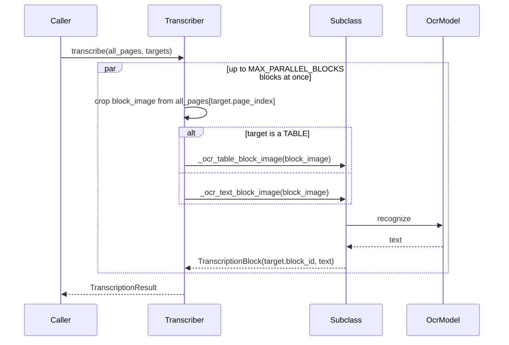

# Transcriber

The last step of the blocked OCR pipeline (see [Plan.md](Plan.md)): every block the
[Classifier](StructureOrganizer.md) said holds text is cropped from its page and
OCR'd in isolation — text as text, a table as a Markdown table.

Reading comes last on purpose. By the time a block gets here it has been called a
paragraph, a note, a formula, a table or a figure, so it is read as the kind of thing
it is, and a figure is not read at all: what a figure says is in the picture.

日本語版: [Transcriber.ja.md](Transcriber.ja.md)

## Structure

`Transcriber` implements `transcribe()` as a template method: a subclass only reads
one already-cropped block image — `_ocr_text_block_image()` for text and
`_ocr_table_block_image()` for a table — while the base class handles cropping each
block out of its page, sending it to the right one of those two, and assembling the
`TranscriptionResult`.

What to read is not this stage's decision. It is given `TranscriptionTarget`s, one
per block that holds text, each saying where the block is and which of the two ways
it is to be read. `TranscriptionType.TABLE` is the only distinction that reaches
here: a table's structure has to survive the reading, while a heading, a note and a
formula are all just text of the page to a recognizer.

Blocks are independent, so `MAX_PARALLEL_BLOCKS` of them are read at once, through
`run_parallel()` (see [Blocker.md](Blocker.md)). The transcriptions come back in
target order whatever order they finished in. A subclass whose model does not take
being called from several threads at once lowers that to 1.

## Conventions

- A figure is never read: it gets no target at all, so nothing here has to know what
  a figure is.
- A table is read as a whole into a Markdown table, not line by line, so its rows and
  columns survive.
- Each block is OCR'd on its own crop, not the whole page, so recognition never sees
  neighboring blocks.
- The crop is padded by `BLOCK_CROP_PADDING` pixels on every side and kept inside the
  page: a box that sits a hair inside the ink would otherwise cut the top off a line.
- `TranscriptionBlock.block_id` matches the `block_id` it was cropped from, so
  transcriptions can be joined back to their blocks by that id.

## YomitokuTranscriber

Uses [yomitoku](https://github.com/kotaro-kinoshita/yomitoku)'s `TextRecognizer`
directly, without its text detector: since each block image is already an isolated
crop, the whole crop is passed as the recognizer's single polygon (`points=None`).
It reads one block at a time (`MAX_PARALLEL_BLOCKS = 1`): the models hold GPU state
that one call at a time is what they were written for.

## LlmTranscriber

Asks a multimodal chat model to transcribe the block image, following the OCR
instructions in `PROMPT` (or `TABLE_PROMPT` for a table). A fence the model wrapped
its whole answer in is taken off: the prompt asks for none, and one that slipped
through would otherwise end up in the document.

## Device

`YomitokuTranscriber()` picks `cuda` when a GPU is available and falls back to `cpu`,
the same way `YomitokuBlocker` does (see [Blocker.md](Blocker.md)). Pass `device=` to
force one.
