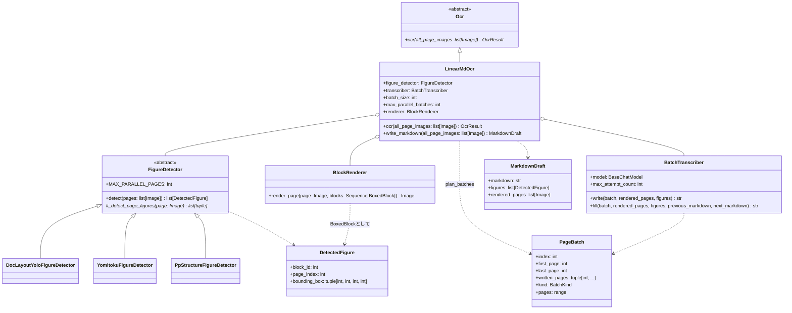
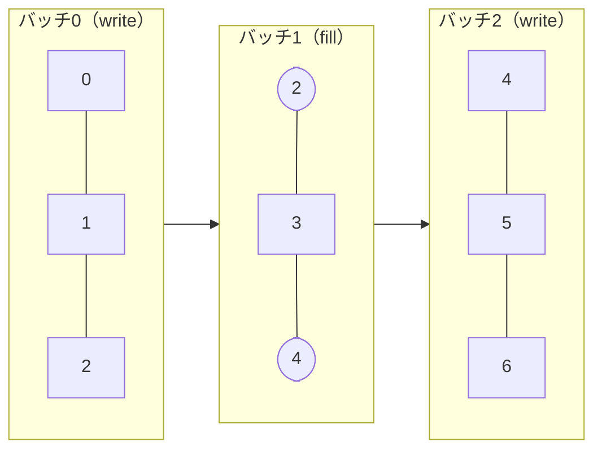
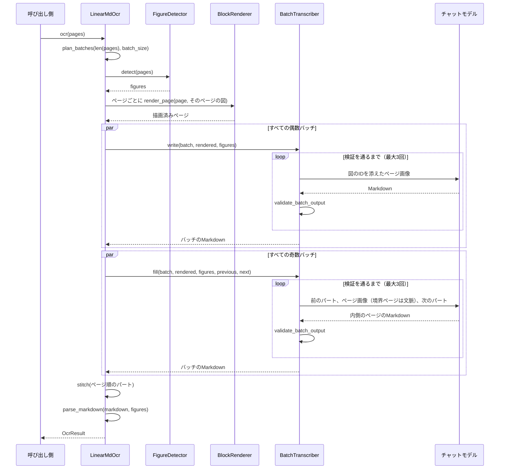

# LinearMdOcr

LinearMDのOCRパイプラインです（[Plan.md](Plan.md) を参照）。レイアウトモデルは図だけを検出し、
その枠とIDをページに描き込みます。続いてマルチモーダルモデルが、複数ページをまとめてMarkdownに
書き下し、図はIDで配置します。最後にそのMarkdownを `OcrResult` に読み込みます。
1回のリクエストで複数ページを扱うので、ページをまたぐ文章も視野に入ったまま書けます。
リクエストの回数も、1ページずつ処理する場合よりずっと少なくなります。

English version: [LinearMdOcr.md](LinearMdOcr.md)

## 構成



残りの段階は、それぞれ独立したモジュールの関数です。

| モジュール | 関数 | 責務 |
| --- | --- | --- |
| [Batching.py](../Batching.py) | `plan_batches` | 全ページを覆う偶数バッチ（write）と奇数バッチ（fill）を作る |
| [Transcriber/prompt.py](../Transcriber/prompt.py) | `WRITE_PROMPT`、`FILL_PROMPT` | モデルへの指示。[Markdownの文法](MarkdownSyntax.ja.md) を含む |
| [MarkdownValidator.py](../MarkdownValidator.py) | `validate_batch_output` | 応答の問題点を、モデルが直せる形の文で返す |
| [Markers.py](../Markers.py) | `strip_page_markers`、`split_continuation` など | ページマーカーと継続マーカーを見つけて取り除く |
| [Containers.py](../Containers.py) | `fence_problems`、`closing_container` など | `:::` フェンスを検証し、パートの境界で分かれた囲みをつなぐ |
| [Stitcher.py](../Stitcher.py) | `stitch` | 各パートを1つの文書に結合する |
| [MarkdownParser.py](../MarkdownParser.py) | `parse_markdown` | 文書を `OcrResult` のツリーに読み込む |

OCRモジュールのほかの部分と共有しているもの: `run_parallel`（[PageParallel.py](../../Blocked/PageParallel.py)）、
`BlockRenderer`（[BlockRenderer.py](../../Blocked/Blocker/BlockRenderer.py)）、`join_texts` /
`join_separator`（[TextJoin.py](../../TextJoin.py)）、[LlmHelper.py](../../LlmHelper.py) のメッセージ用ヘルパー、
`OcrResultSection.recompute_existing_pages`。

## 図の検出

`FigureDetector.detect()` は、Blockedパイプラインの `Blocker` と同じテンプレートメソッドです。
サブクラスは1ページ分の図の枠を返すだけです。基底クラスが `MAX_PARALLEL_PAGES` ページずつ並列に検出し、
各ページを上から下へ並べ替え、全ページがそろってから文書全体で図に番号を振ります。
そのため、IDはどのページが先に終わったかに左右されません。

各検出器は、同じモデルを使うBlockerの読み込み処理と座標変換を使い回し、図にあたるクラスだけを残します。

| 検出器 | 残すもの |
| --- | --- |
| `DocLayoutYoloFigureDetector` | クラス `figure` |
| `YomitokuFigureDetector` | `layout.figures` |
| `PpStructureFigureDetector` | ラベル `image` と `chart`（ロゴである `header_image` / `footer_image` は除く） |

`PpStructureFigureDetector` は `MAX_PARALLEL_PAGES = 1` にしています。PaddleXの予測器は、
複数のスレッドから同時に呼ぶと結果が混ざり、あるページの図が別のページのものとして返ってきます。

表と数式は検出しません。モデルがMarkdownの表とKaTeXで書き下します。
すべてのクラスラベルを意図的に捨てている `Blocker` のオプションにはせず、検出器を `LinearMD/` の下に別に置いています。

## バッチ

`B = batch_size` とすると、バッチ `x` は閉区間 `[B*x, B*(x+1)]` です（最後のページで打ち切る）。
隣り合うバッチは境界のページを共有します。偶数バッチは自分の全ページを書き、奇数バッチは
2つの偶数バッチの間のページだけを書きます。境界のページは文脈として見るだけです。`B = 2`、7ページの場合:



角の丸いページは文脈として送るだけで、書き直しません。`B` は2以上が必要です（1だと奇数バッチに
自分のページができません）。書くページが残らない奇数バッチ（文書の末尾）は作りません。
`B + 1` ページより短い文書は偶数バッチ1つだけになり、2パス目はありません。

## 処理の流れ



どちらのパスも `run_parallel` を通し、`max_parallel_batches` 個ずつ並列に処理します。
最初の失敗で全体を止めます。`max_attempt_count` 回試しても検証を通らないバッチは `RuntimeError` を出します。

奇数バッチには、前後の偶数バッチのMarkdown全文と、境界ページも含めた自分の全ページを渡します。
自分の応答が2つのパートの間にそのまま挿入されることを伝えるので、モデルは前のパートで途切れた段落を
最初から書き直さず、その続きを書きます。そのことは `<!--continues-previous-->` で示させます。
自分の最後の段落が次のパートへ続く場合は `<!--continued-by-next-->` で示させます。
Stitcherはそこで2つの半分を結合します。空白を入れるのは、`join_texts` と同じく、両側がASCIIの場合だけです。
それ以外の境界は空行でつなぎます。

`write_markdown()` はパースの手前で止まり、Markdownと図、描画済みのページを返します。
それらを確認したい呼び出し側のためのものです。

## テスト

- 単体テスト: [Test/Unit/LinearMD/](../../../Test/Unit/LinearMD/)。バッチ計画、マーカーとフェンス、
  検証、結合、パーサ、決まった応答を返す偽モデルを使った書き下し（再試行とその上限を含む）、
  偽の検出器とリクエストの内容から応答する偽モデルを使ったパイプライン全体。
- 本物の検出器とモデルでサンプルPDFを読む手動テスト:
  [TestLinearMd_setup.md](../../../Test/Manual/LinearMD/TestLinearMd_setup.md)。

```bash
cd Uploader
uv run pytest
uv run mypy          # LinearMDに対して厳格モード
```
