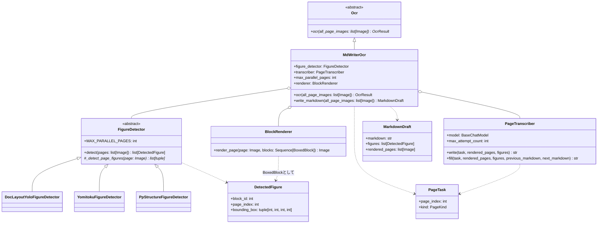
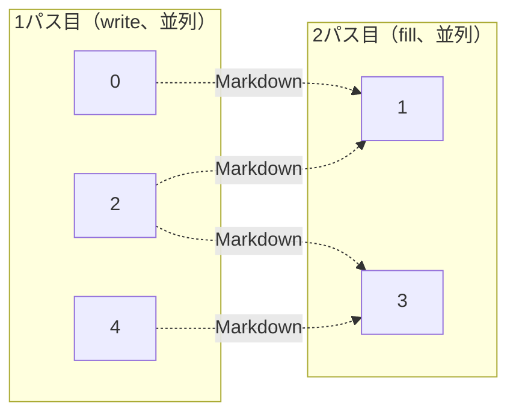
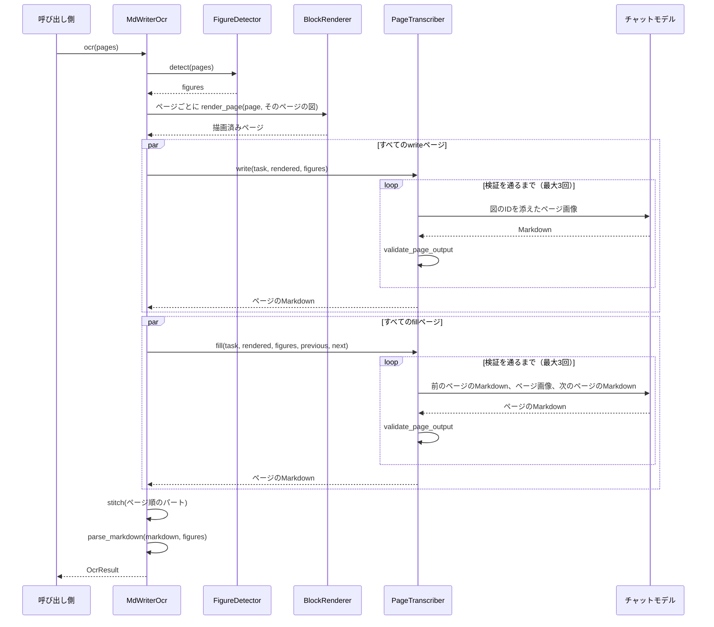

# MdWriterOcr

MdWriterのOCRパイプラインです（[Plan.md](Plan.md) を参照）。レイアウトモデルは図だけを検出し、
その枠とIDをページに描き込みます。続いてマルチモーダルモデルが、1回のリクエストで1ページずつMarkdownに
書き下し、図はIDで配置します。最後にそのMarkdownを `OcrResult` に読み込みます。
2つのページに挟まれたページは最後に、前後のページのMarkdownを見ながら書くので、
ページをまたぐ文章も1つの段落につながります。

English version: [MdWriterOcr.md](MdWriterOcr.md)

## 構成



残りの段階は、それぞれ独立したモジュールの関数です。

| モジュール | 関数 | 責務 |
| --- | --- | --- |
| [Transcriber/prompt.py](../Transcriber/prompt.py) | `WRITE_PROMPT`、`FILL_PROMPT` | モデルへの指示。[Markdownの文法](MarkdownSyntax.ja.md) を含む |
| [MarkdownValidator.py](../MarkdownValidator.py) | `validate_page_output` | 応答の問題点を、モデルが直せる形の文で返す |
| [Markers.py](../Markers.py) | `strip_page_markers`、`split_continuation` など | ページマーカーと継続マーカーを見つけて取り除く |
| [Containers.py](../Containers.py) | `fence_problems`、`closing_container` など | `:::` フェンスを検証し、ページの境界で分かれた囲みをつなぐ |
| [Stitcher.py](../Stitcher.py) | `stitch` | 各パートを1つの文書に結合する |
| [MarkdownParser.py](../MarkdownParser.py) | `parse_markdown` | 文書を `OcrResult` のツリーに読み込む |

OCRモジュールのほかの部分と共有しているもの: `run_parallel`（[PageParallel.py](../../Blocked/PageParallel.py)）、
`BlockRenderer`（[BlockRenderer.py](../../Blocked/Blocker/BlockRenderer.py)）、`join_texts` /
`join_separator`（[TextJoin.py](../../TextJoin.py)）、[LlmHelper.py](../../LlmHelper.py) のメッセージ用ヘルパー、
`OcrResultSection.recompute_existing_pages`。

## 図の検出

`FigureDetector.detect()` は、Blockedパイプラインの `Blocker` と同じテンプレートメソッドです。
サブクラスは1ページ分の図の枠を返すだけです。基底クラスが `MAX_PARALLEL_PAGES` ページずつ並列に検出し、
各ページを上から下へ並べ替え、全ページがそろってから文書全体で図に番号を振ります。
そのため、IDはどのページが先に終わったかに左右されません。

各検出器は、同じモデルを使うBlockerの読み込み処理と座標変換を使い回し、図にあたるクラスだけを残します。

| 検出器 | 残すもの |
| --- | --- |
| `DocLayoutYoloFigureDetector` | クラス `figure` |
| `YomitokuFigureDetector` | `layout.figures` |
| `PpStructureFigureDetector` | ラベル `image` と `chart`（ロゴである `header_image` / `footer_image` は除く） |

`PpStructureFigureDetector` は `MAX_PARALLEL_PAGES = 1` にしています。PaddleXの予測器は、
複数のスレッドから同時に呼ぶと結果が混ざり、あるページの図が別のページのものとして返ってきます。

表と数式は検出しません。モデルがMarkdownの表とKaTeXで書き下します。
すべてのクラスラベルを意図的に捨てている `Blocker` のオプションにはせず、検出器を `MdWriter/` の下に別に置いています。

## パス

1ページを1リクエストで書きます。偶数インデックスのページ（1・3・5…ページ目）が *write* ページで、
1パス目にそれぞれ単独で送ります。その間のページが *fill* ページで、2パス目に、前後のwriteページが
返したMarkdownと一緒に送ります。5ページの場合:



fillページに送る画像は自分のページだけです。前後のページはテキストとして渡し、段落がどこで
途切れているかを示します。1ページだけの文書には2パス目がなく、文書の最後のfillページには次のページがありません。

## 処理の流れ



どちらのパスも `run_parallel` を通し、`max_parallel_pages` ページずつ並列に処理します。
最初の失敗で全体を止めます。`max_attempt_count` 回試しても検証を通らないページは `RuntimeError` を出します。
各リクエストの実行メタデータには `page_index` と `page_kind` を入れるので、コールバック側で
どのリクエスト（とそのトークン使用量）がどのページのものかを区別できます。

fillページには、自分の応答が前後のページの間にそのまま挿入されることを伝えます。そのためモデルは、
前のページで途切れた段落を最初から書き直さず、その続きを書きます。そのことは `<!--continues-previous-->` で示させます。
自分の最後の段落が次のページへ続く場合は `<!--continued-by-next-->` で示させます。
ページマーカーはモデルには書かせません。Stitcherが各ページのMarkdownの前に `<!--page:N-->` を置きます
（モデルが書いたものは先に取り除きます）。継続マーカーのある所では2つの半分を1つの段落に結合し、
空白を入れるのは `join_texts` と同じく両側がASCIIの場合だけです。それ以外の境界は空行でつなぎます。
writeページ同士が隣り合うことはないので、つなぎ方はすべて間にあるfillページが決めます。

`write_markdown()` はパースの手前で止まり、Markdownと図、描画済みのページを返します。
それらを確認したい呼び出し側のためのものです。

## テスト

- 単体テスト: [Test/Unit/MdWriter/](../../../Test/Unit/MdWriter/)。マーカーとフェンス、
  検証、結合、パーサ、決まった応答を返す偽モデルを使った書き下し（再試行とその上限を含む）、
  偽の検出器とリクエストの内容から応答する偽モデルを使ったパイプライン全体。
- 本物の検出器とモデルでサンプルPDFを読み、ページごとのトークン数とコストを出す手動テスト:
  [TestMdWriter_setup.md](../../../Test/Manual/MdWriter/TestMdWriter_setup.md)。

```bash
cd Uploader
uv run pytest
uv run mypy          # MdWriterに対して厳格モード
```
