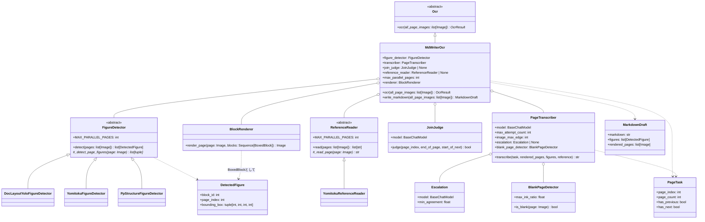
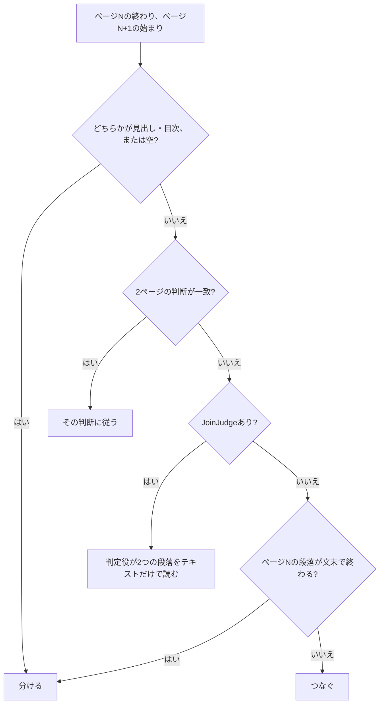
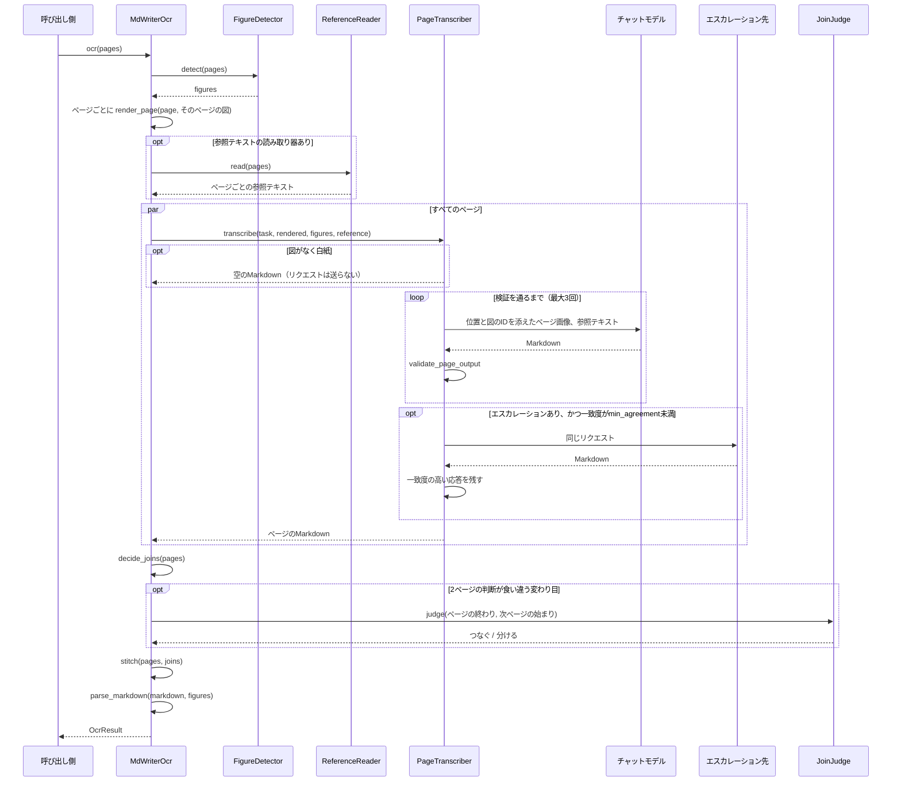

# MdWriterOcr

MdWriterのOCRパイプラインです（[Plan.md](Plan.md) を参照）。レイアウトモデルは図だけを検出し、
その枠とIDをページに描き込みます。続いてマルチモーダルモデルが、1回のリクエストで1ページずつ、
全ページを同時にMarkdownに書き下し、図はIDで配置します。最後にそのMarkdownを `OcrResult` に読み込みます。
各ページは、自分の端で文章がページをまたぐかどうかを自分で示すので、ページの変わり目で分かれた段落は1つにつながります。

オプションで、従来型のOCRを *参照テキスト* として加えられます。各ページのプレーンテキストをモデルに見せて
文字をそこから取らせ、参照テキストとの一致度が低すぎるページは、より強いモデルで書き直します。

English version: [MdWriterOcr.md](MdWriterOcr.md)

## 構成



モジュールは段階ごとに、それぞれ1つのサブディレクトリにまとめています。

| ディレクトリ | 責務 |
| --- | --- |
| `MdWriter/` | 入口の `MdWriterOcr` と、段階の間で受け渡すデータ（[Schema.py](../Schema.py)） |
| [FigureDetector/](../FigureDetector/) | ページの図を見つける |
| [ReferenceReader/](../ReferenceReader/) | 従来型OCRで各ページのプレーンテキストを読む |
| [Transcriber/](../Transcriber/) | 1ページをMarkdownに書き起こし、応答を検証する |
| [Assembly/](../Assembly/) | ページの変わり目を決め、各ページを1つの文書に結合する |
| [Parser/](../Parser/) | 文書を `OcrResult` のツリーに読み戻す |
| [Syntax/](../Syntax/) | [Markdownの文法](MarkdownSyntax.ja.md) そのもの。上の各段階が共有する |

図の検出と参照テキスト以降の段階は、ふつうの関数です。

| モジュール | 関数 | 責務 |
| --- | --- | --- |
| [Transcriber/prompt.py](../Transcriber/prompt.py) | `PROMPT`、`PROMPT_WITH_REFERENCE` | モデルへの指示。[Markdownの文法](MarkdownSyntax.ja.md) を含む |
| [Transcriber/MarkdownValidator.py](../Transcriber/MarkdownValidator.py) | `validate_page_output` | 応答の問題点を、モデルが直せる形の文で返す |
| [Transcriber/Agreement.py](../Transcriber/Agreement.py) | `agreement` | 応答がそのページの参照テキストとどれだけ一致するか |
| [Transcriber/BlankPage.py](../Transcriber/BlankPage.py) | `BlankPageDetector`、`ink_ratio` | 画像から白紙のページを見分け、モデルに書かせないようにする |
| [Assembly/PageJoin.py](../Assembly/PageJoin.py) | `decide_joins` | どのページの変わり目で段落が分かれているかを決める |
| [Assembly/prompt.py](../Assembly/prompt.py) | `JOIN_PROMPT` | `JoinJudge` への指示 |
| [Assembly/Stitcher.py](../Assembly/Stitcher.py) | `stitch` | 各ページを1つの文書に結合する |
| [Parser/MarkdownParser.py](../Parser/MarkdownParser.py) | `parse_markdown` | 文書を `OcrResult` のツリーに読み込む |
| [Syntax/Markers.py](../Syntax/Markers.py) | `strip_page_markers`、`split_continuation` など | ページマーカーと継続マーカーを見つけて取り除く |
| [Syntax/Containers.py](../Syntax/Containers.py) | `fence_problems`、`closing_container` など | `:::` フェンス（注と目次）を検証し、ページの変わり目で分かれた囲みをつなぐ |
| [Syntax/TableOfContents.py](../Syntax/TableOfContents.py) | `parse_entries`、`entry_problems` | `:::toc` ブロックの項目を字下げで入れ子にした木として読み、検証する |

OCRモジュールのほかの部分と共有しているもの: `run_parallel`（[PageParallel.py](../../Blocked/PageParallel.py)）、
`BlockRenderer`（[BlockRenderer.py](../../Blocked/Blocker/BlockRenderer.py)）、`join_texts` /
`join_separator`（[TextJoin.py](../../TextJoin.py)）、[LlmHelper.py](../../LlmHelper.py) のメッセージ用ヘルパー、
`OcrResultSection.recompute_existing_pages`。

## 図の検出

`FigureDetector.detect()` は、Blockedパイプラインの `Blocker` と同じテンプレートメソッドです。
サブクラスは1ページ分の図の枠を返すだけです。基底クラスが `MAX_PARALLEL_PAGES` ページずつ並列に検出し、
各ページを上から下へ並べ替え、全ページがそろってから文書全体で図に番号を振ります。
そのため、IDはどのページが先に終わったかに左右されません。

各検出器は、同じモデルを使うBlockerの読み込み処理と座標変換を使い回し、図にあたるクラスだけを残します。

| 検出器 | 残すもの |
| --- | --- |
| `DocLayoutYoloFigureDetector` | クラス `figure` |
| `YomitokuFigureDetector` | `layout.figures` |
| `PpStructureFigureDetector` | ラベル `image` と `chart`（ロゴである `header_image` / `footer_image` は除く） |

`PpStructureFigureDetector` は `MAX_PARALLEL_PAGES = 1` にしています。PaddleXの予測器は、
複数のスレッドから同時に呼ぶと結果が混ざり、あるページの図が別のページのものとして返ってきます。

表と数式は検出しません。モデルがMarkdownの表とKaTeXで書き下します。
すべてのクラスラベルを意図的に捨てている `Blocker` のオプションにはせず、検出器を `MdWriter/` の下に別に置いています。

## 参照テキスト

`ReferenceReader` は、各ページのプレーンテキストを従来型のOCRで読みます。読むのはスキャンしたままのページ
（図の枠を描く前）です。`YomitokuReferenceReader` はyomitokuの `DocumentAnalyzer` を使い、段落と表を
yomitokuの読み順で並べます（縦書きも含む）。柱・ページ番号・図の中の文字は含めません。
1ページずつ読み（`MAX_PARALLEL_PAGES = 1`）、GPUで1ページあたり1〜2秒です。

この種のOCRは文字を非常に忠実に読みますが、Markdownの構造は分かりません。そこで両者を組み合わせます。
モデルにはページ画像の後に参照テキストを渡し、`PROMPT_WITH_REFERENCE` で、文字は参照テキストから、
構造（見出し・表・数式・囲み・図・読み順）は画像から取るよう指示します。

参照テキストは、誤読したページを見分けるのにも使います。`agreement()` は、応答と参照テキストが共有する
文字バイグラムのF1スコアです。文字と数字だけを比べるので、Markdownの記法や段落の順序は数えず、
捏造・重複・脱落した文字は数えます。`Escalation` を指定すると、一致度が `min_agreement`（既定は0.95）
を下回るページをエスカレーション先のモデルで書き直し、一致度の高いほうの応答を残します。
参照テキストの文字数が `min_reference_letters`（200）未満のページはエスカレーションしません。
図ばかりのページでは参照テキストがキャプションや見出しタブだけになり、一致度が意味を持たないからです。

## 白紙のページ

扉の裏のような白紙のページは、モデルの「このページは白紙です」といった説明ではなく、空として出力しなければなりません。
そのために次の2つを行います。

- リクエストの前に、図がなく、インクの画素（濃さ128未満）の割合が `max_ink_ratio`（既定は0.0001）以下のページは、
  モデルに送らずに空として書きます。1行でも文字があればこれを大きく上回り（本文のページは約1%）、
  スキャンのごみやノンブルだけならこれを下回ります。
- インクはあるが書き起こすものがないページ（柱やノンブルだけ、白紙である旨の注記だけ）には、
  プロンプトの指示に従ってモデルが `<!--blank-page-->` だけを返し、これも空として書きます
  （[MarkdownSyntax.ja.md](MarkdownSyntax.ja.md#白紙ページマーカー) を参照）。

空のページは結合に加わりません。その両側の変わり目は常に段落の区切りになります。

## ページの変わり目

各ページは単独で書くので、ページをまたぐ段落は、両方のページが半分ずつ持つことになります。
各ページは、自分のページ画像だけから判断して、自分の端についてそれを示します。
最初の文章が段落の途中（文の途中から始まる、または段落の字下げがない）なら先頭に `<!--continues-previous-->`、
最後の段落が次へ続く（文の途中で終わる、または最後の行が行末まで埋まり文末の句読点がない）なら末尾に
`<!--continued-by-next-->` を書かせます。最初のページや最後のページに付いたマーカーは意味がないので捨てます。

そのうえで `decide_joins()` が、両側の図を飛ばしながら、各変わり目を決めます。



ページマーカーはモデルには書かせません。Stitcherが各ページのMarkdownの前に `<!--page:N-->` を置きます
（モデルが書いたものは先に取り除きます）。つなぐ所では2つの半分を1つの段落にし（空白を入れるのは
`join_texts` と同じく両側がASCIIの場合だけ）、間にあった図は段落の後ろへ移し、両方のページが同じ囲みに
入れていればそのブロックも1つにします。それ以外の所は空行で区切ります。

目次の項目は段落ではなく行なので、目次の所ではページをつなぎません。各ページが `:::toc` ブロックを
閉じて開き直し、パーサがそれらを1つのブロックにまとめ、項目を1つの並びとして読みます。

## 処理の流れ



ページは `run_parallel` を通し、`max_parallel_pages` ページずつ並列に処理します。最初の失敗で全体を止めます。
`max_attempt_count` 回試しても検証を通らないページは `RuntimeError` を出します。各リクエストの実行メタデータには
`page_index` と `page_kind`（`write`・`escalate`・`join`）を入れるので、コールバック側で、どのリクエスト
（とそのトークン使用量）がどのページのものかを区別できます。

`PageTranscriber.image_max_edge` は、ページを送るときの長辺です（既定は1568px）。OpenAIのモデルは送った
画素をすべて読み、入力トークンはページの面積に比例して増えます。そのため、高いDPIで描画したページほど
小さな文字をよく読めます。その分入力トークンは増えますが、安いモデルでは出力に比べて小さなコストです。

`write_markdown()` はパースの手前で止まり、Markdownと図、描画済みのページを返します。
それらを確認したい呼び出し側のためのものです。

## テスト

- 単体テスト: [Test/Unit/MdWriter/](../../../Test/Unit/MdWriter/)。マーカーとフェンス、検証、一致度、白紙の判定、
  ページの変わり目の判定、結合、パーサ、決まった応答を返す偽モデルを使った書き下し（再試行・参照テキスト・
  エスカレーションを含む）、偽の検出器・偽の読み取り器・リクエストの内容から応答する偽モデルを使ったパイプライン全体。
- 本物の検出器とモデルでサンプルPDFを読み、ページごとのトークン数とコストを出す手動テストと、
  その出力を正解データと比べて採点するスクリプト:
  [TestMdWriter_setup.md](../../../Test/Manual/Ocr/MdWriter/TestMdWriter_setup.md)。

```bash
cd Uploader
uv run pytest
uv run mypy          # MdWriterに対して厳格モード
```
