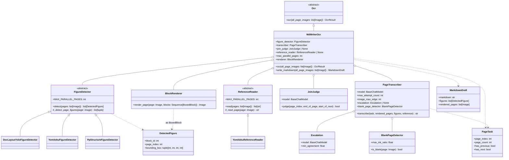
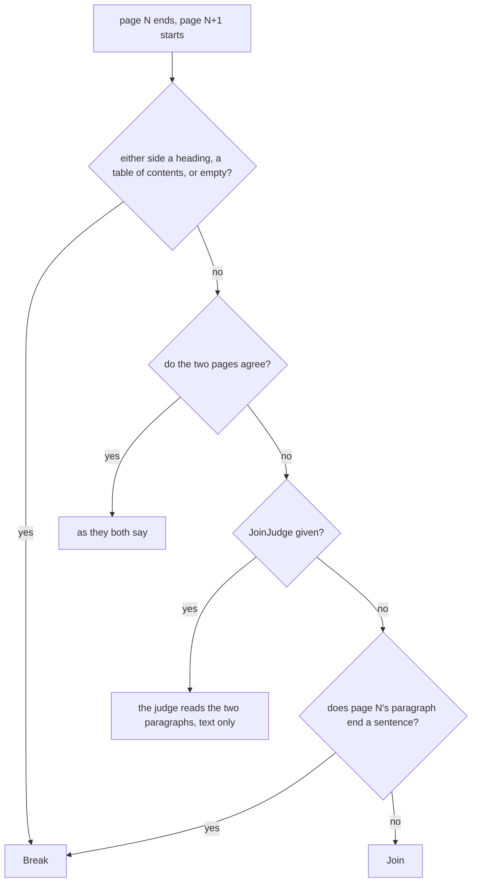
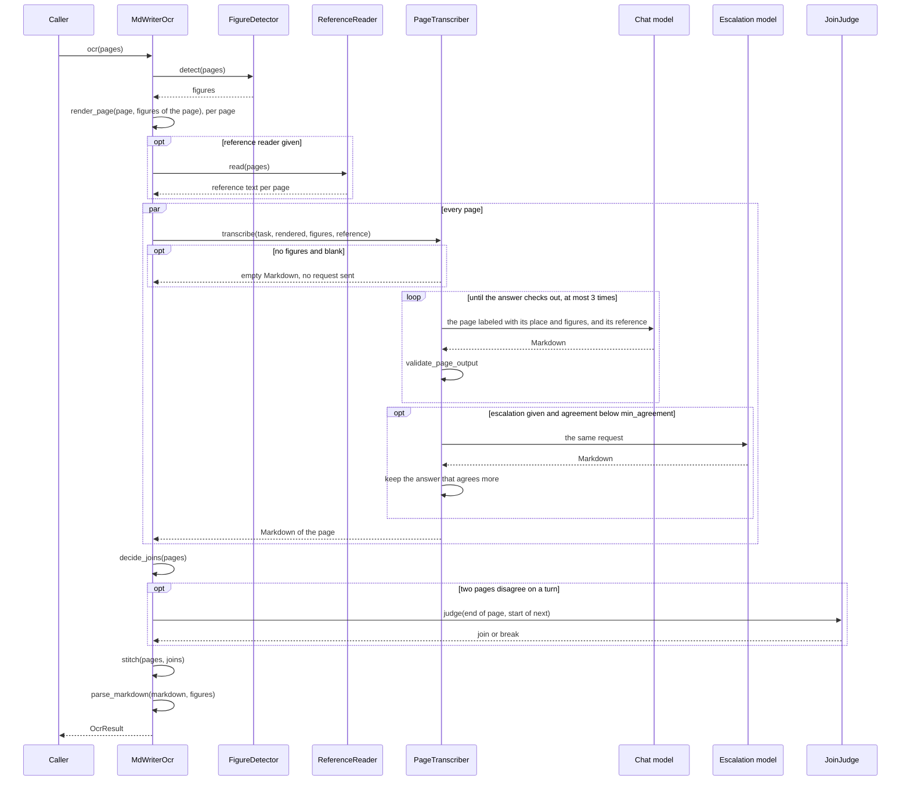

# MdWriterOcr

The MdWriter OCR pipeline (see [Plan.en.md](Plan.en.md)). A layout model finds only the
figures, which are drawn onto the pages with their ids; a multimodal model then writes
the pages out as Markdown, one page per request and every page at once, placing each
figure by id, and the Markdown is read into an `OcrResult`. Each page says of its own
ends whether its text runs over the page turn, so that a paragraph split by a page turn
is joined into one.

A conventional OCR can be added as a *reference*: its plain text of each page is shown to
the model to take the characters from, and a page whose answer agrees too little with it
is written again by a stronger model.

日本語版: [MdWriterOcr.ja.md](MdWriterOcr.ja.md)

## Structure



The modules are grouped by stage, one subdirectory each:

| Directory | Responsibility |
| --- | --- |
| `MdWriter/` | The entry point `MdWriterOcr`, and the data the stages hand each other ([Schema.py](../Schema.py)) |
| [FigureDetector/](../FigureDetector/) | Finding the figures on the pages |
| [ReferenceReader/](../ReferenceReader/) | Reading each page's plain text with a conventional OCR |
| [Transcriber/](../Transcriber/) | Writing one page as Markdown, and checking the answer |
| [Assembly/](../Assembly/) | Deciding the page turns, and stitching the pages into one document |
| [Parser/](../Parser/) | Reading the document back into the `OcrResult` tree |
| [Syntax/](../Syntax/) | The [Markdown syntax](MarkdownSyntax.md) itself, shared by the stages above |

The stages past the figure detection and the reference text are plain functions:

| Module | Function | Responsibility |
| --- | --- | --- |
| [Transcriber/prompt.py](../Transcriber/prompt.py) | `PROMPT`, `PROMPT_WITH_REFERENCE` | What the model is told, the [Markdown syntax](MarkdownSyntax.md) included |
| [Transcriber/MarkdownValidator.py](../Transcriber/MarkdownValidator.py) | `validate_page_output` | What is wrong with an answer, as lines the model can act on |
| [Transcriber/Agreement.py](../Transcriber/Agreement.py) | `agreement` | How well an answer agrees with the page's reference text |
| [Transcriber/BlankPage.py](../Transcriber/BlankPage.py) | `BlankPageDetector`, `ink_ratio` | Telling a blank page from its image, so the model is not asked to write it |
| [Assembly/PageJoin.py](../Assembly/PageJoin.py) | `decide_joins` | Which page turns split a paragraph |
| [Assembly/prompt.py](../Assembly/prompt.py) | `JOIN_PROMPT` | What the `JoinJudge` is told |
| [Assembly/Stitcher.py](../Assembly/Stitcher.py) | `stitch` | The pages joined into one document |
| [Parser/MarkdownParser.py](../Parser/MarkdownParser.py) | `parse_markdown` | The document read into the `OcrResult` tree |
| [Syntax/Markers.py](../Syntax/Markers.py) | `strip_page_markers`, `split_continuation`, … | Finding and taking out the page and continuation markers |
| [Syntax/Containers.py](../Syntax/Containers.py) | `fence_problems`, `closing_container`, … | Checking the `:::` fences (notes and the table of contents), and joining a box split at a page turn |
| [Syntax/TableOfContents.py](../Syntax/TableOfContents.py) | `parse_entries`, `entry_problems` | Reading the entries of a `:::toc` block into a tree nested by indentation, and checking them |

Shared with the rest of the OCR module: `run_parallel` ([PageParallel.py](../../Blocked/PageParallel.py)),
`BlockRenderer` ([BlockRenderer.py](../../Blocked/Blocker/BlockRenderer.py)), `join_texts` /
`join_separator` ([TextJoin.py](../../TextJoin.py)), the message helpers of
[LlmHelper.py](../../LlmHelper.py), and `OcrResultSection.recompute_existing_pages`.

## Figure detection

`FigureDetector.detect()` is a template method, as in the Blocked pipeline's `Blocker`: a
subclass only returns the boxes of the figures of one page, and the base class detects
`MAX_PARALLEL_PAGES` pages at once, sorts each page top-to-bottom, and numbers the
figures across the document once every page is in, so the ids never depend on which
page finished first.

Each detector reuses the loading and box conversion of the Blocker for the same model,
and keeps only the classes that are figures:

| Detector | Kept |
| --- | --- |
| `DocLayoutYoloFigureDetector` | class `figure` |
| `YomitokuFigureDetector` | `layout.figures` |
| `PpStructureFigureDetector` | labels `image` and `chart` (not `header_image` / `footer_image`, which are logos) |

`PpStructureFigureDetector` sets `MAX_PARALLEL_PAGES = 1`: the PaddleX predictor mixes up
the results of pages predicted from several threads at once, handing one page's figures to
another.

Tables and formulas are not detected: the model writes them as Markdown tables and KaTeX.
The detectors live under `MdWriter/` rather than as an option of the `Blocker`, which
deliberately drops every class label.

## Reference text

A `ReferenceReader` reads each page's plain text with a conventional OCR, from the page as
scanned (before the figure boxes are drawn). `YomitokuReferenceReader` uses yomitoku's
`DocumentAnalyzer`: its paragraphs and tables in its reading order, vertical text
included, without the running heads, page numbers, and the text inside figures. It reads
one page at a time (`MAX_PARALLEL_PAGES = 1`), on the GPU about 1-2 s a page.

Such an OCR reads characters very faithfully but knows nothing of Markdown, so the two
are combined: the model is given the reference after the page image, with
`PROMPT_WITH_REFERENCE` telling it to take the characters from the reference and the
structure (headings, tables, math, boxes, figures, reading order) from the image.

The reference also tells a misread page apart. `agreement()` is the F1 score of the
character bigrams the answer and the reference share, letters and digits only, so neither
Markdown syntax nor the order of paragraphs counts, while invented, repeated or missing
text does. With an `Escalation`, a page whose answer agrees less than `min_agreement`
(0.95 by default) is written again by the escalation model, and whichever answer agrees
more is kept. A page whose reference has fewer than `min_reference_letters` (200) letters
is never escalated: on a page of figures, the reference is only a caption or a side tab,
and the agreement with it says nothing.

## Blank pages

A blank page, such as the back of a title page, must come out empty, not as a model's
note that it is blank. Two things see to it:

- Before any request, a page with no figures whose share of ink pixels (grey level below
  128) is at most `max_ink_ratio` (0.0001 by default) is written as empty and never sent
  to the model. A line of print is far above it (a page of text holds about 1%), while
  scanner specks and a lone page number stay under it.
- A page that has some ink but nothing to transcribe (only running heads or a page
  number, or a note that it is left blank) is answered with `<!--blank-page-->` alone,
  as the prompt tells the model, and written as empty too (see
  [MarkdownSyntax.md](MarkdownSyntax.md#blank-page-marker)).

An empty page never takes part in a join: every turn next to it is a break.

## Page turns

Every page is written on its own, so where a paragraph runs over a page turn each page
holds half of it. Each page says so of its own ends, judging from its own image:
`<!--continues-previous-->` first when its first text is the middle of a paragraph (it
starts mid-sentence, or without the paragraph indent), `<!--continued-by-next-->` last
when its last paragraph runs on (it stops mid-sentence, or its last line runs to the end
with no sentence-ending punctuation). A marker on the first or last page means nothing
and is dropped.

`decide_joins()` then decides every turn, looking past a figure at either side:



The model writes no page markers: the stitcher puts `<!--page:N-->` before every page's
Markdown (any the model wrote are taken out first), and at a join puts the two halves
into one paragraph — with a space only between two ASCII characters, as `join_texts` does
— moving a figure that stood between them after the paragraph, and merging a note block
both pages hold it in. Everywhere else, pages are separated by a blank line.

A table of contents is never joined over a turn, since its entries are lines, not a
paragraph: each page closes and reopens its `:::toc` block, and the parser merges
the blocks, reading their entries as one list.

## Flow



The pages go through `run_parallel`, `max_parallel_pages` at a time. The first failure
ends the run: a page that still does not check out after `max_attempt_count` attempts
raises `RuntimeError`. Every request carries `page_index` and `page_kind` (`write`,
`escalate` or `join`) in its run metadata, so a callback can tell which page a request,
and its token usage, was for.

`PageTranscriber.image_max_edge` is the longest side a page is sent at (1568 px by
default). The OpenAI models read every pixel sent, their input tokens growing with the
page's area, so small print is read better from a page rendered at a higher DPI — at more
input tokens, which on a cheap model cost little next to its output.

`write_markdown()` stops before parsing and returns the Markdown with the figures and the
rendered pages, for a caller that wants to look at them.

## Tests

- Unit tests in [Test/Unit/MdWriter/](../../../Test/Unit/MdWriter/): the markers and
  fences, the validator, the agreement, the blank page detection, the page joins, the stitcher, the parser, the
  transcriber against a scripted fake model (retry, reference and escalation included),
  and the whole pipeline against a fake detector, a fake reader and a fake model that
  answers from the request.
- A manual run over the sample PDFs, with a real detector and model, reporting every
  page's tokens and cost, and a script scoring its output against ground truth:
  [TestMdWriter_setup.en.md](../../../Test/Manual/MdWriter/TestMdWriter_setup.en.md).

```bash
cd Uploader
uv run pytest
uv run mypy          # strict, over MdWriter
```
