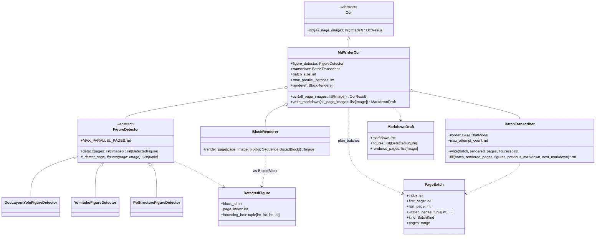
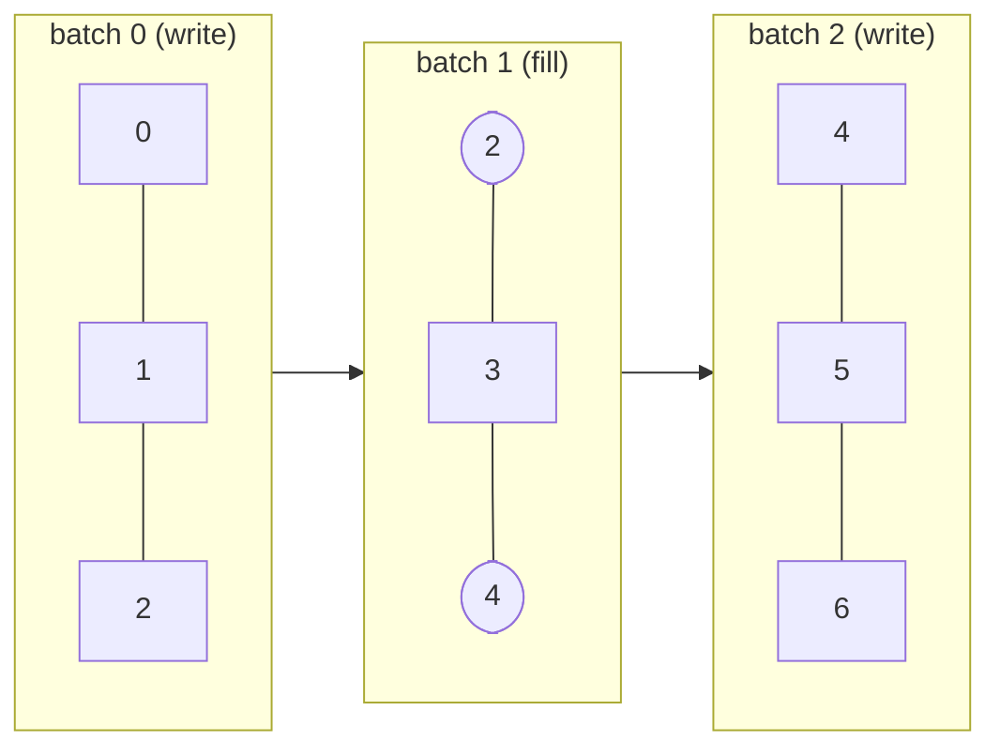
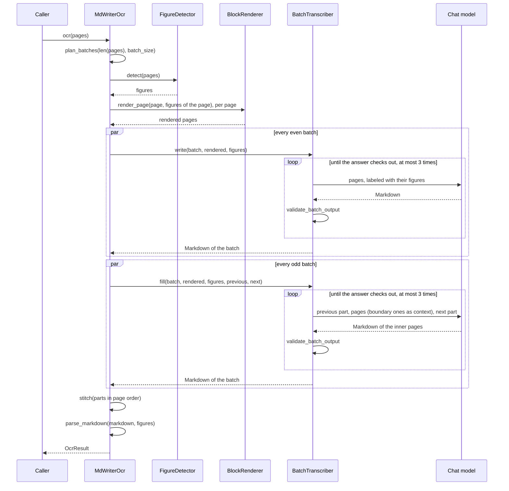

# MdWriterOcr

The MdWriter OCR pipeline (see [Plan.en.md](Plan.en.md)). A layout model finds only the
figures, which are drawn onto the pages with their ids; a multimodal model then writes
whole runs of pages out as Markdown, placing each figure by id, and the Markdown is
read into an `OcrResult`. Since one request covers several pages, text that runs over a
page turn stays in view, and a document costs far fewer requests than one per page.

日本語版: [MdWriterOcr.ja.md](MdWriterOcr.ja.md)

## Structure



The remaining stages are plain functions, each in a module of its own:

| Module | Function | Responsibility |
| --- | --- | --- |
| [Batching.py](../Batching.py) | `plan_batches` | The write and fill batches covering every page |
| [Transcriber/prompt.py](../Transcriber/prompt.py) | `WRITE_PROMPT`, `FILL_PROMPT` | What the model is told, the [Markdown syntax](MarkdownSyntax.md) included |
| [MarkdownValidator.py](../MarkdownValidator.py) | `validate_batch_output` | What is wrong with an answer, as lines the model can act on |
| [Markers.py](../Markers.py) | `strip_page_markers`, `split_continuation`, … | Finding and taking out the page and continuation markers |
| [Containers.py](../Containers.py) | `fence_problems`, `closing_container`, … | Checking the `:::` fences, and joining a box split at a part boundary |
| [Stitcher.py](../Stitcher.py) | `stitch` | The parts joined into one document |
| [MarkdownParser.py](../MarkdownParser.py) | `parse_markdown` | The document read into the `OcrResult` tree |

Shared with the rest of the OCR module: `run_parallel` ([PageParallel.py](../../Blocked/PageParallel.py)),
`BlockRenderer` ([BlockRenderer.py](../../Blocked/Blocker/BlockRenderer.py)), `join_texts` /
`join_separator` ([TextJoin.py](../../TextJoin.py)), the message helpers of
[LlmHelper.py](../../LlmHelper.py), and `OcrResultSection.recompute_existing_pages`.

## Figure detection

`FigureDetector.detect()` is a template method, as in the Blocked pipeline's `Blocker`: a
subclass only returns the boxes of the figures of one page, and the base class detects
`MAX_PARALLEL_PAGES` pages at once, sorts each page top-to-bottom, and numbers the
figures across the document once every page is in, so the ids never depend on which
page finished first.

Each detector reuses the loading and box conversion of the Blocker for the same model,
and keeps only the classes that are figures:

| Detector | Kept |
| --- | --- |
| `DocLayoutYoloFigureDetector` | class `figure` |
| `YomitokuFigureDetector` | `layout.figures` |
| `PpStructureFigureDetector` | labels `image` and `chart` (not `header_image` / `footer_image`, which are logos) |

`PpStructureFigureDetector` sets `MAX_PARALLEL_PAGES = 1`: the PaddleX predictor mixes up
the results of pages predicted from several threads at once, handing one page's figures to
another.

Tables and formulas are not detected: the model writes them as Markdown tables and KaTeX.
The detectors live under `MdWriter/` rather than as an option of the `Blocker`, which
deliberately drops every class label.

## Batches

With `B = batch_size`, batch `x` spans the closed range `[B*x, B*(x+1)]`, cut short at the
last page, so neighbouring batches share their boundary page. Even batches write all of
their pages; odd batches write only the pages between two even ones, and see the
boundary pages as context only. With `B = 2` and 7 pages:



Rounded pages are sent as context and not written again. `B` has to be 2 or more, or an
odd batch has no page of its own; an odd batch left with none (at the end of the
document) is not planned, and a document shorter than `B + 1` pages is one write batch
with no second pass.

## Flow



Both passes go through `run_parallel`, `max_parallel_batches` batches at a time. The first
failure ends the run: a batch that still does not check out after `max_attempt_count`
attempts raises `RuntimeError`.

A fill batch is given the whole Markdown of the write batches either side of it, and all
of its own pages, boundary ones included. It is told that its answer goes verbatim between
the two, so it writes the rest of a paragraph the previous part broke off rather than
starting it again, and says so with `<!--continues-previous-->`; a paragraph of its own
that the next part carries on is marked with `<!--continued-by-next-->`. The stitcher joins
the two halves there — with a space only between two ASCII characters, as `join_texts`
does — and blank lines everywhere else.

`write_markdown()` stops before parsing and returns the Markdown with the figures and the
rendered pages, for a caller that wants to look at them.

## Tests

- Unit tests in [Test/Unit/MdWriter/](../../../Test/Unit/MdWriter/): batch planning, the
  markers and fences, the validator, the stitcher, the parser, the transcriber against a
  scripted fake model (retry and its limit included), and the whole pipeline against a
  fake detector and a fake model that answers from the request.
- A manual run over the sample PDFs, with a real detector and model:
  [TestMdWriter_setup.en.md](../../../Test/Manual/MdWriter/TestMdWriter_setup.en.md).

```bash
cd Uploader
uv run pytest
uv run mypy          # strict, over MdWriter
```
