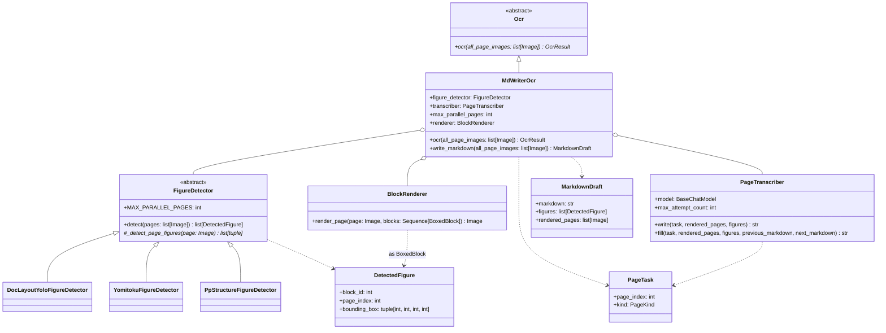
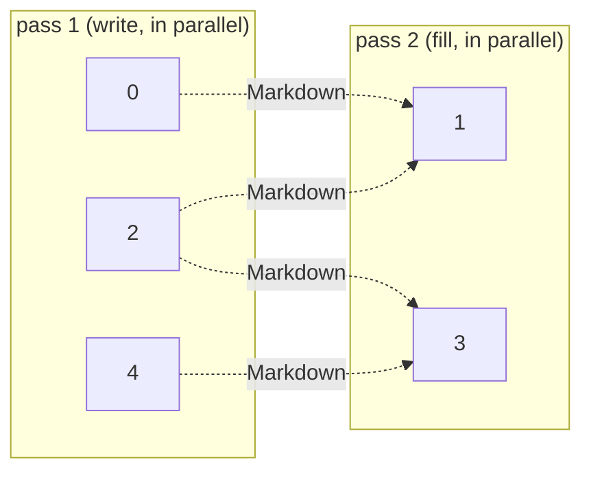
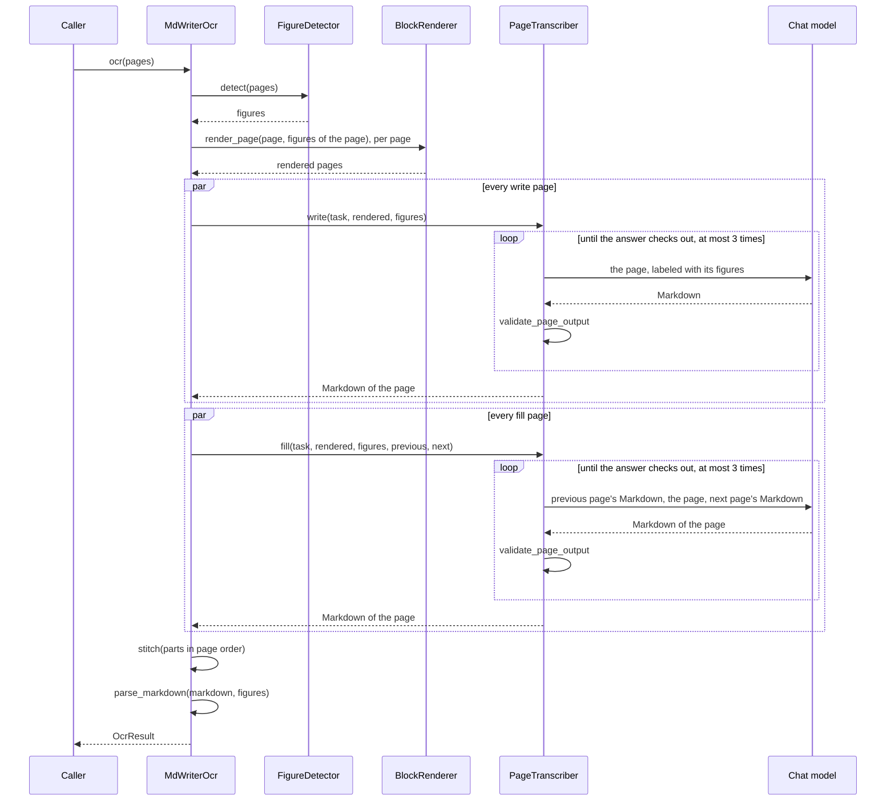

# MdWriterOcr

The MdWriter OCR pipeline (see [Plan.en.md](Plan.en.md)). A layout model finds only the
figures, which are drawn onto the pages with their ids; a multimodal model then writes
the pages out as Markdown, one page per request, placing each figure by id, and the
Markdown is read into an `OcrResult`. A page between two others is written last, with
the Markdown of both in view, so that text running over a page turn joins into one
paragraph.

日本語版: [MdWriterOcr.ja.md](MdWriterOcr.ja.md)

## Structure



The remaining stages are plain functions, each in a module of its own:

| Module | Function | Responsibility |
| --- | --- | --- |
| [Transcriber/prompt.py](../Transcriber/prompt.py) | `WRITE_PROMPT`, `FILL_PROMPT` | What the model is told, the [Markdown syntax](MarkdownSyntax.md) included |
| [MarkdownValidator.py](../MarkdownValidator.py) | `validate_page_output` | What is wrong with an answer, as lines the model can act on |
| [Markers.py](../Markers.py) | `strip_page_markers`, `split_continuation`, … | Finding and taking out the page and continuation markers |
| [Containers.py](../Containers.py) | `fence_problems`, `closing_container`, … | Checking the `:::` fences, and joining a box split at a page boundary |
| [Stitcher.py](../Stitcher.py) | `stitch` | The parts joined into one document |
| [MarkdownParser.py](../MarkdownParser.py) | `parse_markdown` | The document read into the `OcrResult` tree |

Shared with the rest of the OCR module: `run_parallel` ([PageParallel.py](../../Blocked/PageParallel.py)),
`BlockRenderer` ([BlockRenderer.py](../../Blocked/Blocker/BlockRenderer.py)), `join_texts` /
`join_separator` ([TextJoin.py](../../TextJoin.py)), the message helpers of
[LlmHelper.py](../../LlmHelper.py), and `OcrResultSection.recompute_existing_pages`.

## Figure detection

`FigureDetector.detect()` is a template method, as in the Blocked pipeline's `Blocker`: a
subclass only returns the boxes of the figures of one page, and the base class detects
`MAX_PARALLEL_PAGES` pages at once, sorts each page top-to-bottom, and numbers the
figures across the document once every page is in, so the ids never depend on which
page finished first.

Each detector reuses the loading and box conversion of the Blocker for the same model,
and keeps only the classes that are figures:

| Detector | Kept |
| --- | --- |
| `DocLayoutYoloFigureDetector` | class `figure` |
| `YomitokuFigureDetector` | `layout.figures` |
| `PpStructureFigureDetector` | labels `image` and `chart` (not `header_image` / `footer_image`, which are logos) |

`PpStructureFigureDetector` sets `MAX_PARALLEL_PAGES = 1`: the PaddleX predictor mixes up
the results of pages predicted from several threads at once, handing one page's figures to
another.

Tables and formulas are not detected: the model writes them as Markdown tables and KaTeX.
The detectors live under `MdWriter/` rather than as an option of the `Blocker`, which
deliberately drops every class label.

## Passes

Every page is one request. The pages at even indices (the 1st, 3rd, 5th, … page) are the
*write* pages: the first pass sends each of them on its own. The pages between them are
the *fill* pages: the second pass sends each with the Markdown the write pages either
side of it came back as. With 5 pages:



A fill page is sent its own image only; the neighbours are there as text, to show where
their paragraphs break off. A one-page document has no second pass, and a fill page that
ends the document has no next page.

## Flow



Both passes go through `run_parallel`, `max_parallel_pages` pages at a time. The first
failure ends the run: a page that still does not check out after `max_attempt_count`
attempts raises `RuntimeError`. Every request carries `page_index` and `page_kind` in its
run metadata, so a callback can tell which page a request, and its token usage, was for.

A fill page is told that its answer goes verbatim between its two neighbours, so it
writes the rest of a paragraph the previous page broke off rather than starting it again,
and says so with `<!--continues-previous-->`; a paragraph of its own that the next page
carries on is marked with `<!--continued-by-next-->`. The model writes no page markers:
the stitcher puts `<!--page:N-->` before every page's Markdown (any the model wrote are
taken out first), and joins the two halves of a paragraph at a continuation marker — with
a space only between two ASCII characters, as `join_texts` does — and blank lines
everywhere else. Two write pages are never next to each other, so every join is decided
by the fill page between them.

`write_markdown()` stops before parsing and returns the Markdown with the figures and the
rendered pages, for a caller that wants to look at them.

## Tests

- Unit tests in [Test/Unit/MdWriter/](../../../Test/Unit/MdWriter/): the markers and fences, the validator, the stitcher, the parser, the transcriber against a
  scripted fake model (retry and its limit included), and the whole pipeline against a
  fake detector and a fake model that answers from the request.
- A manual run over the sample PDFs, with a real detector and model, reporting every
  page's tokens and cost:
  [TestMdWriter_setup.en.md](../../../Test/Manual/MdWriter/TestMdWriter_setup.en.md).

```bash
cd Uploader
uv run pytest
uv run mypy          # strict, over MdWriter
```
