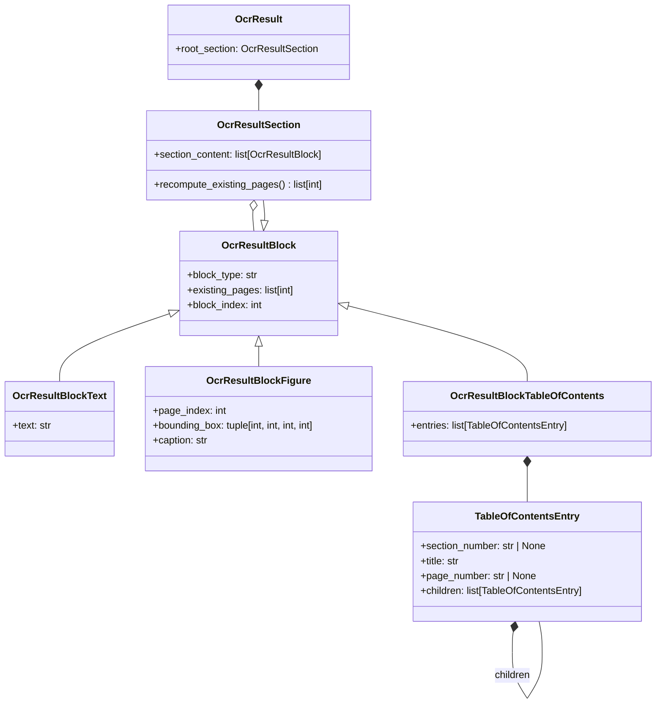

# Uploader

文書のページ画像を読み、構造化した文書ツリー（`OcrResult`、[OcrSchema.py](OcrModule/OcrSchema.py) を参照）にします。

English version: [README.md](README.md)

## 必要なもの

- Python 3.12
- [uv](https://docs.astral.sh/uv/)
- CUDA 13.0対応ドライバのNVIDIA GPU（レイアウトモデルはCPUでも動きます。遅くなるだけです）

## セットアップ

```bash
uv sync
```

APIキーは `.env` に書きます。`template.env` を参照してください。

## 文書ツリー



テキストブロックの種類は `paragraph`・`heading`・`document_index`・`note`・`code`・`math`・
`table` のいずれかです。目次ブロックは、印刷された目次を項目の木として持ち、各項目は
セクション番号とページ番号を印刷どおりに持ちます（印刷されていなければ `None`）。
今のところ目次ブロックを書くのはMdWriterだけです。

## OCRパイプライン

どのパイプラインも `Ocr`（[Ocr.py](OcrModule/Ocr.py)）を実装しています。

| パイプライン | 読み方 | ドキュメント |
| --- | --- | --- |
| Linear | エージェントが1ページずつツリーに読み込む | [Linear/Docs/Plan.md](OcrModule/Linear/Docs/Plan.md) |
| Blocked | レイアウトモデルがブロックを検出し、LLMが種別を決め、最後に各ブロックを読む | [Blocked/Docs/Plan.md](OcrModule/Blocked/Docs/Plan.md) |
| MdWriter | レイアウトモデルが図を検出し、LLMが1ページずつMarkdownに書き下し、それを解析する | [MdWriter/Docs/Plan.md](OcrModule/MdWriter/Docs/Plan.md) |

レイアウトモデルの重みは、初回使用時にダウンロードされてキャッシュされます
（`~/.cache/huggingface/`、`~/.paddlex/official_models/`）。

## 見出しレベル付け

`Leveler` は、どのパイプラインの出力でも完成した `OcrResult` の見出しにレベルを付け、
それに合わせて木を入れ子にします: [Leveler/Docs/Leveler.ja.md](Leveler/Docs/Leveler.ja.md)。

## チェック

```bash
uv run pytest        # 単体テスト
uv run mypy          # 新しいモジュールの厳格な型チェック
uv run black --check OcrModule Leveler Test
```

## 手動テスト

どれも `Test/Manual/Ocr/Sample/` のサンプルPDFを本物のモデルで読みます。

- [TestLinear_setup.md](Test/Manual/Ocr/TestLinear_setup.md) — Linear
- [TestBlocker_setup.md](Test/Manual/Blocked/TestBlocker_setup.md) — Blockedパイプラインのレイアウト段階
- [TestMdWriter_setup.md](Test/Manual/MdWriter/TestMdWriter_setup.md) — MdWriter
