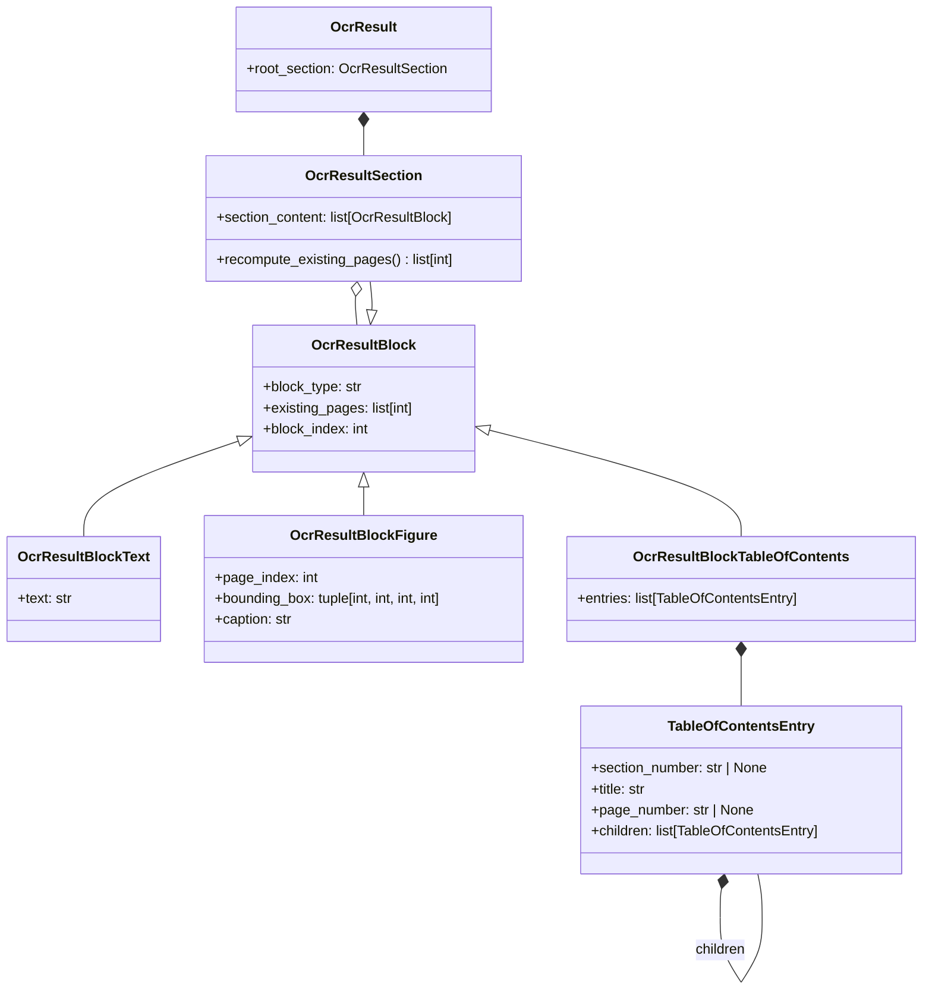

# Uploader

Reads document page images into a structured document tree (`OcrResult`, see
[OcrSchema.py](OcrModule/OcrSchema.py)).

日本語版: [README.ja.md](README.ja.md)

## Prerequisites

- Python 3.12
- [uv](https://docs.astral.sh/uv/)
- NVIDIA GPU with a CUDA 13.0 compatible driver (the layout models also run on the CPU, only slower)

## Setup

```bash
uv sync
```

API keys go in `.env`; see `template.env`.

## Document tree



A text block is one of `paragraph`, `heading`, `document_index`, `note`, `code`, `math`
and `table`. A table of contents block holds the printed table of contents as a tree
of entries, each with its section number and page number as printed (`None` when not
printed); only MdWriter writes one so far.

## OCR pipelines

Every pipeline implements `Ocr` ([Ocr.py](OcrModule/Ocr.py)).

| Pipeline | How it reads | Docs |
| --- | --- | --- |
| Linear | An agent reads one page at a time into the tree | [Linear/Docs/Plan.md](OcrModule/Linear/Docs/Plan.md) |
| Blocked | A layout model finds the blocks, an LLM settles what they are, each block is read last | [Blocked/Docs/Plan.en.md](OcrModule/Blocked/Docs/Plan.en.md) |
| MdWriter | A layout model finds the figures, an LLM writes the pages as Markdown, one per request, which is parsed | [MdWriter/Docs/Plan.en.md](OcrModule/MdWriter/Docs/Plan.en.md) |

Layout model weights are downloaded on first use and cached (`~/.cache/huggingface/`,
`~/.paddlex/official_models/`).

## Heading leveler

`Leveler` ranks the headings of a finished `OcrResult`, from any pipeline, and nests
its tree to match: [Leveler/Docs/Leveler.md](Leveler/Docs/Leveler.md).

## Checks

```bash
uv run pytest        # unit tests
uv run mypy          # strict type check of the newer modules
uv run black --check OcrModule Leveler Test
```

## Manual tests

Each runs the sample PDFs in `Test/Manual/Ocr/Sample/` through real models:

- [TestLinear_setup.md](Test/Manual/Ocr/TestLinear_setup.md) — Linear
- [TestBlocker_setup.en.md](Test/Manual/Blocked/TestBlocker_setup.en.md) — the Blocked pipeline's layout stage
- [TestMdWriter_setup.en.md](Test/Manual/MdWriter/TestMdWriter_setup.en.md) — MdWriter
